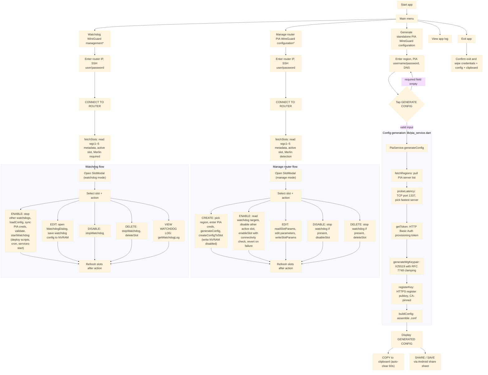

# How it works

The provisioning logic in `lib/pia_service.dart` is a direct Dart translation of the command line version's [Go code](https://github.com/ExponentiallyDigital/pia-wireguard-cfg/blob/main/main.go), implementing the same steps in the same order:

1. **Server discovery**: pulls the complete endpoints mapping directly from serverlist.piaservers.net/vpninfo/servers/v6. The payload splits at the first newline boundary to discard the payload block signature.
2. **Latency probes**: dispatches immediate TCP probes to port 1337 across regional candidate blocks to calculate routing latency.
3. **Session tokens**: challenges the central API through a standard POST request over TLS, securing an execution token from basic user parameters.
4. **Keypair issuance**: generate WireGuard keypair using X25519 with RFC 7748 scalar clamping  
   (k[0] &= 248, k[31] &= 127, k[31] |= 64)
5. **Secure registration**: submits the dynamic public key configuration to the chosen low-latency endpoint via an HTTPS API (port 1337). The step utilises the dynamically resolved PIA root certificate, matching the specific Common Name (CN) mapping fields rather than raw IP routing addresses. The certificate is not hardcoded, so that it stays current when PIA rotates it.
6. **Config assembly**: transforms payload metadata returns into localised .conf specifications utilising Unix line endings (\n) for cross-compatibility.

## App processing flow



> [!NOTE]
> WireGuard configuration is backed up before any destructive/configuration activity, and restored if any issue is detected.

### In summary...

When you select a PIA region and push it to your router, the app connects directly to your router over your home network and switches your VPN tunnel to the new location. It first checks whether a VPN tunnel is already running, stops it cleanly, writes the new VPN server details into the router's permanent memory, and then starts the new tunnel. The app watches the router until it confirms the tunnel is active, then checks that internet traffic is actually flowing through it by verifying the public IP address your router is using. If anything goes wrong at any point, the app restores the router to exactly the state it was in before you started.

### In detail...

The push operation establishes an SSH session to the router and uses `wg show interfaces` to detect any currently active WireGuard client slot. If an existing slot config is present in NVRAM, the current `wgcN_*` keys are snapshotted as a backup before any changes are made. The active tunnel is stopped by disabling its `enforce` and `enable` NVRAM flags, committing, then issuing `service "stop_wgc N"; service start_vpnrouting0` targeted at that specific slot. The new configuration is written across the full set of NVRAM keys for the target slot, with `ep_addr_r` and `rip` explicitly cleared since these are populated dynamically by the firmware after tunnel establishment. After a single nvram commit, the new tunnel is started via `service "restart_wgc N"; service start_vpnrouting0`. The app then polls `wg show interfaces` for up to 60 seconds to confirm the interface is active, followed by polling `ipv4.icanhazip.com` (a service run and hosted by [Cloudflare](https://www.cloudflare.com/)) via curl through the tunnel to confirm routed connectivity. On any failure, independent recovery blocks restore the backed-up NVRAM keys and re-enable the previously active slot as appropriate to the failure scenario.

### Router WireGuard NVRAM fields

```text
wgcN_addr=the local tunnel IP address assigned to the router by the VPN server in CIDR notation (e.g., `10.x.x.x/32`).
wgcN_alive=the persistent keepalive interval, set to 25 (seconds) by default. This field is user editable.
wgcN_desc=the slot's PIA region name. This must match the actual PIA region name for the watchdog function to operate.
wgcN_dns=two DNS servers to use. Optional, but defaults to `"9.9.9.9, 149.112.112.112"`.
wgcN_enable=set to `1` this enables this slot; when set to `0` this slot is disabled.
wgcN_enforce=set to `1` this enables the killswitch on this slot; when set to `0` it is disabled. The killswitch blocks routed clients if the tunnel goes down.
wgcN_ep_addr=the domain name (FQDN) or public IP address of the remote PIA WireGuard server (peer endpoint) you are connecting to.
wgcN_ep_addr_r=if `wgcN_ep_addr` contains either a DNS name or an IP address, this is the resolved numeric IP address; if `wgcN_ep_addr` contains a direct IP address, this field will hold an identical value. This field is set when the interface is initialised.
wgcN_ep_port=the endpoint port, defaulting to `1337` for PIA.
wgcN_fw=set to `1` to enable the inbound firewall on this slot; set to `0` to disable it.
wgcN_mtu=the MTU (Maximum Transmission Unit), set to `1420` by default.
wgcN_nat=set to `1` to enable network address translation (NAT); set to `0` to disable NAT.
wgcN_ppub=The PIA VPN server public key.
wgcN_priv=the PIA user's private key. This field should be rendered as an obscured input (like a password field) with a show/hide toggle, consistent with how SSH and PIA credentials are handled elsewhere in the app.
wgcN_psk=this value is not used by PIA and is read-only for the user (reserved for a preshared key).
wgcN_rip=stores the router's current external public IP address as seen by the internet.
wgcN_aips=allowed IP addresses, defaults to `0.0.0.0/0`.
```

---

## Watchdog details

On Merlin firmware routers, enabling the watchdog deploys

1. a slot-specific shell script `/jffs/scripts/watchdog_wgcN.sh`
2. cron entries via `/jffs/scripts/services-start`.

### Shell script

The shell script checks connectivity via the VPN tunnel on a periodic basis using two ping targets

- `8.8.8.8` (Google)
- `1.1.1.1` (Cloudflare)

If connectivity fail, the interface is reconfigured with back off.

### Cron entries

A `crontab`/`cru` entry drives the configurable periodic health check. An additinal job rotates the watchdog router log file at midnight, retaining the prior log. To avoid filling the JFFS partition, all logging is stored in `/tmp`. Watchdog logging does not persist after a reboot or power loss.

```bash
*/5 * * * * /jffs/scripts/watchdog_wgc1.sh #watchdog_wgc1#
0 0 * * * mv /tmp/watchdog_wgc1.log /tmp/watchdog_wgc1.log.old && touch /tmp/watchdog_wgc1.log #watchdog_log_rotate_wgc1#
```

### Watchdog NVRAM fields

All watchdog configuration is stored on your router's NVRAM. Defaults are as follows:

```bash
# slot specific
wgcN_wd_check_interval=5
wgcN_wd_email_enabled=0
wgcN_wd_email_from=
wgcN_wd_email_subject=cfg-pia-wg alert
wgcN_wd_email_to=
wgcN_wd_primary_ip=8.8.8.8
wgcN_wd_secondary_ip=1.1.1.1
wgcN_wd_smtp_pass=
wgcN_wd_smtp_server=
wgcN_wd_smtp_user=
# global
cfg_pia_wg_password=
cfg_pia_wg_user=
```

(where `N` is the slot number 1-5)

---

### Sample `cfg-pia-wg` output

Standalone configuration file, suitable for importing into various WireGuard clients/routers:

```none
[Interface]
PrivateKey = <freshly generated private key>
Address    = <client IP/32 assigned by PIA>
DNS        = 9.9.9.9, 149.112.112.112
MTU        = 1420

[Peer]
PublicKey           = <server public key from PIA>
Endpoint            = <server IP:port from PIA>
PersistentKeepalive = 25
AllowedIPs          = 0.0.0.0/0
```

---

## Network traffic

Below are detailed representations of the app's network calls, with illustrative, not real, IP addresses.

.svg>)

.svg>)

---

## Output & session destruction

Generated configuration data is managed via:

- **Ephemeral verification:** displayed on-screen inside a text viewport for visual validation.
- **Transient streaming:** shareable using Android's system share sheet (e.g., via "Save to Files" or encrypted side-channels).
- **Clipboard sanitisation:** tapping **COPY** invokes a 60-second timer that clears the clipboard storage space automatically.
- **Application exit:** all applicaation exit paths flush credentials and scrub configs from memory before application shutdown.

---
