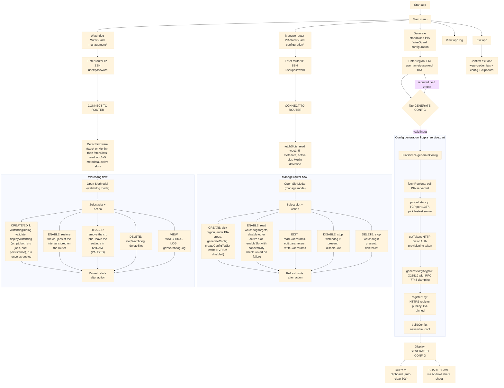
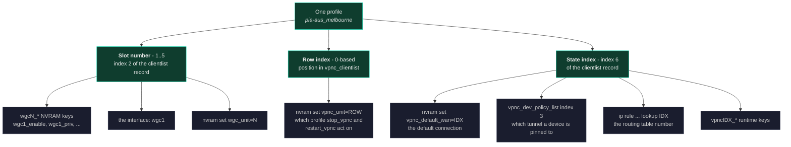
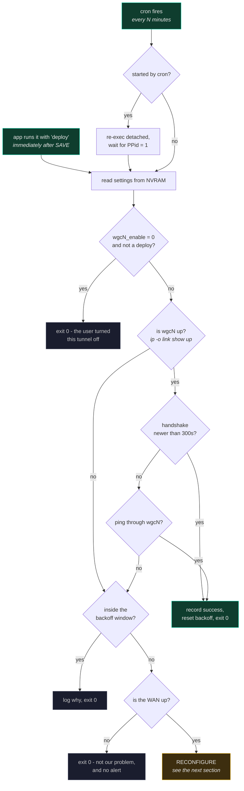
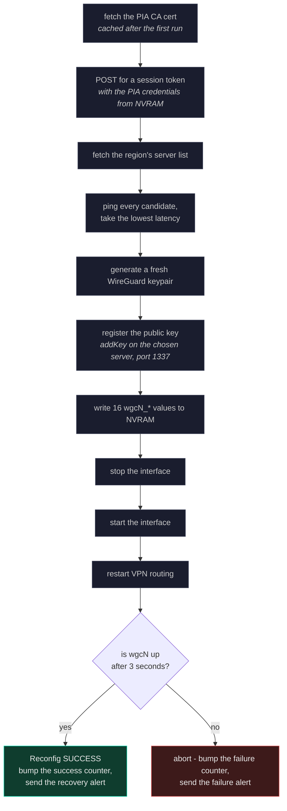

# ARCHITECTURE.md

This app provisions Private Internet Access WireGuard configurations onto an ASUS router, and keeps
them working. It does four separate jobs, and most of this document is about the last three:

1. **Generate a configuration** from PIA and hand it to you. No router is involved, and nothing is stored.
2. **Write one into a router slot** over SSH, start the tunnel, and prove that traffic is really flowing through it.
3. **Deploy a watchdog** onto the router, which checks the tunnel on a schedule and rebuilds it unattended when it fails.
4. **Pin individual LAN devices to a tunnel**, so one device uses a VPN and another does not. Stock firmware only - Merlin does this through VPN Director, which the app does not drive.

**"Slot" means one of the five WireGuard client profiles the router hardware provides**, numbered 1
to 5 and named `wgc1` to `wgc5`. They are fixed: the router has five, the app can fill any of them,
and a slot holds one PIA server at a time. Nearly everything the app does to a router is scoped to a
single slot, and almost every NVRAM key below is prefixed `wgcN_` for that reason.

**One idea is needed before the detail makes sense.** The two firmwares drive WireGuard in completely
different ways. Asuswrt-Merlin exposes each of the five client slots directly through VPN Director;
stock Asuswrt hides them behind VPN Fusion, where a single profile is named by three different
numbers depending on which key is being written. Nearly every awkward thing below is a consequence of
that split, and the app carries both paths.

**None of this comes from vendor documentation, because there is none.** Every claim about the
firmware was measured on hardware, usually by changing one thing in the web interface and diffing
NVRAM either side. Entries carry the date they were measured, and say when a reading is an inference
rather than a measurement.

**Start with [What this app depends on ASUS not changing](#what-this-app-depends-on-asus-not-changing).**
It lists the firmware behaviours the app leans on, and it is the right first stop when a firmware
update breaks something: the failure almost never looks like its cause.

- [1. How it works](#how-it-works)
- [2. What this app depends on ASUS not changing](#what-this-app-depends-on-asus-not-changing)
- [3. App processing flow](#app-processing-flow)
  - [3.1. Overview](#overview)
  - [3.2. Detail](#detail)
- [4. Wireguard SSH commands](#wireguard-ssh-commands)
  - [4.1. Merlin](#merlin)
    - [4.1.1. Enable](#enable)
    - [4.1.2. Disable](#disable)
    - [4.1.3. Delete](#delete)
    - [4.1.4. What only Merlin has](#what-only-merlin-has)
    - [4.1.5. Firmware detection](#firmware-detection)
  - [4.2. Stock](#stock)
    - [4.2.1. Create and enable a slot](#create-and-enable-a-slot)
    - [4.2.2. Enable existing slot](#enable-existing-slot)
    - [4.2.3. Stop/Disable](#stopdisable)
    - [4.2.4. Delete](#stock-delete)
    - [4.2.5. VPN Fusion](#vpn-fusion)
- [5. Router WireGuard NVRAM fields](#router-wireguard-nvram-fields)
  - [5.1. Field reference](#field-reference)
  - [5.2. Stock `vpnc_clientlist`](#stock-vpnc-clientlist)
  - [5.3. The three numbers that name one profile](#the-three-numbers-that-name-one-profile)
- [6. Device assignment (stock)](#device-assignment-stock)
  - [6.1. `vpnc_default_wan`](#vpnc-default-wan)
  - [6.2. Shared format](#shared-format)
  - [6.3. `dhcp_staticlist`](#dhcp-staticlist)
    - [6.3.1. Telling a reserved address from a leased one](#reserved-or-not-the-distinction-the-screen-needs)
  - [6.4. `custom_clientlist`](#custom-clientlist)
  - [6.5. Practical notes](#practical-notes)
  - [6.6. Reading the two device JSON files](#reading-the-two-device-json-files)
  - [6.7. `cfg_device_list` - the router and its mesh nodes](#cfg-device-list-the-router-and-its-mesh-nodes)
  - [6.8. `vpnc_dev_policy_list` - the assignment](#vpnc-dev-policy-list-the-assignment)
    - [6.8.1. How a change is written](#how-a-change-is-written)
    - [6.8.2. The starting state, before any VPN exists](#the-starting-state-before-any-vpn-exists)
    - [6.8.3. Reservations are created by ANY assignment, and never removed - MEASURED 2026-09-08](#reservations-are-created-by-any-assignment-and-n)
    - [6.8.4. `vpnc_dev_policy_list_tmp`](#vpnc-dev-policy-list-tmp)
    - [6.8.5. Service calls](#service-calls)
    - [6.8.6. `vpnc_default_wan` uses the same identifier](#vpnc-default-wan-uses-the-same-identifier)
    - [6.8.7. `enabled` is what separates "on the internet" from "follows the default" - CONFIRMED 2026-09-08](#enabled-is-what-separates-on-the-internet-from-f)
    - [6.8.8. Changing the default connection - the exact sequence, MEASURED 2026-09-08](#changing-the-default-connection-the-exact-sequen)
    - [6.8.9. Assigning a device with no DHCP reservation creates one](#assigning-a-device-with-no-dhcp-reservation-crea)
    - [6.8.10. What happens when the tunnel drops](#what-happens-when-the-tunnel-drops)
    - [6.8.11. Stock leaves the old routing rule behind - MEASURED 2026-09-10](#stock-leaves-the-old-routing-rule-behind-measure)
- [7. Watchdog details](#watchdog-details)
  - [7.1. Shell script](#shell-script)
    - [7.1.1. Backoff](#backoff)
    - [7.1.2. Email alerting](#email-alerting)
  - [7.2. When the script runs, and when it does nothing](#when-the-script-runs-and-when-it-does-nothing)
  - [7.3. What a reconfigure does](#what-a-reconfigure-does)
  - [7.4. Cron entries](#cron-entries)
    - [7.4.1. The router's service queue, and how it wedges](#the-routers-service-queue-and-how-it-wedges)
    - [7.4.2. The second init script, and how both are made recoverable](#the-second-init-script-and-how-both-are-made-rec)
    - [7.4.3. What an uninstall leaves behind](#what-an-uninstall-leaves-behind)
  - [7.5. USB storage for Download Master](#usb-storage-for-download-master)
  - [7.6. Watchdog NVRAM fields](#watchdog-nvram-fields)
  - [7.7. Sample `cfg-pia-wg` output](#sample-cfg-pia-wg-output)
  - [7.8. `curl` refuses to run from cron](#curl-refuses-to-run-from-cron)
- [8. Network traffic](#network-traffic)
- [9. Output & session destruction](#output-session-destruction)
- [10. Build provenance (the About screen)](#build-provenance-the-about-screen)
  - [10.1. The channel](#the-channel)
  - [10.2. Where each field comes from](#where-each-field-comes-from)
  - [10.3. Gradle-side notes](#gradle-side-notes)
  - [10.4. GNU licence text](#gnu-licence-text)
- [11. Appendix: readings that were superseded](#appendix-readings-that-were-superseded)
  - [11.1. The two-cost model for applying an assignment](#the-two-cost-model-for-applying-an-assignment)
  - [11.2. Placeholder records in the policy list](#placeholder-records-in-the-policy-list)

## 1. <a name='how-it-works'></a>How it works

The provisioning logic in `lib/pia_service.dart` is a direct Dart translation of the command line version's [Go code](https://github.com/ExponentiallyDigital/pia-wireguard-cfg/blob/main/main.go), doing the same six steps in the same order:

1. **Find the servers.** Fetch the endpoint list from `serverlist.piaservers.net/vpninfo/servers/v6` and split the payload at the first newline, discarding the signature block that follows it.
2. **Pick the fastest one.** Open a TCP connection to port 1337 on each candidate in the chosen region and keep the one that answers first.
3. **Get a session token.** POST the PIA username and password over TLS; the reply carries the token the next step needs.
4. **Make a keypair.** X25519 with RFC 7748 clamping - `k[0] &= 248`, `k[31] &= 127`, `k[31] |= 64`.
5. **Register the public key** with the chosen server over HTTPS on port 1337. PIA present a certificate signed by their own root, so the app fetches that root at runtime, turns off the platform trust store for the call, and accepts the server certificate only when its Common Name matches the server it meant to reach. Fetching the root rather than embedding it is what keeps this working when PIA rotate it.
6. **Assemble the `.conf`** from what came back, with Unix line endings.

---

## 2. <a name='what-this-app-depends-on-asus-not-changing'></a>What this app depends on ASUS not changing

Read this first when a firmware update breaks something.

Everything below was measured on hardware, not read in documentation - ASUS publish none of it. Each row says what the app relies on, where the detail is, and what breaks if it changes. If a firmware update alters one of these, the failure will usually look like something else entirely, so the "how it fails" column matters as much as the assumption.

| # | The app assumes | Detail in | If ASUS change it |
| --: | --- | --- | --- |
| 1 | `vpnc_clientlist` is `<`-separated records of `>`-separated fields, and a profile is named by THREE different numbers: its slot, its row index (`vpnc_unit`) and its index 6 | [Stock `vpnc_clientlist`](#stock-vpnc-clientlist) | Every stock operation targets the wrong profile. Silent: the app reports success and the wrong tunnel restarts |
| 2 | `vpnc_dev_policy_list` is `enabled>IP>?>index6>`, keyed by IP address, and an ENABLED index 0 differs from a DISABLED one | [`vpnc_dev_policy_list`](#vpnc-dev-policy-list-the-assignment) | Device assignment writes records the firmware ignores, or pins devices to the wrong place |
| 3 | The default connection is changed by a five-step sequence in one exact order, and `restart_default_wan` resets the key as it runs | [Changing the default connection](#changing-the-default-connection-the-exact-sequen) | The change appears to work and does nothing. Eleven probes to find this the first time |
| 4 | Per-device routing is `ip rule` at priority 100, the default connection is a pair at priority 10000, and stock NEVER removes a stale rule | [Stock leaves the old routing rule behind](#stock-leaves-the-old-routing-rule-behind-measure) | Assignments are written correctly and have no effect, because an older rule at equal priority matches first |
| 5 | `notify_rc` records the running action in `rc_service` and clears it when done; a caller finding it set waits 15s then DISCARDS its own event | [The router's service queue](#the-routers-service-queue-and-how-it-wedges) | A hung service makes the router silently ignore everything, including `reboot`. Only a power cycle recovers it |
| 6 | `/usr/sbin/curl` walks its process ancestry and refuses to run with `crond` in the chain | [`curl` refuses to run from cron](#curl-refuses-to-run-from-cron) | The watchdog can never fetch a PIA token from cron, so it can never recover a tunnel. Exits 0 with no output at all |
| 7 | Stock drives WireGuard through VPN Fusion (`restart_vpnc` / `stop_vpnc`), Merlin through `start_wgc` / `stop_wgc` | [Stock](#stock) and [Merlin](#merlin) | Enable and disable stop working on one firmware while continuing to look correct |
| 8 | `/opt/etc/init.d/S50downloadmaster` and `S50asuslighttpd` are run at boot, and are the only user-writable boot hook on stock | [Cron entries](#cron-entries) | Watchdog schedules do not survive a reboot. Nothing reports this - it simply stops running |
| 9 | The device inventory is split across `nmp_cl_json.js`, `nmp_cache.js`, `custom_clientlist`, `dhcp_staticlist` and `cfg_device_list`, none of which is complete on its own | [Device assignment (stock)](#device-assignment-stock) | Devices vanish from the assignment list, or appear without an address and cannot be assigned |
| 10 | 17 `wgcN_*` keys exist on Merlin; stock has 12 of them and no kill switch at all | [Field reference](#field-reference) | Slot editing writes keys nothing reads, or omits keys the firmware now requires |

**How to use this after a firmware update.** Work down the table. For each row, run the check named in the linked section and confirm the assumption still holds. A row that fails tells you which part of the app is now broken, and the linked section tells you what the app does about it today.

---

## 3. <a name='app-processing-flow'></a>App processing flow

The whole app on one page: the entry points from the main menu, what each asks for, and where the
work happens. The two sections after the diagram describe the push operation again in plain
language and then in detail, because that is the part most worth being able to check.


```mermaid
graph TD
%%{init: {
  'theme': 'base',
  'themeVariables': {
    'fontSize': '24px'
  },
  'flowchart': {
    'subGraphTitleMargin': { 'top': 1,
    'bottom': 15}
  }
}}%%
    A["Start app"] --> B["Main menu"]
    B --> C["Generate standalone PIA WireGuard configuration"]
    B --> D["Manage router PIA WireGuard configuration*"]
    B --> E["Watchdog WireGuard management*"]
    B --> F["View app log"]
    B --> G["Exit app"]

    C --> H["Enter region, PIA username/password, DNS"]
    H --> I{"Tap GENERATE CONFIG"}
    I -->|"required field empty"| H
    I -->|"valid input"| J["PiaService.generateConfig"]

    subgraph GEN["Config generation: lib/pia_service.dart"]
        J --> J1["fetchRegions: pull PIA server list"]
        J1 --> J2["probeLatency: TCP port 1337, pick fastest server"]
        J2 --> J3["getToken: HTTP Basic Auth provisioning token"]
        J3 --> J4["generateWgKeypair: X25519 with RFC 7748 clamping"]
        J4 --> J5["registerKey: HTTPS register pubkey, CA-pinned"]
        J5 --> J6["buildConfig: assemble .conf"]
    end

    J6 --> K["Display GENERATED CONFIG"]
    K --> L["COPY to clipboard (auto-clear 60s)"]
    K --> M["SHARE / SAVE via Android share sheet"]

    D --> D1["Enter router IP, SSH user/password"]
    D1 --> D2["CONNECT TO ROUTER"]
    D2 --> D3["fetchSlots: read wgc1–5 metadata, active slot, Merlin detection"]
    D3 --> D4["Open SlotModal (manage mode)"]

    subgraph MGR["Manage router flow"]
      D4 --> D5["Select slot + action"]
      D5 --> D5a["CREATE: pick region, enter PIA creds, generateConfig, createConfigToSlot (write NVRAM disabled)"]
      D5 --> D5b["ENABLE: read watchdog targets, disable other active slot, enableSlot with connectivity check, revert on failure"]
      D5 --> D5c["EDIT: readSlotParams, edit parameters, writeSlotParams"]
      D5 --> D5d["DISABLE: stop watchdog if present, disableSlot"]
      D5 --> D5e["DELETE: stop watchdog if present, deleteSlot"]
      D5a --> D5f["Refresh slots after action"]
      D5b --> D5f
      D5c --> D5f
      D5d --> D5f
      D5e --> D5f
    end

    E --> E1["Enter router IP, SSH user/password"]
    E1 --> E2["CONNECT TO ROUTER"]
    E2 --> E3["Detect firmware (stock or Merlin), then fetchSlots: read wgc1–5 metadata, active slots"]
    E3 --> E4["Open SlotModal (watchdog mode)"]

    subgraph WD["Watchdog flow"]
      E4 --> E5["Select slot + action"]
      E5 --> E5a["CREATE/EDIT: WatchdogDialog, validate, deployWatchdog (script, both cru jobs, boot persistence), run once as deploy"]
      E5 --> E5b["ENABLE: restore the cru jobs at the interval stored on the router"]
      E5 --> E5c["DISABLE: remove the cru jobs, leave the settings in NVRAM (PAUSED)"]
      E5 --> E5d["DELETE: stopWatchdog, deleteSlot"]
      E5 --> E5e["VIEW WATCHDOG LOG: getWatchdogLog"]
      E5a --> E5f["Refresh slots after action"]
      E5b --> E5f
      E5c --> E5f
      E5d --> E5f
      E5e --> E5f
    end

    G --> R["Confirm exit and wipe credentials + config + clipboard"]
```

> [!NOTE]
> WireGuard configuration is backed up before any destructive/configuration activity, and restored if any issue is detected.

### 3.1. <a name='overview'></a>Overview

When you select a PIA region and push it to your router, the app connects directly to your router over your home network and switches your VPN tunnel to the new location.

It first checks whether a VPN tunnel is already running, stops it cleanly, writes the new VPN server details into the router's permanent memory, and then starts the new tunnel. The app watches the router until it confirms the tunnel is active, then checks that internet traffic is actually flowing through it by verifying the public IP address your router is using. If anything goes wrong at any point, the app restores the router to the state it was in before you started.

### 3.2. <a name='detail'></a>Detail

The commands here are the **Merlin** ones. Stock reaches the same result through VPN Fusion, and both are set out in [Wireguard SSH commands](#wireguard-ssh-commands).

The push operation establishes an SSH session to the router and uses `wg show interfaces` to detect any currently active WireGuard client slot.

- If an existing slot config is present in NVRAM, the current `wgcN_*` keys are backed up before any changes are made.
- The active tunnel is stopped by disabling its `enforce` and `enable` NVRAM flags, committing, then issuing `service "stop_wgc N"; service start_vpnrouting0` targeted at that slot.
- The new NVRAM configuration is written for the target slot. `ep_addr_r` and `rip` are explicitly cleared since these are populated dynamically by the firmware after tunnel establishment.
- After a nvram commit, the new tunnel is started via `service "restart_wgc N"; service start_vpnrouting0`.
- The app then polls `wg show interfaces` to confirm the interface is active, followed by pinging the user supplied ping targets (defaults to 8.8.8.8 & 1.1.1.1) through the tunnel to confirm routed connectivity.
- If the ping fails, a recovery block restores and re-enables the previously active slot.

## 4. <a name='wireguard-ssh-commands'></a>Wireguard SSH commands

To manage Wireguard Merlin uses VPN Director, stock ASUS uses VPN Fusion. These are similar but different: using nvram settings to store configuration parameters, but differs in how these are applied and used. There's scant reference detail I could find on how stock officially manages things and a **lot** more by having access to Merlin's source code, so the below is my understanding which may be incorrect and have gaps.

### 4.1. <a name='merlin'></a>Merlin

VPN Director exposes each slot directly: there is no clientlist and no unit indirection. Write the `wgcN_*` keys, commit, then act on the slot **by its own number**.

```text
   nvram set wgcN_*      (17 keys, see the field reference)
          │
   nvram commit          always BEFORE the service call, so the
          │              service cannot read a half-written slot
          ▼
        exec
  service "start_wgc N"  OR  service "stop_wgc N"
          │
          ▼
  service restart_vpnrouting0   (start)
  service start_vpnrouting0     (stop)
          │
          ▼
        wgcN
```

#### 4.1.1. <a name='enable'></a>Enable

```bash
nvram set wgcN_enable=1
nvram commit
service "start_wgc N"; service restart_vpnrouting0
```

Then poll `wg show interfaces` until `wgcN` appears. The app tries five times at two-second intervals and reverts to disabled if it never comes up — the `service` call is queued through `notify_rc` and returns immediately, so a prompt return says nothing about the tunnel.

#### 4.1.2. <a name='disable'></a>Disable

```bash
nvram set wgcN_enable=0
nvram commit
service "stop_wgc N"; service start_vpnrouting0
```

Note the asymmetry: **`restart_vpnrouting0` on the way up, `start_vpnrouting0` on the way down.** Then poll until `wgcN` leaves `wg show interfaces` — unsetting keys before it has gone lets the firmware re-create `wgcN_enable` behind you.

#### 4.1.3. <a name='delete'></a>Delete

Disable as above, wait for the interface to go, then `nvram unset` all 17 `wgcN_*` keys plus `wgcN_wd_primary_ip` / `wgcN_wd_secondary_ip`, and commit. There are no `vpncN_*` runtime keys to clean up on Merlin.

#### 4.1.4. <a name='what-only-merlin-has'></a>What only Merlin has

- `wgcN_enforce` (kill switch), `wgcN_fw` (inbound firewall), `wgcN_rip` — `kMerlinOnlySlotKeys`. Writing them on stock creates keys nothing reads and DELETE does not clean up.
- `wgcN_desc` as a real firmware field. On stock the app writes it anyway, as a key of its own, because the watchdog script needs the region name from a bare `nvram get`.
- The JFFS custom-scripts partition, which the watchdog needs for reboot persistence:

  ```bash
  nvram get jffs2_scripts   # both must be 1
  nvram get jffs2_on
  ```

  The app sets and commits them if they are not already on. Stock has no equivalent and no `/jffs/scripts` hook directory, so the watchdog persists its cron entries differently there — see [Cron entries](#cron-entries).

#### 4.1.5. <a name='firmware-detection'></a>Firmware detection

`nvram get 3rd-party` returns `merlin` on Merlin and is empty on stock. Detected once per app session; every router command branches on the result.

### 4.2. <a name='stock'></a>Stock

VPN Fusion abstracts the underlying per slot calls to manipulate WG VPNs. Find the profile's **row** in `vpnc_clientlist`, set `vpnc_unit` to that row's 0-based index, then exec the `service` command:

> [!IMPORTANT]
> **`vpnc_unit` must be set before every `service` call in this section, and it is what the call
> acts on.** `stop_vpnc` and `restart_vpnc` take no argument: the only thing telling VPN Fusion
> which profile is meant is the value sitting in `vpnc_unit` when the call is made. It keeps its
> last value, so a call made without setting it first acts on whatever was targeted previously -
> silently, and with no error. This applies to **all** of the operations below, not just the one
> that happens to mention it.

```text
        vpnc_clientlist
              │
              ├── row 0 ── slot 5 ─┐
              ├── row 1 ── slot 1  │  find the row whose
              └── row N ── slot M  │  index 2 == target slot
              │                    │
             set ◄─────────────────┘
   vpnc_unit=(row index)
              │
              ▼
            exec
  stop_vpnc OR restart_vpnc
              │
              ▼
          VPN Fusion
              │
              ▼
             wgcN
```

> [!IMPORTANT]
> `vpnc_unit` is the **row index**, not `5 - slot`.
>
> The WebUI can only create profiles in slot order 5,4,3,2,1, so in any list it built row 0 is slot 5, row 1 is slot 4, and so on — the row index and `5 - slot` are the same number, which is why the `5 - slot` rule looked correct.
>
> `cfg-pia-wg` lets the user pick any slot, so its lists can be in any order and only the row index holds. Measured: with rows `[slot 5, slot 1]`, enabling the slot-1 profile from the WebUI writes `vpnc_unit=1`; `5 - slot` would give `4`, a row that does not exist, and nothing comes up.
>
> Row index is a strict generalisation — it agrees with `5 - slot` on every WebUI-ordered list.

The runtime state keys are indexed differently again: `vpncN_state_t` / `vpncN_dns` / `vpncN_sbstate_t` use **index 6** of the profile's `vpnc_clientlist` record, *not* the slot number and *not* `vpnc_unit`.

> [!IMPORTANT]
> One profile carries three different indexes. For `aus_perth` in slot 1, sitting at row 1 with index 6 = 9:
>
> | Index | Value | Used by |
> |---|:-:|---|
> | slot number | 1 | `wgc1_*` keys, `service` targets |
> | clientlist row | 1 | `vpnc_unit` |
> | clientlist index 6 | 9 | `vpnc9_state_t`, `vpnc9_sbstate_t`, `vpnc9_dut_disc` |
>
> Measured: enabling then deleting wgc1 left `vpnc9_*` behind. Slot 5 is the trap - there the slot number and index 6 are both 5, so a reading taken only from wgc5 cannot tell them apart.

#### 4.2.1. <a name='create-and-enable-a-slot'></a>Create and enable a slot

Creating the first slot in the WebUI adds the below keys and populates settings.

The below examples are for `wgc5`, which is the first WG VPN created. **NB** the first slot created is numbered `5` and the last is `1`.

  1. set `wgcN_*` values:

  ```bash
  # Primary keys
  wgc5_addr=10.119.0.18/32          # local tunnel IP address assigned by the VPN server
  wgc5_aips=0.0.0.0/0               # allowed IP addresses
  wgc5_alive=25                     # tunnel keep alive in seconds
  wgc5_dns=9.9.9.9,149.112.112.112  # two DNS servers
  wgc5_enable=1                     # 1=enable, 0=disable
  wgc5_ep_addr=45.130.141.215       # FQDN or public IP of the remote PIA WireGuard peer endpoint
  wgc5_ep_addr_r=45.130.141.215     # resolved numeric IP if `wgcN_ep_addr` is a DNS name; set when the interface initialises
  wgc5_ep_port=1337                 # end point port; PIA WG uses port 1337
  wgc5_mtu=                         # maximum transmission unit, taken from the conf file that created this slot
  wgc5_nat=1                        # 1=enable, 0=disabled
  wgc5_ppub=PUBLIC_KEY              # PIA VPN server public key
  wgc5_priv=PRIVATE_KEY             # PIA user's private key
  wgc5_psk=                         # preshared key, not used by PIA.

  # VPN Fusion runtime keys, created when the slot is enabled
  vpnc5_dns=9.9.9.9 149.112.112.112 # DNS servers, set when slot is enabled, unset when disabled
  vpnc5_dut_disc=5                  # unknown, unset when slot is enabled, when disabled this is the slot #
  vpnc5_sbstate_t=0                 # unknown
  vpnc5_state_t=2                   # TBC. interface exists=2
  vpnc_unit=0                       # the ROW of the profile being acted on; retains its last value.
  ```

  2. `vpnc_clientlist` is created and contains

  ```bash
  pia-aus_melbourne>WireGuard>5>>ROUTER_ADMIN_PWD>1>5>>>0>0>Web
  ```

  3. exec `service restart_vpnc`

#### 4.2.2. <a name='enable-existing-slot'></a>Enable existing slot

  1. set `wgcN_enable=1`
  2. set `vpnc_clientlist` index 5 (vpn state) to `1` (active) — do this **before** step 3, since a slot with no profile gains a new row here and the unit is that row's index
  3. set `vpnc_unit=N` where `N` is the 0-based index of the slot's row in `vpnc_clientlist` (see [The three numbers that name one profile](#the-three-numbers-that-name-one-profile))
  4. exec `service restart_vpnc`

  `service restart_default_wan` is run by the UI when "apply to all devices" is enabled/disabled.

There is **no** `start_vpnc` command, which is why enable uses `restart_vpnc`.

#### 4.2.3. <a name='stopdisable'></a>Stop/Disable

  1. set `wgcN_enable=0`
  2. set `vpnc_clientlist` index 5 (vpn state) to `0` (disabled)
  3. set `vpnc_unit=N` where `N` is the 0-based index of the slot's row in `vpnc_clientlist` (see [The three numbers that name one profile](#the-three-numbers-that-name-one-profile))
  4. exec `service stop_vpnc`

> [!WARNING]
> `restart_vpnc` does **not** stop a tunnel. Using it here clears `wgcN_enable` and index 5 — so the WebUI reports the profile disconnected — while the interface stays up and keeps appearing in `wg show interfaces`. Deleting a slot must issue `stop_vpnc` too, and must resolve `vpnc_unit` *before* the row is removed from `vpnc_clientlist`.

#### 4.2.4. <a name='stock-delete'></a>Delete

Deleting a slot set to `apply to all devices` executes

```bash
service restart_default_wan
service restart_vpnc_dev_policy
```

Deleting the last WG slot executes

```bash
service restart_vpnc_dev_policy
```

#### 4.2.5. <a name='vpn-fusion'></a>VPN Fusion

 `vpncN_*` values are

  ```bash
  vpnc5_dut_disc=5   # retained after reboot
  vpnc5_sbstate_t=0  # removed after reboot
  vpnc5_state_t=2    # removed after reboot
  ```

  `wgcN_*` are **not** removed when a profile is deleted.

---

## 5. <a name='router-wireguard-nvram-fields'></a>Router WireGuard NVRAM fields

Merlin exposes 17 nvram fields per WireGuard slot, stock exposes 12.

Alongside the per-slot fields, the app keeps a handful of **global** `cfg_pia_wg_*` fields that are not tied to a slot. Every NVRAM variable the app writes must be described here.

| Field                      | Written by                          | Default      | Description                                                                                                                                                                                                               |
| -------------------------- | ----------------------------------- | ------------ | ------------------------------------------------------------------------------------------------------------------------------------------------------------------------------------------------------------------------- |
| `cfg_pia_wg_user`          | Watchdog deploy                     | –            | Your PIA username. Needed on the router because the watchdog re-authenticates with PIA unattended; stored in plaintext (see SECURITY.md).                                                                                 |
| `cfg_pia_wg_password`      | Watchdog deploy                     | –            | Your PIA password, same reasoning and same caveat.                                                                                                                                                                        |
| `cfg_pia_wg_sdate`         | First watchdog deploy or test email | today's date | `yyyy-mm-dd` the app first configured this router. Reported as the "Since ..." date in the HISTORY section of every alert email, so the counters below have a period to be counted over. Seeded once and never rewritten. |
| `cfg_pia_wg_reconfig_ok`   | Watchdog script                     | `0`          | Lifetime count of successful re-configurations, across all slots. Incremented by the deployed script when a tunnel is rebuilt.                                                                                            |
| `cfg_pia_wg_reconfig_fail` | Watchdog script                     | `0`          | Lifetime count of failed re-configuration attempts, across all slots. Incremented when the script aborts.                                                                                                                 |

The two counters are committed once per alert, never per check: `nvram commit` writes flash, and a tunnel that is broken for hours would otherwise commit every cooldown.

### 5.1. <a name='field-reference'></a>Field reference

| Field            | Merlin | Stock  | Default                      | Description                                                                                                                                                                                                                                                                             |
| ---------------- | :----: | :----: | ---------------------------- | --------------------------------------------------------------------------------------------------------------------------------------------------------------------------------------------------------------------------------------------------------------------------------------- |
| `wgcN_addr`      |  Yes   |  Yes   | –                            | Local tunnel IP address assigned by the VPN server, in CIDR notation (e.g. `10.1.2.3`).                                                                                                                                                                                                 |
| `wgcN_aips`      |  Yes   |  Yes   | `0.0.0.0/0`                  | Allowed IP addresses.                                                                                                                                                                                                                                                                   |
| `wgcN_alive`     |  Yes   |  Yes   | `25` (seconds)               | Persistent keepalive interval.                                                                                                                                                                                                                                                          |
| `wgcN_desc`      |  Yes   | **No** | –                            | Slot's PIA region name, stored with a `pia-` prefix (e.g. `pia-aus_melbourne`) so the app's VPNs stand out among any others on the router. The watchdog strips the prefix (`REGION="${DESC#pia-}"`) before its region lookup, so the remainder must still match a real PIA region name. |
| `wgcN_dns`       |  Yes   |  Yes   | `"9.9.9.9, 149.112.112.112"` | Two DNS servers to use, actual values are set in the cfg-pia-wg app.                                                                                                                                                                                                                    |
| `wgcN_enable`    |  Yes   |  Yes   | –                            | `1` enables this slot, `0` disables it.                                                                                                                                                                                                                                                 |
| `wgcN_enforce`   |  Yes   | **No** | –                            | `1` enables the killswitch on this slot, `0` disables it. Blocks routed clients if the tunnel goes down. Stock exposes no UI to alter this - when running on stock this field will be ignored.                                                                                          |
| `wgcN_ep_addr`   |  Yes   |  Yes   | –                            | FQDN or public IP of the remote PIA WireGuard peer endpoint.                                                                                                                                                                                                                            |
| `wgcN_ep_addr_r` |  Yes   |  Yes   | –                            | Resolved numeric IP if `wgcN_ep_addr` is a DNS name (identical value if `wgcN_ep_addr` is already an IP). Set when the interface initialises.                                                                                                                                           |
| `wgcN_ep_port`   |  Yes   |  Yes   | `1337`                       | Endpoint port.                                                                                                                                                                                                                                                                          |
| `wgcN_fw`        |  Yes   | **No** | –                            | `1` enables the inbound firewall on this slot, `0` disables it.                                                                                                                                                                                                                         |
| `wgcN_mtu`       |  Yes   |  Yes   | `1420`                       | Maximum transmission unit.                                                                                                                                                                                                                                                              |
| `wgcN_nat`       |  Yes   |  Yes   | –                            | `1` enables NAT, `0` disables it.                                                                                                                                                                                                                                                       |
| `wgcN_ppub`      |  Yes   |  Yes   | –                            | PIA VPN server public key.                                                                                                                                                                                                                                                              |
| `wgcN_priv`      |  Yes   |  Yes   | –                            | PIA user's private key.                                                                                                                                                                                                                                                                 |
| `wgcN_psk`       |  Yes   |  Yes   | –                            | Reserved for a preshared key, not used by PIA.                                                                                                                                                                                                                                          |
| `wgcN_rip`       |  Yes   | **No** | –                            | Router's current external public IP address as seen by the internet.                                                                                                                                                                                                                    |

**Note: `wgcN_alive`:** Merlin sets this to 25 by default. Stock only defaults to 25 if the field is not explicitly set; the field itself is otherwise optional.

### 5.2. <a name='stock-vpnc-clientlist'></a>Stock `vpnc_clientlist`

On stock firmware, several WireGuard slot parameters are consolidated into a single nvram setting, `vpnc_clientlist`, rather than being stored as individual `wgcN_` values. This setting is a delimited string holding up to five VPN profiles, one per slot.

**Delimiters:**

- Records (profiles) are separated by `<`. The first record has no leading delimiter; each subsequent record is prefixed by `<`.
- Fields within a record are separated by `>`.

**Field schema** (applies to every record):

| Index | Field        | Meaning                                    |
| :---: | ------------ | ------------------------------------------ |
|   0   | description  | slot description (set to PIA region name)  |
|   1   | protocol     | always `WireGuard`                         |
|   2   | slot number  | maps to `wgcN_` (e.g. `5` = `wgc5_`)       |
|   3   | vpn username | ignore                                     |
|   4   | vpn password | ignore, WebUI sets to router admin pwd     |
|   5   | vpn state    | `1` = active, `0` = disabled               |
|   6   | vpnc_idx     | `10 - slot number`, maps to `vpncN_*`      |
|   7   | region       | ignore, always empty, purpose unconfirmed  |
|   8   | conn type    | ignore, always empty, purpose unconfirmed  |
|   9   | tunnel       | always `0`, purpose unconfirmed            |
|  10   | wan_idx      | always `0`, purpose unconfirmed            |
|  11   | source       | created by GUI = `Web`, app = `cfg-pia-wg` |

**Worked example:**

```text
$nvram show vpnc_clientlist
pia-aus_melbourne>WireGuard>5>>password>1>5>>>0>0>cfg-pia-wg<pia-aus>WireGuard>4>>password>0>6>>>0>0>cfg-pia-wg<pia-au_brisbane-pf>WireGuard>3>>password>0>7>>>0>0>cfg-pia-wg<pia-au_adelaide-pf>WireGuard>2>>password>0>8>>>0>0>cfg-pia-wg<pia-aus_perth>WireGuard>1>>password>0>9>>>0>0>cfg-pia-wg
```

| Index | Web UI slot 1     | Web UI slot 2 | Web UI slot 3      | Web UI slot 4      | Web UI slot 5 |
| :---: | ----------------- | ------------- | ------------------ | ------------------ | ------------- |
|   0   | pia-aus_melbourne | pia-aus       | pia-au_brisbane-pf | pia-au_adelaide-pf | pia-aus_perth |
|   1   | WireGuard         | WireGuard     | WireGuard          | WireGuard          | WireGuard     |
|   2   | 5                 | 4             | 3                  | 2                  | 1             |
|   3   | –                 | –             | –                  | –                  | –             |
|   4   | password          | password      | password           | password           | password      |
|   5   | 1                 | 0             | 0                  | 0                  | 0             |
|   6   | 5                 | 6             | 7                  | 8                  | 9             |
|   7   | –                 | –             | –                  | –                  | –             |
|   8   | –                 | –             | –                  | –                  | –             |
|   9   | 0                 | 0             | 0                  | 0                  | 0             |
|  10   | 0                 | 0             | 0                  | 0                  | 0             |
|  11   | cfg-pia-wg        | cfg-pia-wg    | cfg-pia-wg         | cfg-pia-wg         | cfg-pia-wg    |

### 5.3. <a name='the-three-numbers-that-name-one-profile'></a>The three numbers that name one profile

The single hardest thing to hold in your head about stock, and the cause of more wrong guesses during development than anything else. One WireGuard profile is referred to by **three different numbers**, and every one of them is used somewhere.


```mermaid
graph TD
    P["One profile<br/><i>pia-aus_melbourne</i>"]

    P --> S["<b>Slot number</b> - 1..5<br/>index 2 of the clientlist record"]
    P --> R["<b>Row index</b> - 0-based<br/>position in vpnc_clientlist"]
    P --> X["<b>State index</b> - index 6<br/>of the clientlist record"]

    S --> S1["wgcN_* NVRAM keys<br/>wgc1_enable, wgc1_priv, ..."]
    S --> S2["the interface: wgc1"]
    S --> S3["nvram set wgc_unit=N"]

    R --> R1["nvram set vpnc_unit=ROW<br/>which profile stop_vpnc and<br/>restart_vpnc act on"]

    X --> X1["nvram set vpnc_default_wan=IDX<br/>the default connection"]
    X --> X2["vpnc_dev_policy_list index 3<br/>which tunnel a device is pinned to"]
    X --> X3["ip rule ... lookup IDX<br/>the routing table number"]
    X --> X4["vpncIDX_* runtime keys"]

    classDef n fill:#0F3D2E,stroke:#00D4AA,color:#E8E8E8
    classDef a fill:#1A1D2E,stroke:#3A3F55,color:#C8C8C8
    class P n
    class S,R,X n
    class S1,S2,S3,R1,X1,X2,X3,X4 a
```

**Worked example.** Two profiles, created by this app in the order wgc5 then wgc1:

```text
vpnc_clientlist=pia-aus_perth>WireGuard>5>>password>1>5>>>0>0>cfg-pia-wg<pia-aus_melbourne>WireGuard>1>>password>1>9>>>0>0>cfg-pia-wg
                              ^slot 5                   ^idx 5                            ^slot 1                   ^idx 9
                 |------------------ row 0 -------------------|            |------------------ row 1 -------------------|
```

So `pia-aus_melbourne` is **slot 1**, **row 1**, **index 9**. To stop it you write `vpnc_unit=1`; to make it the default connection you write `vpnc_default_wan=9`; to pin a device to it you write `9` into the policy record; its private key is in `wgc1_priv`; and its traffic goes to routing table `9`.

**Why `5 - slot` looked right for so long.** The web interface can only create profiles in the order wgc5, wgc4, wgc3, wgc2, wgc1, so on any list IT built, the row index and `5 - slot` give the same answer. The app lets a user pick any slot, so its lists are in creation order instead - and the moment they differ, `5 - slot` silently targets a profile that may not exist. Confirmed by watching what the web interface itself writes: with rows `[slot 5, slot 1]`, enabling wgc1 from the web interface wrote `vpnc_unit=1`.

Resolved by `vpncUnitForSlot` in `router_slot_service.dart`, which reads the list and returns the row - never arithmetic.

## 6. <a name='device-assignment-stock'></a>Device assignment (stock)

How stock binds a LAN device to a VPN profile, and the NVRAM lists involved. Measured on hardware 2026-09-06 and 2026-09-07 by diffing NVRAM either side of each WebUI action; see `.claude/plans/plan_vpn_device_assignments.md` for the method and for what is still unverified.

> [!NOTE]
> Every IP address, hostname and MAC address in this section is invented, including in the sample records. Real values are never recorded in this repository.

The app writes two of these keys - `vpnc_dev_policy_list` and `vpnc_default_wan` - from the DEVICE ASSIGNMENT screen, and reads the rest. `scripts/clearall.sh` touches the same two.

### 6.1. <a name='vpnc-default-wan'></a>`vpnc_default_wan`

An integer naming the VPN that unassigned devices use. It is **index 6 (0-based)** of that profile's `vpnc_clientlist` record - the same number the `vpncN_*` runtime keys are indexed by, not the slot number and not `vpnc_unit`.

```text
vpnc_default_wan=9
vpnc_clientlist=pia-aus_melbourne>WireGuard>1>>password>1>9>>>0>0>cfg-pia-wg
                                                            ^ index 6 = 9
```

So `vpnc_default_wan=9` means slot 1, `pia-aus_melbourne`. `0` means the plain internet - no VPN.

### 6.2. <a name='shared-format'></a>Shared format

`dhcp_staticlist` and `custom_clientlist` are both single NVRAM strings using `<` as the record separator and `>` as the field separator. Values are stored **percent-encoded** - the WebUI runs `decodeURIComponent()` on read - so names containing `<`, `>` or spaces come back escaped.

### 6.3. <a name='dhcp-staticlist'></a>`dhcp_staticlist`

Four fields per record, always with a leading `<`:

```text
<MAC>IP>DNS>Hostname
```

| Idx | Field | Notes |
| ---: | --- | --- |
| 0 | MAC | Uppercase, colon separated |
| 1 | IP | The reserved lease |
| 2 | DNS | Per client DNS server, empty for most entries |
| 3 | Hostname | Optional, pushed into dnsmasq as the lease name |

Sample:

```text
<00:01:02:03:04:05>192.168.1.2>><05:04:03:02:01:00>192.168.1.30>>hostname2<FF:F0:E0:D0:C0:B0>192.168.1.40>>hostname5<0A:0B:0C:0D:0E:0F>192.168.1.60>>hostname6
```

Trailing fields are treated as empty if absent, so `<MAC>IP` alone is valid and the UI fills in `""` for DNS and hostname.

> [!NOTE]
> On 384.13 through the 386 branch, ASUS and Merlin briefly split hostnames into a separate `dhcp_hostnames` variable (`<MAC>hostname`). Current firmware is back on the reunified four-field layout, but any older script found on the forums may assume the split.

#### 6.3.1. <a name='reserved-or-not-the-distinction-the-screen-needs'></a>Telling a reserved address from a leased one

**Do not use the WebUI `IP Method` column as a design input.** It is not stable, and it does not mean what it appears to.

Observed 2026-09-07 on one network across a few hours, with no configuration change in between: the column first showed two values (`Automatic IP`, `MAC-IP Binding`) and later showed three, having reclassified some devices to `Static IP`. Those devices were **exactly the ones wired to an AiMesh node**, and none of them had a DHCP reservation - the LAN -> DHCP Server page listed only the four genuinely reserved devices throughout.

So `Static IP` is very unlikely to mean "this device is configured with a static address". The reading that fits the evidence is **"the router sees this address in use but has no current lease record binding it"** - which is what a client behind a mesh node looks like once the main router's view of that lease has aged or been relayed. That is an inference from one network, not a measurement.

What matters is the consequence, which does not depend on the inference being right:

- **A device can change `IP Method` on its own.** Anything derived from it would silently change with it.
- **`Static IP` does not imply a stable address.** Those devices are on ordinary DHCP leases; treating them as already-pinned means an assignment that stops working at some later lease renewal, with nothing to show for it.

**Use `dhcp_staticlist` membership instead**, which is authoritative, stable, and the thing the firmware itself keys the reservation on:

| Test | Means | Assigning it |
| --- | --- | --- |
| MAC is in `dhcp_staticlist` | reserved, the address is pinned | nothing extra to write |
| MAC is not | ordinary lease, the address can move | the app creates the reservation first, or the assignment decays at the next lease change |

Two states, not three. On the measured network that is four devices reserved and six not, rather than the seven-and-three an `IP Method` reading would have suggested.

> [!CAUTION]
> **Devices behind an AiMesh node are seen differently by the main router - RESOLVED 2026-09-08, and it does not block assignment.**
>
> AiMesh nodes report their **wireless** clients up to the main router; a device on a node's **ethernet** port is bridged transparently and never registers as a mesh client. The kernel says so directly - `<MAC> not mesh client, can't update it's ip` - for exactly the wired-behind-node devices the WebUI also labelled `Static IP`. One phenomenon, two symptoms: the AiMesh client table has no IP binding for them, so the client-tracking code cannot label them and cannot update them.
>
> **The app's own sources are unaffected**, checked on hardware for a wired-behind-node device:
>
> | Source | Has it? |
> | --- | --- |
> | `/jffs/nmp_cl_json.js` | yes - `online: 1`, `wireless: 0`, and **no `ip` field at all** |
> | `/tmp/nmp_cache.js` | yes, with the IP and the user's name for it |
> | `/proc/net/arp` | yes, on `br0` |
>
> So such a device can be listed and assigned. It also confirms the two-source design in [Reading the two device JSON files](#reading-the-two-device-json-files) is **necessary rather than tidy**: `nmp_cl_json.js` carries no address, so the IP has to come from `nmp_cache.js` for every device, not just these.
>
> The kernel messages themselves are cosmetic. They appear only in `dmesg`, never in `/tmp/syslog.log`, because `/proc/sys/kernel/printk` reads `5 4 1 7` - only priorities below 5 are forwarded, and these are informational.

> [!NOTE]
> **The guest network is a separate bridge** (`br1`, a different subnet) and is isolated from the LAN by design. **DECIDED 2026-09-08: guest devices are never offered for assignment.** They cannot reach the LAN, and routing them through a VPN slot is a different proposition from routing a LAN device.

Two behaviours confirmed 2026-09-06:

- **Removing a reservation in the WebUI is disruptive.** Deleting one entry there dropped a 5 GHz laptop hard enough to kill an RDP session running over it - the signature of `restart_net_and_phy`, which the WebUI calls and the app does not. The app never removes a reservation anyway, for the reason below.
- **A device keeps its address after its reservation is removed.** The tablet held the same IP on a plain lease afterwards, reappearing in the client list as `Automatic IP`. So removing a reservation does not immediately break an assignment keyed on that IP - it just stops guaranteeing it, and the breakage arrives silently at some later renewal. That is a worse failure than an immediate one, and it is an argument for the app never removing a reservation on unassign.

> [!NOTE]
> A real example of the fragile combination has been observed: a device with a **randomised MAC** (locally-administered bit set) that also holds a **reservation**. It looks pinned and is not; the reservation dies at the next MAC rotation and the assignment goes with it, silently.
>
> The WebUI does **not** flag this. Its `Device Type` column carries a vendor or DHCP-fingerprint string (`Microsoft`, `Sony Interactive Entertainment Inc.`, `android-dhcp-17`, and sometimes the literal `Loading manufacturer..`, a transient UI state that leaks into the client table the WebUI exports - which is where the observations in this section come from). It is not an enum and nothing in it identifies a randomised address, so the locally-administered-bit check is the app's own work, not something to read off the firmware.

> [!NOTE]
> **Nothing in the client list identifies the AiMesh node or the router itself** - the WebUI simply omits both from the export. So excluding them from the assignable list needs a signal from elsewhere; check what `/jffs/nmp_cl_json.js` carries for them before assuming.

---
### 6.4. <a name='custom-clientlist'></a>`custom_clientlist`

Up to nine fields per record. The **first record has no leading `<`**, so split on `<` and discard empty chunks rather than assuming index 0 is junk:

```text
Name>MAC>Group>Type>Callback>Keeparp>AppGroup>AppAge>AppGroupID
```

| Idx | Field | Notes |
| ---: | --- | --- |
| 0 | Name | User assigned display name |
| 1 | MAC | Uppercase |
| 2 | Group | Always written as `0` by the UI |
| 3 | Type | Icon index into the device type list in `client_function.js` |
| 4 | Callback | ROG device property, preserved on edit, otherwise empty |
| 5 | Keeparp | ROG device property, preserved on edit, otherwise empty |
| 6 | AppGroup | Parental controls / app tags, empty unless used |
| 7 | AppAge | Parental controls / app tags, empty unless used |
| 8 | AppGroupID | Parental controls / app tags, empty unless used |

Sample:

```text
hostname1>00:01:02:03:04:05>0>4>>>>><hostname2>05:04:03:02:01:00>0>60>>>>><hostname3>AA:BB:CC:DD:EE:FF>0>60>>>>><hostname4>FF:F0:E0:D0:C0:B0>0>9>>>>>
```

**Records are NOT a fixed nine indexes.** Measured 2026-09-06 on a six-record list, the counts were 9, 9, 9, 8, 6 and 6 - the WebUI writes some trailing empties and drops others, apparently depending on which firmware version created the entry. A parser that requires nine indexes rejects most of a real list.

```text
device1>AA:BB:CC:DD:EE:FF>0>60>>>>><device4>0A:0B:0C:0D:0E:0F>0>4>>>><RT-EFGH>05:04:03:02:01:00>0>24>>
```

Split on `<`, then on `>`, and treat any index past the end as empty. Group type `0` means unknown and gives a generic icon.

### 6.5. <a name='practical-notes'></a>Practical notes

- **The two lists are independent.** A MAC can appear in one and not the other, and renaming in `custom_clientlist` does not change the DHCP hostname. The sample data above shows it both ways: `hostname4` is only in `custom_clientlist`, `hostname5` and `hostname6` only in `dhcp_staticlist`.
- **MAC is the only stable identifier.** Hostnames are not unique and are editable in one list without changing the other.
- **NVRAM has a hard size ceiling.** After `nvram set` you need `nvram commit`, and a silently truncated write is the usual failure mode once a list gets long.

### 6.6. <a name='reading-the-two-device-json-files'></a>Reading the two device JSON files

Both are plain JSON despite the `.js` extension - objects keyed by uppercase MAC, no wrapper, no trailing semicolon - so `jq` reads them directly.

> [!WARNING]
> **`/tmp/nmp_cache.js` mixes non-device keys in at the top level.** Measured 2026-09-08: alongside the MAC-keyed device objects it carries `maclist` (an ARRAY of every tracked MAC) and `ClientAPILevel` (the STRING `"5"`). A parser that assumes every value is a device object throws - `jq to_entries[] | .value.isGateway` failed with `Cannot index array with string` on exactly this. **Skip any entry whose value is not an object, and require the key to look like a MAC.**

Other traps in the same pair of files:

- `type` is an INTEGER in `nmp_cl_json.js` and a STRING in `nmp_cache.js`. The `nmp_cache` value is the user-set icon type and matches `custom_clientlist` index 3; the `nmp_cl_json` one is the raw detection.
- `name` is the auto-detected name; `nickName` is the user's and is already merged from `custom_clientlist`. So `nmp_cache.js` alone supplies the whole name chain when it is present.
- **`conn_ts` is not a last-seen time.** It reads `0` for every wired device, and the wireless ones share a value to within three seconds - the last reboot. It is a wireless association timestamp, not a last-seen time.
- **Liveness comes from `nmp_cl_json.js`, never from `nmp_cache.js`.** Measured 2026-09-08 on a device powered off for ten minutes: `nmp_cl_json.js` had updated to `"online": 0`, while `nmp_cache.js` still read `"isOnline": "1"`. Sourcing liveness from `nmp_cache.js` - the obvious choice, since every other field comes from there - would show every device as permanently online.
- **An offline device KEEPS its `ip` in `nmp_cache.js`**, so it stays assignable. The address is only genuinely unavailable when a device is unreserved, powered off, AND has not connected since the last reboot, because `/tmp` is rebuilt at boot.
- The router itself does not appear in `nmp_cache.js` at all. A mesh node does, indistinguishable from a client - see [`cfg_device_list` - the router and its mesh nodes](#cfg-device-list-the-router-and-its-mesh-nodes).

### 6.7. <a name='cfg-device-list-the-router-and-its-mesh-nodes'></a>`cfg_device_list` - the router and its mesh nodes

Read-only for this app, and the answer to "which entries in the device list are not really devices".

```text
cfg_device_list=<RT-ABCD>192.168.1.1>AA:BB:CC:DD:EE:FF>1<RT-EFGH>192.168.1.90>0A:0B:0C:0D:0E:0F>0
```

Records separated by `<`, fields by `>`: `name>IP>MAC>flag`. The flag is `1` for the router itself and `0` for a mesh node.

**Any MAC in this list is never offered as assignable.** One read covers the router and every node, by identity rather than by matching a model string or a name. The flag does not need interpreting - membership is the whole rule.

This matters because a mesh node is otherwise indistinguishable from an ordinary client. Measured 2026-09-08: the node appears in `nmp_cache.js` with `isGateway: "0"`, exactly like a laptop, so that field is no help. `lan_hwaddr` and `label_mac` identify the router alone and say nothing about nodes.

A related field, not needed for exclusion but worth knowing: `nmp_cache.js` carries `amesh_isReClient` and `amesh_papMac` on devices connected THROUGH a node, where `amesh_papMac` is the node MAC. That identifies a device behind the mesh - which is assignable like any other (see [Telling a reserved address from a leased one](#reserved-or-not-the-distinction-the-screen-needs)) - not the node itself.

### 6.8. <a name='vpnc-dev-policy-list-the-assignment'></a>`vpnc_dev_policy_list` - the assignment

**SETTLED 2026-09-06** by `scripts/probe-device-assignment.sh`: eight WebUI actions, each diffed against a snapshot either side, with two control steps supplying the noise set. Records separated by `<`, indexes by `>`.

```text
enabled>IP>?>vpnc_idx>
```

| Idx | Field | Notes |
| ---: | --- | --- |
| 0 | enabled | `1` assigned, `0` not. **Both forms occur** - see below |
| 1 | **IP address** | the device LAN IP - **not its MAC** |
| 2 | ? | empty on every record observed, purpose still unknown |
| 3 | vpnc_idx | **index 6 of the target profile `vpnc_clientlist` record** - not the slot number, and not the row index |
| 4 | - | trailing empty, written unconditionally |

Worked example. Two profiles, wgc1 at clientlist index 6 = `9` and wgc5 at index 6 = `5`:

```text
vpnc_clientlist=pia-aus_melbourne>WireGuard>1>>password>1>9>>>0>0>cfg-pia-wg<pia-aus_perth>WireGuard>5>>password>0>5>>>0>0>cfg-pia-wg
vpnc_dev_policy_list=1>192.168.1.20>>9><1>192.168.1.22>>5>
```

`192.168.1.20` is on wgc1 and `192.168.1.22` is on wgc5. **Index 3 is the third of the three indexes a profile carries** - alongside the slot number and the clientlist row (`vpnc_unit`) - so resolving it needs the clientlist read first. Getting it wrong assigns the device to a different tunnel, or to one that does not exist.

> [!IMPORTANT]
> **Index 3 can point at a profile this app has no business touching.** The web interface allows up to **16 VPN profiles of any kind** - OpenVPN, WireGuard, PPTP, L2TP, or one of the built-in third-party providers - and they all share `vpnc_clientlist` and all get an index 6. So a policy record may name an OpenVPN profile just as easily as a `wgcN` one, and the app supports WireGuard only.
>
> Two rules follow, and the second is a correctness rule rather than a nicety:
>
> - The assignment picker offers **only** app-managed `wgcN` slots. A non-WireGuard profile is never an option.
> - A record pointing at a non-WireGuard profile is written back **byte-for-byte**. Rendering such a device as unassigned would silently destroy the user's existing assignment on the next write - it must be shown as belonging to a VPN this app does not manage, and left alone.

> [!IMPORTANT]
> **The record is keyed by IP, so a device whose address is unknown cannot be assigned at all.** `/jffs/nmp_cl_json.js` - the persistent device inventory, and the only source that lists offline devices - carries no `ip` field. The address therefore comes from `/tmp/nmp_cache.js` when that file exists, and otherwise from `dhcp_staticlist`, which holds MAC-to-IP for every reserved device whether it is online or not. A device that is both unreserved and absent from the cache has no address to write and none that could safely be invented, so it is listed but not assignable.

#### 6.8.1. <a name='how-a-change-is-written'></a>How a change is written

| Action | Before | After |
| --- | --- | --- |
| Assign one device | *(empty)* | `1>192.168.1.20>>5>` |
| Assign a second to the same tunnel | `1>192.168.1.20>>5>` | `1>192.168.1.20>>5><1>192.168.1.21>>5>` |
| **Move** `.20` from wgc5 to wgc1 | `1>192.168.1.20>>5><1>192.168.1.21>>5>` | `1>192.168.1.21>>5><1>192.168.1.20>>9>` |
| Unassign `.21` | `1>192.168.1.21>>5><1>192.168.1.20>>9>` | `1>192.168.1.20>>9>` |

> [!IMPORTANT]
> **A move is a delete plus an append, not an edit in place.** Record order is not stable across a change, so the app must rebuild the whole list from its own model and write it in one go, keyed on IP. Any code that patches the string positionally, or assumes a device keeps its index, will corrupt the list the first time a user moves a device.

> [!IMPORTANT]
> **A record being present does not mean the device is assigned.** On a freshly rebuilt router that had never had a `wgc` slot configured, the list already read:
>
> ```text
> 0>192.168.1.20>>0<0>192.168.1.21>>0<0>192.168.1.22>>0<0>192.168.1.23>>0
> ```
>
> Four records, all `enabled=0` and `vpnc_idx=0`, one for each device holding a **DHCP reservation** (the router itself and the mesh node excluded). Those records were left behind by assignments made and undone rather than seeded by the firmware - see [Placeholder records in the policy list](#placeholder-records-in-the-policy-list) - and the probe separately showed that unassigning can remove a record outright. **Both forms mean the same thing.**
>
> Two consequences, and the first is a security bug waiting to happen:
>
> - **Read index 0, never mere presence.** A parser that treats "in the list" as "assigned" reports every reserved device as being on a VPN when none of them are.
> - **Preserve records the app did not create.** Writing only the app's own assignments would drop the placeholders the firmware maintains. Rebuild the list from the existing one with the app's changes applied, rather than from the app's model alone.

#### 6.8.2. <a name='the-starting-state-before-any-vpn-exists'></a>The starting state, before any VPN exists

An **untouched router has an empty `vpnc_dev_policy_list`** - no records at all, not a list of
zeros. The screen therefore has to render "every device is on the default connection" from an
empty string. Records that look like placeholders are leftovers from assignments made and undone;
two earlier readings of them are retracted in [Placeholder records in the policy list](#placeholder-records-in-the-policy-list).

What the WebUI shows in that state, observed on a rebuilt router with `wgc1` freshly created and
nothing assigned (2026-09-07):

- **"Internet Connection" is itself an entry in the server list**, marked *Default Connection*, with **"Apply to all devices" ON**.
- The device picker offers **all** known devices, reserved or not.
- A newly created VPN profile starts with **no devices assigned**.

#### 6.8.3. <a name='reservations-are-created-by-any-assignment-and-n'></a>Reservations are created by ANY assignment, and never removed - MEASURED 2026-09-08

Assigning devices in the WebUI and then unassigning them again produced this, with the policy list left empty:

```text
dhcp_staticlist=<AA:BB:CC:DD:EE:FF>192.168.1.20>>hostname1<...> 4 named, typed by hand
                <0A:0B:0C:0D:0E:0F>192.168.1.21>>              6 new, hostname EMPTY
vpnc_dev_policy_list=                                          nothing assigned
```

Three things follow:

- **Assigning to the "Internet Connection" profile creates a reservation too.** It is not VPN-specific: binding a device to *any* profile pins its address, because every profile is keyed by IP. So the expensive path is reached by an action that does not look like it involves a VPN at all.
- **Unassigning does NOT remove the reservation.** This was previously an open sub-question answered only by inference; here the policy list is empty and all ten reservations remain. Reservations accumulate and are never cleaned up.
- **The reservation is created once and stays.** After a user has assigned devices even briefly, every one of them is reserved, so later assignments and reassignments write nothing to `dhcp_staticlist` at all. A router that has ever used VPN Fusion is likely to arrive in that state already.

#### 6.8.4. <a name='vpnc-dev-policy-list-tmp'></a>`vpnc_dev_policy_list_tmp`

Confirmed: it holds the **previous committed value** of `vpnc_dev_policy_list`. After every one of the eight steps, `_tmp` equalled the list as it stood before that step. It is the WebUI rollback copy.

The app should write it the same way - set `_tmp` to the outgoing value, then set the list - so a WebUI visit afterwards does not find a stale rollback point pointing at a configuration that never existed.

#### 6.8.5. <a name='service-calls'></a>Service calls

Exactly three, in this order, for an assignment change to a device that **already has a DHCP reservation**:

```sh
service stop_vpnc                    # the tunnel must be down first - see below
service restart_vpnc_dev_policy      # applies the new list
service restart_vpnc                 # brings the tunnel back
```

But when the device has **no reservation** and the firmware has to create one, the middle call becomes a chained pair and the cost changes completely:

```text
notify_rc restart_net_and_phy;restart_vpnc_dev_policy;
```

`restart_net_and_phy` restarts the network **and the physical layer**. Every switch port bounces, which takes down anything wired downstream - a second router, an AP, a switch, and everything behind it - and it renews the WAN lease, which on a residential connection usually means a new public address. Confirmed 2026-09-06: the LAN dropped at `20:11:41`, `udhcpc_wan` re-leased at `20:11:58`, and DDNS registered a new address at `20:12:08`. The `restart_vpnc_dev_policy`-only steps earlier in the same run caused none of that.

And for "apply to all devices", the same shape with the middle call swapped:

```sh
service stop_vpnc
service restart_default_wan          # applies vpnc_default_wan
service restart_vpnc
```

All of these go through `notify_rc`, which queues and returns immediately, so none of them is finished when the call returns - the same trap that produced the watchdog deploy race in 409. Verify by polling, do not sleep and hope.

#### 6.8.6. <a name='vpnc-default-wan-uses-the-same-identifier'></a>`vpnc_default_wan` uses the same identifier

Turning on "apply to all devices" for wgc1 set `vpnc_default_wan=9` - the clientlist index 6 again, not the slot. Turning it off set it back to `0`. So `0` means plain WAN and any other value is an index-6 identifier, which settles the open question in [`vpnc_default_wan`](#vpnc-default-wan).

#### 6.8.7. <a name='enabled-is-what-separates-on-the-internet-from-f'></a>`enabled` is what separates "on the internet" from "follows the default" - CONFIRMED 2026-09-08

Two records can both carry index `0` and mean different things:

```text
1>192.168.1.200>>0>    enabled, index 0  -> pinned to Internet Connection, IGNORES the default
0>192.168.1.73>>0>     disabled          -> follows the default connection
```

The router's own interface renders the difference, which is how it was confirmed: with the tunnels stopped so its device lists could be read, a device holding an ENABLED index-0 record showed as **selected** under Internet Connection, while every device holding a DISABLED record showed as a **greyed** selection there. Same list, same column, two states.

This matters because unassigning in this app writes the disabled form. A user who then looks at the web interface sees their device greyed under Internet Connection and may read that as "pinned to the internet" - it is not, it follows whatever the default connection is. The distinction is exactly the one that decides whether a device leaks or fails closed when a tunnel drops (3.3.6).

**The app models both since 421.** `DevicePolicy.isAssigned` is the enabled flag alone - index 0 does not disqualify a record - so `assignedIndexFor` returns `0` for a device pinned to the internet and `null` for one that follows the default. The per-device picker offers both as separate choices: *default*, which names what the default currently resolves to, and *Internet*, which pins and ignores the default from then on. Until 421 only the first existed, so a device deliberately pinned to the internet was displayed as following the default and rewritten as such on the next apply.

#### 6.8.8. <a name='changing-the-default-connection-the-exact-sequen'></a>Changing the default connection - the exact sequence, MEASURED 2026-09-08

Writing `vpnc_default_wan` does nothing on its own, and eleven probes were needed to find out why. The sequence below is the only one that works; every element is load-bearing and none of it is guessable.

```sh
nvram set vpnc_unit=<clientlist ROW of the target>
service stop_vpnc                 # stops the profile vpnc_unit names
service restart_default_wan       # tears the clients down AND resets the key to 0
nvram set vpnc_default_wan=<index 6 of the target>
nvram set wgc_unit=<SLOT number of the target>
nvram commit
service restart_vpnc              # starts the target, and THIS installs the routing
```

Three different numbers name the same profile here. For wgc5 in a two-profile list they are row `1`, index 6 `5`, slot `5`; for wgc1 they are `0`, `9`, `1`. Getting `vpnc_unit` wrong is the quiet failure - the wrong tunnel is stopped and restarted, nothing else complains, and the default is silently not applied.

What the default connection actually IS, once applied - a pair of rules at priority 10000, one per bridge:

```text
10000:  from all iif br0 lookup 5
10000:  from all iif br1 lookup 5
```

They are installed by `restart_vpnc` starting the target, not by writing the key.

> [!IMPORTANT]
> **`restart_default_wan` is a teardown, not a routing refresh.** It stops every WireGuard client - `wg show interfaces` comes back empty - and resets `vpnc_default_wan` to `0`. That reset is why writing the key first always failed: the value went in ahead of the thing that clears it. The app must never call it except as step 3 of this sequence.

> [!IMPORTANT]
> **`notify_rc` only queues.** Issued back to back the whole sequence completes in two seconds and fails, because `restart_default_wan` runs after the values have been written. Each step has to be waited for. The app polls rather than sleeping: the target leaving `wg show interfaces`, then the key reading `0`, then the target returning - which takes about six seconds in total against fifty-five for fixed sleeps.

Things that do NOT work, all measured rather than assumed:

- writing `vpnc_default_wan` alone - the key holds, no route changes
- `restart_vpnc_dev_policy` - applies device assignments, does nothing for the default
- `restart_vpnc` alone after writing the key - the key holds, no route changes
- writing the key before `restart_default_wan`, in any combination, stopped or running
- a `vpnc_clientlist` field - the list is byte-for-byte identical either side of a web-interface change

The cost is real and the app warns before doing it: the tunnels stop and restart, anything using them loses its connection for the duration, and a watchdog on an affected slot reports the outage. Assigning a device does none of that.

#### 6.8.9. <a name='assigning-a-device-with-no-dhcp-reservation-crea'></a>Assigning a device with no DHCP reservation creates one

The device used for the final step had no reservation. Assigning it added one to `dhcp_staticlist`:

```text
<AA:BB:CC:DD:EE:FF>192.168.1.22>>
```

MAC, IP, empty DNS, **empty hostname**. That follows from the binding being by IP: the firmware has to pin the address before a policy on it means anything. Two consequences for the app:

- Assigning a device is not a read-only act on `dhcp_staticlist`. If the app writes `vpnc_dev_policy_list` itself, it must add the reservation too, or the assignment decays the moment the lease moves.
- For a device using **MAC randomisation** the reservation is pinned to the address it happens to be using now, so it breaks silently at the next rotation. Warn, or refuse.

> [!NOTE]
> **Creating the reservation is not expensive, as long as the app creates it.** Measured 2026-09-08: writing `dhcp_staticlist` and `vpnc_dev_policy_list` and then calling only `restart_dnsmasq` and `restart_vpnc_dev_policy` applies the assignment with **nothing bouncing** - the WAN address unchanged, no `restart_net_and_phy` in the syslog, a wired SSH session held. The WebUI reaches for the heavy call for this case and the app does not need to, so the reservation is created without ceremony and without a warning. The two-cost model that preceded this, and the Broadcom defect the heavy call provokes, are in [The two-cost model for applying an assignment](#the-two-cost-model-for-applying-an-assignment).

> [!IMPORTANT]
> **The WebUI disables the tunnel before changing its assignments.** Every observed WebUI sequence starts with `stop_vpnc`. That is the WebUI being careful rather than a rule of the firmware: the app changes assignments on a running profile and they take effect.

#### 6.8.10. <a name='what-happens-when-the-tunnel-drops'></a>What happens when the tunnel drops

**A per-device assignment falls through to the DEFAULT CONNECTION when its tunnel drops.**
CONFIRMED 2026-09-08 by running the same test twice with different defaults.

```text
default = Internet          default = wgc1 (another tunnel)
unassigned  : dev eth0      unassigned  : dev wgc1
assigned,up : dev wgc5      assigned,up : dev wgc5
assigned,DN : dev eth0      assigned,DN : dev wgc1        <- the discriminator
```

The second run is decisive: with the tunnel down the device went to **wgc1, not the WAN**. So the
rule is not "falls back to the internet" but "the `ip rule` is torn down with its interface and
traffic falls through to the default connection". The first run only looked like a leak because
the default happened to be the internet.

| Default connection | Tunnel drops | Result | Evidence |
| --- | --- | --- | --- |
| Internet | falls to WAN | traffic **leaks** | measured 2026-09-08 14:10 |
| a different, working tunnel | falls to that tunnel | still encrypted, different exit | measured 2026-09-08 14:40 |
| the same tunnel | default is dead too | **no internet, no leak** | predicted by the rule; matches the maintainer's years of running exactly this, and is the fault this app was written to fix. Not measured in this harness |

It also retires the "two mechanisms" reading: `vpnc_default_wan` appeared to fail closed on
2026-09-05 only because the default WAS the tunnel. One rule, three outcomes, chosen by a setting.

**What this gives the app.** Assignment alone is not a kill switch, and must never be described as
one. But fail-closed behaviour is *reachable*, and now on evidence rather than hope: pin the
devices to a tunnel AND make that tunnel the default connection. That is a recommendation the app
can make. The watchdog then bounds how long the outage lasts - which is the whole origin of this
project, where a stale PIA config took a network off the internet until a config was rebuilt by
hand. Assignment, default connection and watchdog are one story, not three features.

#### 6.8.11. <a name='stock-leaves-the-old-routing-rule-behind-measure'></a>Stock leaves the old routing rule behind - MEASURED 2026-09-10

**Writing the assignment is not applying it.** An assignment becomes a policy routing rule, `from <device IP> lookup <index 6>`, and the routing table number is the profile's index 6. Moving a device writes the new rule but **never removes the old one**, and both sit at **priority 100**:

```text
100:    from 192.168.1.51 lookup 9      <- wgc1, stale
100:    from 192.168.1.51 lookup 5      <- wgc5, the assignment just made
```

At equal priority the kernel evaluates in insertion order, so the older rule matches first and the new one is never reached. The result is a device whose traffic keeps leaving through the tunnel it was moved off, while `vpnc_dev_policy_list`, the web interface and this app all correctly say otherwise. Nothing in the visible state is wrong; the assignment simply has no effect.

Confirm which tunnel a table belongs to by reading it - `0.0.0.0/1 dev wgcN` names the interface:

```sh
ip rule show | grep <device IP>
ip route show table <n>
```

Measured on hardware: **no service call clears the stale rule.** `restart_dnsmasq`, `restart_vpnc_dev_policy`, `restart_vpnrouting0`, `service "restart wgc5"`, and a full `stop_vpnc` / `restart_vpnc` cycle with `vpnc_unit` set to the target row all leave it in place. Only `restart_net_and_phy` clears it, by tearing down the whole rule set and rebuilding it - and that bounces every switch port and re-leases the WAN, dropping every wireless client on the network.

**So the app deletes the rule itself**, after `restart_vpnc_dev_policy`, for each device whose assignment changed:

```sh
ip rule del from <device IP> lookup <old index 6>
```

Three points of care, all covered by `staleRuleTables` in `lib/device_assignment.dart`:

- **Unassigning needs it too.** Sending a device back to the default connection leaves its rule behind exactly the same way, so the device stays on the old tunnel. Every per-device rule for that address goes.
- **A duplicate of the CORRECT rule is also stale.** Repeated applies can add the same rule more than once; one copy is kept and the rest deleted.
- **The default-connection rules must never be touched.** Those are `from all iif br0 lookup <index 6>` and its br1 twin, at priority 10000, and they are what sends unassigned devices to the default (see "Changing the default connection"). They do not name a device address, so a per-device sweep must match on the address rather than on the table number.

---

> [!IMPORTANT]
> **The table is not always a number.** A device pinned to the plain internet - `vpnc_dev_policy_list`
> index 6 of `0` - gets `from <ip> lookup main`, not a numeric table. Measured 2026-09-11: a device
> moved to Internet and then to wgc5 held both rules, with `main` listed first and winning.
>
> ```text
> 100:    from 192.168.1.51 lookup main  <- Internet, stale, matched first
> 100:    from 192.168.1.51 lookup 5     <- wgc5, correct, never reached
> ```
>
> So a device that had ever been pinned to Internet stayed on the WAN through every later
> reassignment until the router was rebooted. Any sweep of these rules has to match the table by
> NAME rather than by number. The `from` address is what keeps that safe: the global
> `32766: from all lookup main` and the priority-10000 `from all iif br0` rules name `all`, never a
> device, so a per-device sweep can never reach them.

> [!IMPORTANT]
> **`vpnc_default_wan` is a key, not a policy record, so nothing that rewrites the policy list
> touches it.** Deleting the profile the default connection names leaves the key pointing at an
> index no record carries. Measured 2026-09-11: every device following the default then reported
> as `profile 9`, and unassigned traffic was being aimed at a profile that no longer existed.
>
> `restart_default_wan` resets the key to `0` as it runs, so returning the default to the plain
> internet needs no write at all - the teardown half of the sequence is the whole of it. The app
> does this as part of DELETE, and moves the devices that were pinned to that profile onto the
> internet rather than onto the default, which is what the web interface does. Sending an
> explicitly pinned device to the default would put it on whatever tunnel the default happens to
> name, which nobody chose.
## 7. <a name='watchdog-details'></a>Watchdog details

Deploying a watchdog writes three things to the router, plus the settings in [Watchdog NVRAM fields](#watchdog-nvram-fields):

1. a slot-specific shell script, `/jffs/cfg-pia-wg/watchdog_wgcN.sh`
2. two `cru` entries — the periodic check and a nightly log rotation
3. reboot persistence for those entries, which differs by firmware ([Cron entries](#cron-entries))

The app then runs the script once by hand, as `watchdog_wgcN.sh deploy`, so the watchdog is live immediately rather than at its next scheduled tick.

`/jffs/cfg-pia-wg` is the app's own directory on both firmwares. It also holds the cached PIA CA certificate, and on stock the user-installed `jq` and `mailsend-go` binaries. It is deliberately **not** `/jffs/scripts`, which is Merlin's hook directory and does not exist on stock.

Watchdogs run per slot and concurrently — two slots can each have their own, with independent intervals and email settings.

### 7.1. <a name='shell-script'></a>Shell script

Each run asks one question: is this tunnel carrying traffic?

1. **Handshake.** `wg show wgcN latest-handshakes` — a handshake newer than 300 s means the peer is answering. This is the only firmware-independent liveness signal, and it is the primary one.
2. **Ping fallback.** If there is no recent handshake, ping the two configured targets *through the interface* (`ping -I wgcN`), by default `8.8.8.8` and `1.1.1.1`. This is a Merlin fallback: on stock the router's own traffic is not routed into `wgcN`, so a failed ping there says nothing.

> [!NOTE]
> Ping alone used to be the whole test. On stock it fails even when the tunnel is perfectly healthy, which produced reconfigure after reconfigure — and enough PIA token requests to get the account temporarily refused. The handshake check is what fixed it.

A healthy check writes the time to `/tmp/watchdog_last_ping_success_wgcN`, resets the backoff counter and exits.

A failed check reconfigures: fetch a PIA token, fetch the region's server list, ping every candidate and take the lowest latency, generate a fresh keypair, register the public key with `addKey`, write the 16 `wgcN_*` values, and restart the interface. Full flow in [What a reconfigure does](#what-a-reconfigure-does).

#### 7.1.1. <a name='backoff'></a>Backoff

PIA answers **HTTP 403** after sustained re-registration and clears on its own after tens of minutes. Retrying at a fixed interval is what provokes and prolongs that, so the wait grows with each consecutive failed attempt and resets on success:

| Consecutive failures | Wait before the next attempt |
| ---: | --- |
| 1 | 2 min |
| 2 | 4 min |
| 3 | 8 min |
| 4 | 16 min |
| 5 | 30 min |
| 6 | 60 min |
| 7 and beyond | 90 min — the cap |

The counter in `/tmp/watchdog_backoff_wgcN` counts attempts **actually made**, not checks that found a fault: a run the backoff turns away leaves it untouched, so a rung means the same thing whatever the check interval. A run inside the wait logs `Backing off after N failed attempts: Xs of Ys elapsed` and exits — a long silent gap in the log otherwise reads as a watchdog that has stopped.

#### 7.1.2. <a name='email-alerting'></a>Email alerting

Optional, per slot, and sent from the user's own SMTP account — nothing is routed through a third party. Merlin uses BusyBox `sendmail` over `openssl s_client`; stock uses `mailsend-go`, since BusyBox sendmail is not viable there.

Three events send mail:

| Event | Subject | Notes |
| --- | --- | --- |
| Deploy | `<subject>: SUCCESS - wgcN:pia-<region>` | The `deploy` run always mails, **even when it finds the tunnel already healthy** - it is the user's proof that alerting works, at the moment they set it up rather than months later during an outage. It reports `Event: watchdog deployed` whichever path it took, counts as neither a successful nor a failed reconfigure, and omits the outage and attempt rows - there was no outage. Where the tunnel was already up no addKey ran either, so the endpoint comes from `wgcN_ep_addr`/`_ep_port` with no server name or latency. |
| Reconfigure succeeded | `<subject>: SUCCESS - wgcN:pia-<region>` | Outage duration, kill-switch state, the new server and its latency, attempt number. |
| Reconfigure failed | `<subject>: FAILED - wgcN:pia-<region>` | Adds a `WHAT TO DO` block and the last ten lines of the router-side watchdog log, so the evidence travels with the alert. |

A fourth, the **test email**, is sent by the app from the watchdog configuration screen and uses the same layout.

Times carry a **numeric UTC offset** (`+1000`), never a zone name. `%Z` prints whatever the zone is *called*, and cron inherits `TZ` from init - on ASUS that is `/etc/TZ`, a POSIX string like `UTC-10DST,...` which literally names the zone "UTC" while offsetting by +10. Every cron-fired alert therefore labelled a correct local time as UTC, while manual and app-fired ones said AEST, because a dropbear login shell sets no `TZ` at all and falls back to `/etc/localtime`.

An alert that **could not be sent** is counted in `/tmp/watchdog_unsent_wgcN` and reported by the next email that does get through (`2 earlier alert(s) could not be sent, the most recent at ...`). An alert about lost connectivity is the one most likely to be undeliverable - a downed default tunnel takes DNS with it - and a stale alert arriving hours later is worse than a line of context on a live one.

Every message is plain text with four sections — `WHAT HAPPENED`, `ROUTER`, `HISTORY`, and on failures `WHAT TO DO` and `ROUTER LOG` — ordered answer first, action second, evidence last. `HISTORY` reports the lifetime counters from [Router WireGuard NVRAM fields](#router-wireguard-nvram-fields). Worked examples are in [README.md, Email alerts](README.md#531-email-alerts).

> [!NOTE]
> The failure email's router-log excerpt can contain the PIA **username** (`Requesting PIA token for user ...`). It never contains the password or the token — the script logs the token's length only.

### 7.2. <a name='when-the-script-runs-and-when-it-does-nothing'></a>When the script runs, and when it does nothing

Most runs do nothing, which is the point. The expensive path costs a PIA token and a key registration, so everything before it exists to avoid taking it.


```mermaid
flowchart TD
    CRON["cron fires<br/><i>every N minutes</i>"] --> DETACH
    DEPLOY["app runs it with 'deploy'<br/><i>immediately after SAVE</i>"] --> LOAD

    DETACH{"started by cron?"}
    DETACH -->|yes| REEXEC["re-exec detached,<br/>wait for PPid = 1"]
    REEXEC --> LOAD
    DETACH -->|no| LOAD

    LOAD["read settings from NVRAM"] --> ENABLED{"wgcN_enable = 0<br/>and not a deploy?"}
    ENABLED -->|yes| STOP1["exit 0 - the user turned<br/>this tunnel off"]
    ENABLED -->|no| IFACE

    IFACE{"is wgcN up?<br/><i>ip -o link show up</i>"}
    IFACE -->|no| BACKOFF
    IFACE -->|yes| HS{"handshake<br/>newer than 300s?"}
    HS -->|yes| OK["record success,<br/>reset backoff, exit 0"]
    HS -->|no| PING{"ping through wgcN?"}
    PING -->|yes| OK
    PING -->|no| BACKOFF

    BACKOFF{"inside the<br/>backoff window?"}
    BACKOFF -->|yes| STOP2["log why, exit 0"]
    BACKOFF -->|no| WAN{"is the WAN up?"}
    WAN -->|no| STOP3["exit 0 - not our problem,<br/>and no alert"]
    WAN -->|yes| RECONF["RECONFIGURE<br/><i>see the next section</i>"]

    classDef go fill:#0F3D2E,stroke:#00D4AA,color:#E8E8E8
    classDef stop fill:#1A1D2E,stroke:#3A3F55,color:#C8C8C8
    classDef work fill:#3D2E0F,stroke:#E0A800,color:#E8E8E8
    class CRON,DEPLOY,OK go
    class STOP1,STOP2,STOP3 stop
    class RECONF work
```

**Why each gate is there.**

The **detach** exists because ASUS's curl refuses to run with `crond` in its process ancestry - see [`curl` refuses to run from cron](#curl-refuses-to-run-from-cron). Without it the watchdog can never fetch a token, and therefore can never recover a tunnel.

The **enable check** stops the watchdog undoing a decision the user just made. A tunnel switched off in the web interface looks exactly like a tunnel that dropped.

The **handshake** is the primary liveness test and the only firmware-independent one. `ping -I wgcN` is a Merlin fallback: on stock the router's own traffic is not routed into the tunnel, so a failed ping there says nothing at all. Ping alone used to be the whole test, and it reconfigured healthy tunnels often enough to get the PIA account temporarily refused.

The **backoff** is what stops a genuinely broken tunnel hammering PIA. It climbs 2, 4, 8, 16, 30, 60 minutes and stops at a ceiling of 90.

The **WAN check** is last before the expensive path, and it exits SILENTLY. If the router has no internet, a tunnel being down is neither surprising nor something an email can help with.

### 7.3. <a name='what-a-reconfigure-does'></a>What a reconfigure does

Reached only when everything above has failed. Every step can abort, and an abort sends the failure alert and increments the failure counter.


```mermaid
flowchart TD
    A["fetch the PIA CA cert<br/><i>cached after the first run</i>"] --> B
    B["POST for a session token<br/><i>with the PIA credentials from NVRAM</i>"] --> C
    C["fetch the region's server list"] --> D
    D["ping every candidate,<br/>take the lowest latency"] --> E
    E["generate a fresh WireGuard keypair"] --> F
    F["register the public key<br/><i>addKey on the chosen server, port 1337</i>"] --> G
    G["write 16 wgcN_* values to NVRAM"] --> H
    H["stop the interface"] --> I
    I["start the interface"] --> J
    J["restart VPN routing"] --> K
    K{"is wgcN up<br/>after 3 seconds?"}
    K -->|yes| OK["Reconfig SUCCESS<br/>bump the success counter,<br/>send the recovery alert"]
    K -->|no| FAIL["abort - bump the failure counter,<br/>send the failure alert"]

    classDef go fill:#0F3D2E,stroke:#00D4AA,color:#E8E8E8
    classDef bad fill:#3D1A1A,stroke:#E05252,color:#E8E8E8
    classDef step fill:#1A1D2E,stroke:#3A3F55,color:#C8C8C8
    class OK go
    class FAIL bad
    class A,B,C,D,E,F,G,H,I,J step
```

**A fresh keypair every time is deliberate.** PIA's `addKey` binds a public key to a session; reusing an old one after a server change gives a tunnel that comes up and carries nothing.

**The three service calls at the end are the fragile part.** They go through `notify_rc`, so they are queued rather than executed, and a wedged queue discards them silently - the config is written perfectly and nothing acts on it. See [The router's service queue](#the-routers-service-queue-and-how-it-wedges).

**Emails are a branch of this flow, not a separate one.** `send_alert` is called from exactly two places: the success at the bottom, and `abort` anywhere above it. Both carry the same facts - what happened, what to do, the router, the history, and the last ten log lines - so a failure and its recovery read as two halves of one story. Detail in [Email alerting](#email-alerting).

### 7.4. <a name='cron-entries'></a>Cron entries

A `cru` (`crontab`) entry drives the configurable periodic health check. An additional job rotates the watchdog router log file at midnight. To avoid filling the JFFS partition, all logging is stored in `/tmp`. Watchdog logs do not persist after a reboot or power loss.

```bash
*/5 * * * * /jffs/cfg-pia-wg/watchdog_wgc1.sh #watchdog_wgc1#
0 0 * * * mv /tmp/watchdog_wgc1.log /tmp/watchdog_wgc1.log.old && touch /tmp/watchdog_wgc1.log #watchdog_log_rotate_wgc1#
```

`cru` entries do not survive a reboot, so both lines are also written somewhere that runs at boot — and that is the one place the two firmwares differ:

| Firmware | Boot hook |
| --- | --- |
| Merlin | `/jffs/scripts/services-start`, created and made executable if absent |
| Stock | `/opt/etc/init.d/S50downloadmaster` — a script stock already runs at boot and on a firewall restart, which the app replaces |

Stock has no user-script hook of its own, so the app **replaces** `S50downloadmaster` wholesale with its own template (`lib/s50_template.dart`), carrying across only the `cru` lines it finds between the `# ********** REPLACEMENT START/END **********` markers of the previous copy. Whatever else the file held is discarded.

> [!IMPORTANT]
> **Every other way of doing this on stock was tried first, over several weeks, and none of them held.** Stock offers no user-script hook, no `services-start` equivalent, and nothing else in `/opt/etc/init.d` that the firmware guarantees to run. Replacing this means repeating that search, so it is not a tidy-up job.
>
> **It does replace a working Download Master installation.** A real `S50downloadmaster` is 52,525 bytes and the app template is around 700, measured either side of an install 2026-09-07. Harmless for the documented setup, where Download Master is installed and then left alone; not harmless for someone who actually downloads with it. [README.md, Enabling prequisites](README.md#41-enabling-prequisites) says so, without going into how.
>
> Reinstalling or updating Download Master restores the original and removes the app boot persistence with it, so the two overwrite each other in both directions. Anything that re-runs the installer needs the watchdog re-deployed afterwards.
>
> Separately in the app's favour: Download Master running alongside a VPN set to start at boot has been observed to hang the tunnel and the router startup outright.
>
> **Keep this low-key in user-facing text.** Describe the requirement and the consequence, not the mechanism - see the working agreement in `.claude/CONTEXT.md`.

The deployed copy is LF-terminated: the repo template `scripts/S50downloadmaster-TEMPLATE.sh` is CRLF, and a CRLF shebang makes the router's kernel refuse to exec it. `test/unit/s50_template_test.dart` fails if the two drift apart.

#### 7.4.1. <a name='the-routers-service-queue-and-how-it-wedges'></a>The router's service queue, and how it wedges

**In one paragraph.** The app changes nothing on a router by itself. Everything it does - enabling a
tunnel, applying a device assignment, changing the default connection - is a request for the
firmware to restart one of its own services, and the firmware takes those requests through a queue.
That queue can jam. When it does, the router stops acting on anything it is told while still
reporting success, so the app appears to work perfectly and changes nothing at all. This section is
how that happens, how to recognise it, and what `lib/router_service_queue.dart` does about it.

**Why it is worth a section of its own.** A jammed queue is the most misleading failure this project
has met. Nothing errors. The app says the tunnel is up, the logs read normally, and every command
appears to succeed - while the router quietly discards all of it, including a request to reboot. The
first time it happened it took ninety minutes and a power cycle, and the cause was invisible until
someone thought to read one NVRAM key.

The mechanism, then the trap, then what the app does.

The router runs one service action at a time, and it uses a single NVRAM key as the whole of its
bookkeeping.

Every `service <name>` call goes through `notify_rc`. It writes what it is doing into `rc_service`,
writes a pid into `rc_service_pid`, and clears both when the action finishes. A later call that finds
`rc_service` already set waits for it - `rc_service: waitting "<name>" via ...` - and after 15
seconds gives up and **throws itself away**: `rc_service: skip the event: <name>`.

A short wait is ordinary. The key is doing its job, and the second call runs a moment later.

**A service that never finishes is the problem.** It never clears the key, so every event sent to the
router from then on is discarded, silently, for as long as the router stays up.

Measured 2026-09-10. `service restart_vpnc` hung at 17:40:25 and the router spent ninety minutes
discarding everything sent to it:

- Four watchdog reconfigures fetched a PIA token, registered a key and wrote a complete tunnel config that nothing acted on. Each ended `wgc1 did not come up after reconfiguration`.
- The app reported `router command failed (exit 1)` with no hint as to why.
- A `reboot` request was discarded too. The web interface said the router was rebooting; it was not. **A power cycle was the only way out.**
- After the power cycle the key was empty at boot and cleared itself normally from then on, so this is a wedge rather than how the firmware behaves.

**Telling a wedge from ordinary work is the hard part.**

Clearing the key by hand fixes it. The difficulty is knowing when to: clearing a key that a running
service still needs is the same mistake in the other direction.

**The obvious test does not work.** `rc_service_pid` looks like it answers "is it still working?" and
it does not. It names `notify_rc`, the process that puts the job in the queue and then exits
immediately. The job itself runs somewhere else. So within about a second of **every** call, finished
or not, the pid names a process that is gone.

Measured 2026-09-12: an eighteen-step hardware run logged `cleared stale rc_service marker` after
every single service call, because the app was reading the key its own call had just set, finding the
pid gone, and calling it a ghost. Two things followed from that. The step meant to wait for a call to
finish returned in about a second without waiting for anything. And the warning fired so often that
it stopped meaning anything, which is the surest way to miss the one time it is real.

**So the app asks a different question: has anything changed?** A service that is genuinely working
clears its own key when it finishes. One that has hung never will. Time is the only honest signal
left.

**What the app does**, in `lib/router_service_queue.dart`:

| Situation | What happens |
| --- | --- |
| The key is empty | Carry on. This is the normal case. |
| The key is set, and clears within 10 seconds | Wait for it. Something was running and it finished. Nothing is cleared and nothing is logged. |
| The key CHANGES while being watched | The queue is moving, so it is working. The ten seconds start again from the new value. |
| The same key sits unchanged for 10 seconds, pid gone | A ghost. Clear it, warn in the app log, and write the detail to the router's syslog. |
| The key is set and its pid really is alive, past the timeout | `RouterServiceWedgedException`. The app cannot fix this one, so it names the service and says to power cycle. Rare, because of the pid behaviour above. |

Ten seconds is longer than any service this app issues takes, and the wedge it guards against lasted
ninety minutes - so waiting costs nothing and guessing costs everything.

The check runs **before** each service call as well as after, because a wedge clears for one call
only: that call sets the key again, and the next one waits on whatever it left behind.

Related, and the same kind of mistake: an interface seen up ONCE is not up. The app reported
"wgc1 enabled" a second after `restart_vpnc` because it caught the interface mid-restart, then ran
the deploy script against a tunnel on its way back down. Two consecutive sightings are required.

Full evidence in `.claude/testing/2026-09-10_rc-service-stuck-runsheet.md`.

#### 7.4.2. <a name='the-second-init-script-and-how-both-are-made-rec'></a>The second init script, and how both are made recoverable

`S50asuslighttpd` sits beside `S50downloadmaster` in `/opt/etc/init.d` and is run by the same triggers - at boot, and again on **every VPN up or down**. It contains `sleep` calls, and with a VPN set to start at boot they stall the boot until the tunnel is disabled by hand. Nothing in it is wanted here, so a watchdog deploy replaces it with a stub that returns immediately whatever trigger it is given (`scripts/S50asuslighttpd-TEMPLATE.sh`, embedded as `kS50AsusLighttpdTemplate`, chmod 700).

Both scripts are copied to `<path>.old` before the app writes over them, so a router can be returned to how it was found - and so the uninstall feature has something to rename back. The copy is guarded three ways, and each guard is load-bearing:

| Guard | Why |
| --- | --- |
| the file must exist | an empty `.old` would later be restored over a working setup |
| `.old` must not already exist | a second deploy would overwrite a good backup |
| the file must not already be the app's | otherwise the app's own copy is saved as though it were the router's; if `.old` is missing by then the original is already gone, and a false backup is worse than none |

The third test is a string match: `REPLACEMENT START` for `S50downloadmaster`, `auto-generated by cfg-pia-wg` for the stub. Taking the backup is best-effort - a router that will not take the copy still gets a working watchdog, because failing the deploy over a backup would trade the feature for the ability to undo it.

The stub is rewritten on every deploy rather than once, so a firmware update that restores the original is undone the next time a watchdog is deployed.

The app can put all of this back. SETTINGS carries an uninstall that restores each script from its `.old` copy and deletes `/jffs/cfg-pia-wg` - in that order, so a failure at the last step still leaves a router that boots the way it originally did. Where no `.old` exists the app's own copy is removed rather than left behind, and the confirmation says which of the two happened for each script. The cron schedules and every NVRAM key the app wrote go with it. **The tunnels are deliberately untouched**: the `wgcN_*` keys and the profiles belong to the user, and the Manage screen's DELETE is what removes those.

#### 7.4.3. <a name='what-an-uninstall-leaves-behind'></a>What an uninstall leaves behind

The uninstall in SETTINGS removes the app from the router, not the user's VPNs. It restores both boot scripts from their `.old` copies, removes every watchdog `cru` entry, unsets the fifteen NVRAM keys the app writes, and deletes `/jffs/cfg-pia-wg`. Tunnel configuration (`wgcN_*`) is deliberately untouched: the tunnels keep working and stay manageable from the router's own web interface.

> [!NOTE]
> **A disabled default connection does NOT block traffic.** Observed 2026-09-10 with the app fully uninstalled including its NVRAM settings, the router rebooted, the default connection set to wgc5, wgc5 DISABLED, no other WireGuard client enabled, and every device assigned to that disabled slot: LAN traffic left via the WAN rather than being blocked. The default connection names where unassigned traffic SHOULD go; it is not a kill switch, and stock has none - see [What happens when the tunnel drops](#what-happens-when-the-tunnel-drops) for what fail-closed behaviour actually takes, and [Email alerting](#email-alerting) for how the app words it. A user who wants fail-closed behaviour needs the default connection pointed at a tunnel that is actually up.

Both replacement scripts carry `# <name> - auto-generated by cfg-pia-wg; *do* *not* edit.` as their second line, and the uninstall will not delete a file without it. That header was added to `S50downloadmaster` in 428: it had been recognised by its REPLACEMENT markers, which the restored original does not carry either - so a SECOND uninstall saw a file it did not recognise and deleted the router's own script. Reported 2026-09-10.

### 7.5. <a name='usb-storage-for-download-master'></a>USB storage for Download Master

Stock has no user-script hook of its own, so the app takes over an init script that Download Master installs (see "The boot hook, and why it is Download Master"). Download Master in turn installs onto a USB stick, which makes the stick's filesystem a prerequisite of the whole boot-persistence mechanism.

Download Master writes `asusware.arm` and `Download2` to the root of the partition, so it has to be writable with a few hundred MB free.

| Format | Supported | Notes |
| --- | :-: | --- |
| **ext4** | yes | No file-size cap, native Unix permissions for the package install. Technically the best, but it cannot be made on the router |
| ext2 / ext3 | yes | Fine; 8 GB file-size cap |
| **NTFS** | yes | **Recommended in the README.** Read and write both supported, and it is the one format here that both Windows and the router's own Format tool can create |
| FAT32 | yes | Mounts, but the 4 GB file-size cap is a problem for large downloads |
| FAT16 | yes | 2 GB limit, avoid |
| HFS+ | partial | ASUS marks it with an undefined asterisk; treat as read-only |
| **exFAT** | **NO** | **Will not mount.** The most common failure by a distance: any modern stick over 32 GB that Windows formatted is exFAT by default |

**A single primary partition on an MBR table.** ASUSWRT's `fdisk` cannot create or edit GPT, and the installer has a long history of not offering a target that is not the first partition. OS-encrypted volumes (BitLocker, FileVault) are not supported.

The router's own Format tool only offers NTFS, FAT and HFS, so an ext4 partition has to be made elsewhere - `parted` and `mkfs.ext4` on Linux, or a partition tool such as MiniTool Partition Wizard on Windows.

Authoritative source: [ASUS Plug-n-Share Disks Compatibility List](https://www.asus.com/us/support/faq/1047043/).

### 7.6. <a name='watchdog-nvram-fields'></a>Watchdog NVRAM fields

All watchdog configuration is stored on your router's NVRAM. Defaults are as follows:

```bash
# slot specific
wgcN_wd_check_interval=5
wgcN_wd_email_enabled=0
wgcN_wd_email_from=
wgcN_wd_email_subject=cfg-pia-wg alert
wgcN_wd_email_to=
wgcN_wd_primary_ip=8.8.8.8
wgcN_wd_secondary_ip=1.1.1.1
wgcN_wd_smtp_pass=
wgcN_wd_smtp_server=
wgcN_wd_smtp_user=
# global (the NVRAM field reference describes each of these)
cfg_pia_wg_password=
cfg_pia_wg_user=
cfg_pia_wg_sdate=
cfg_pia_wg_reconfig_ok=0
cfg_pia_wg_reconfig_fail=0
```

(where `N` is the slot number 1-5)

### 7.7. <a name='sample-cfg-pia-wg-output'></a>Sample `cfg-pia-wg` output

Standalone configuration file, suitable for importing into various WireGuard clients/routers:

```none
[Interface]
PrivateKey = <freshly generated private key>
Address    = <client IP/32 assigned by PIA>
DNS        = 9.9.9.9, 149.112.112.112
MTU        = 1420

[Peer]
PublicKey           = <server public key from PIA>
Endpoint            = <server IP:port from PIA>
PersistentKeepalive = 25
AllowedIPs          = 0.0.0.0/0
```

### 7.8. <a name='curl-refuses-to-run-from-cron'></a>`curl` refuses to run from cron

`/usr/sbin/curl` on stock ASUS firmware inspects its own process ancestry at startup and **refuses to run if `crond` appears anywhere in the chain**. The rejection is silent in every way that matters: exit status 0, no HTTP status, no response body, and nothing on stderr. The only trace is a line in `/jffs/curllst`.

Measured 2026-09-09, stock firmware, curl 7.84.0. Identical command, one minute apart, from a cron job that ran the same script three ways:

| Caller | `%{http_code} exit=%{exitcode}` | `/jffs/curllst` |
| --- | --- | --- |
| `crond` -> `sh -c script` -> `curl` | *(empty)* | `Invalid caller(crond)` |
| `crond` -> `sh script` -> detached child reparented to init -> `curl` | `200 exit=0` | ancestry ends at `/sbin/init`, no rejection |
| `crond` -> `sh -c script` -> busybox `wget` | `rc=0` | not logged |

The consequence is that **a watchdog invoked directly by cron can never fetch a PIA token**, and therefore can never reconfigure a tunnel by itself. Every successful reconfigure observed before this was found came from the app running the script over SSH, where the parent is `dropbear`.

The fix is at the top of `watchdog_wgcN.sh`. A run with no argument, which is how cron invokes it, re-execs itself with the argument `detached`, backgrounds that copy and exits immediately. The child waits for its `PPid` to become 1 - the parent exiting is what reparents it to init - and then continues with `RUNMODE` set back to `cron`, so nothing downstream knows the difference. A `deploy` run, which is the app running the script over SSH, is not detached: its ancestry is fine, and detaching it would throw away the output the app shows the user.

`exit 0` with no status, no body and no stderr is this failure and nothing else, and the watchdog's token-fetch error message reports all three. Seeing that combination again means the detach has stopped working.

> [!WARNING]
> `/jffs/curllst` is world-readable (mode 666), survives reboots, and records **the full command line** of every `curl` invocation - including the `-u <user>:<password>` of the PIA token request. It is rotated to `/jffs/curllst.1`. There is no way to disable it, so the watchdog empties it (`echo -n > /jffs/curllst`) after every `curl`, on the success paths and in `abort()`. Never paste this file anywhere without redacting it.

---

## 8. <a name='network-traffic'></a>Network traffic

Below are detailed representations of the app's network calls, with illustrative, not real, IP addresses.

.svg>)

.svg>)

---

## 9. <a name='output-session-destruction'></a>Output & session destruction

Generated configuration data is managed via:

- **Ephemeral verification:** displayed on-screen inside a text viewport for visual validation.
- **Transient streaming:** shareable using Android's system share sheet (e.g., via "Save to Files" or encrypted side-channels).
- **Clipboard sanitisation:** tapping **COPY** invokes a 60-second timer that clears the clipboard storage space automatically.
- **Application exit:** all application exit paths flush credentials and scrub configs from memory before application shutdown.

---

## 10. <a name='build-provenance-the-about-screen'></a>Build provenance (the About screen)

`lib/screens/about_screen.dart` exists so a bug reportor can identify which binary is running. Displays the commit, branch/tag, CI run, build type, and install source.

### 10.1. <a name='the-channel'></a>The channel

`com.exponentiallydigital.pia_wireguard_cfga/build_info`, registered in `MainActivity.configureFlutterEngine` and answering a single method, `getBuildInfo`, with a flat `Map<String, String>`.

Everything is a `String` deliberately: a uniform map crosses `StandardMessageCodec` without mixed-type surprises and needs no per-key casting in `lib/build_info_service.dart`. Any field the host cannot determine comes back as the literal `unknown` rather than null.

`loadBuildInfo()` handles `MissingPluginException` and `PlatformException`, returning `BuildInfo.unknown()`. With `flutter test` no native side is registered, so every test takes that path.

### 10.2. <a name='where-each-field-comes-from'></a>Where each field comes from

| Field                                                                                                | Source                                                                                                                                  |
| ---------------------------------------------------------------------------------------------------- | --------------------------------------------------------------------------------------------------------------------------------------- |
| `versionName`, `buildNumber`                                                                         | `PackageManager` at runtime (`longVersionCode` on API 28+)                                                                              |
| `installer`                                                                                          | `getInstallSourceInfo()` on API 30+, else `getInstallerPackageName()`; mapped to a friendly label, falling back to the raw package name |
| `buildType`                                                                                          | `BuildConfig.BUILD_TYPE` is AGP-generated; can be `debug`, `profile` (Flutter adds it) or `release`                                     |
| `cpuAbi`                                                                                             | `Build.SUPPORTED_ABIS[0]` is the *device's* preferred ABI, since `flutter build apk` ships a universal APK                              |
| `osVersion`                                                                                          | `RELEASE_OR_CODENAME` on API 30+, else `RELEASE`, plus `SDK_INT`                                                                        |
| `buildTimestamp`, `commitHash`, `commitDate`, `gitBranch`, `runnerId`, `compileSdk`, `kotlinVersion` | `BuildConfig`, injected by `android/app/build.gradle.kts` at configuration time                                                         |

### 10.3. <a name='gradle-side-notes'></a>Gradle-side notes

`buildFeatures { buildConfig = true }` is required, AGP 8+ defaults it to `false`, and AGP 9 removed the `android.defaults.buildfeatures.buildconfig` escape hatch. Once enabled, AGP generates `DEBUG`, `APPLICATION_ID`, `BUILD_TYPE`, `VERSION_CODE` and `VERSION_NAME` itself; only the seven custom fields are declared by hand.

- **git** runs through `providers.exec` (a raw `ProcessBuilder` would be a configuration-cache violation) as `git -C <android/>`, so it never depends on the daemon's working directory. Every failure path: git absent from `PATH`, no `.git` in a source tarball, degrades to `unknown` instead of failing the build.
- **`gitBranch`** prefers `GITHUB_REF_NAME` and rejects a literal `HEAD` from the git fallback: `release.yml` triggers on tag pushes, which leaves a detached HEAD where `rev-parse --abbrev-ref` returns `HEAD`, never the tag.
- **`buildTimestamp`** is wall-clock at configuration time, which means `GenerateBuildConfig` is never up to date and every build recompiles and repackages the app module. That is an accepted trade for exact build provenance; `GIT_COMMIT_DATE` is delivered alongside it as a reproducible cross-check.
- **`kotlinVersion`** comes from `getKotlinPluginVersion()`, falling back to `KotlinBasePlugin.pluginVersion`. The Kotlin plugin is deliberately *not* added to the app's `plugins {}` block as Flutter's Gradle plugin applies it, and declaring it again makes Flutter log an AGP-9 migration warning at error level on every build.
- **`buildConfigField`'s value is emitted verbatim** into `BuildConfig.java`, so `javaStringLiteral()` escapes every string. These values come from git and the environment: a branch named `foo"bar` would otherwise produce uncompilable generated Java.
- No new dependencies, so the STRICT `gradle.lockfile` set is untouched. This is also why the Kotlin side hand-rolls the `longVersionCode` branch rather than using `androidx.core`'s `PackageInfoCompat`.

### 10.4. <a name='gnu-licence-text'></a>GNU licence text

`lib/license_text.dart` holds `./LICENSE` a verbatim raw-string constant, generated at development time, not loaded at runtime and not registered as an asset.

## 11. <a name='appendix-readings-that-were-superseded'></a>Appendix: readings that were superseded

Each entry below was believed, written down, and then measured to be wrong. They are kept together
here because a wrong idea that fits the evidence is a reasonable one to have twice: the one-line
retraction where the idea would occur stops it being re-adopted, and this is the working behind it.
**Nothing in this appendix describes how the app behaves.**

### 11.1. <a name='the-two-cost-model-for-applying-an-assignment'></a>The two-cost model for applying an assignment

Retracted in [Assigning a device with no DHCP reservation creates one](#assigning-a-device-with-no-dhcp-reservation-crea).

The belief, from watching the WebUI apply assignments in 2026-09-06 and -07: applying an assignment
cost one of two very different amounts, and which one depended on the device.

- **Device already has a DHCP reservation:** `stop_vpnc` / `restart_vpnc_dev_policy` / `restart_vpnc`. VPN routing bounces for assigned devices, everything else untouched. Cheap.
- **Device has no reservation:** the firmware creates one, which drags in `restart_net_and_phy` - every switch port bounces, downstream routers and APs drop with everything behind them, and the WAN re-leases. Expensive, and it hits devices that have nothing to do with the assignment.

The design that followed was to offer reserved devices as the ordinary case and treat "create a
reservation for this device" as a separate, explicitly confirmed action that warned the whole
network would drop for a minute. `restart_default_wan`, used by "apply to all devices", was
measured as harmless alongside it - it dropped nothing during that run, which later measurement
of the default-connection change contradicts.

**What killed it, 2026-09-08.** Writing the reservation and the policy record and then calling only
`restart_dnsmasq` and `restart_vpnc_dev_policy` applied the assignment with **nothing bouncing** -
the WAN address unchanged, no `restart_net_and_phy` in the syslog, and a wired SSH session that did
not drop. The expensive branch was never a property of creating a reservation. It was a property of
how the WebUI chooses to apply one, and the app is not obliged to copy it.

**A second, independent signal said the same thing.** A day of syslog was searched for the Broadcom
multicast-snooping error `bcm_mcast_netlink_process_snoop_cfg,884: interface N could not be found`.
It appears in three bursts of around 120 lines each, and every burst follows a `restart_net_and_phy`
within ten seconds. Nothing else provokes it: `restart_vpnc`, `stop_vpnc`, `restart_vpnc_dev_policy`
alone, `restart_default_wan`, `restart_wgs` and `restart_firewall` all ran repeatedly in the same log
and produced none. The heavy call tears down every network device at once, so `mcpd` retries its
snooping config against interface indexes that no longer exist until the rebuild settles. This is an
ASUS defect and not one the app can repair, but the app never triggers it, because the light pair
does not rebuild the network stack. The number in the message is a kernel `ifindex`, never reused
within a boot and reset on reboot; it identifies nothing the app owns and needs no handling.

### 11.2. <a name='placeholder-records-in-the-policy-list'></a>Placeholder records in the policy list

Retracted in [A record being present does not mean the device is assigned](#how-a-change-is-written) and in [The starting state, before any VPN exists](#the-starting-state-before-any-vpn-exists).

A freshly rebuilt router that had never had a `wgc` slot configured was found on 2026-09-06 with a
`vpnc_dev_policy_list` already holding one `0>IP>>0>` record per **reserved** device, and none for
any unreserved one. Two readings were offered for that, a week apart:

1. The firmware seeds a disabled placeholder for every device holding a DHCP reservation.
2. The records are not placeholders at all but **devices bound to the Internet connection**, index `0` being the WAN. That fits the WebUI, where "Internet Connection" is itself an entry in the server list, and its device list held exactly those four reserved devices, ticked.

**Both are wrong, 2026-09-08.** A router with **nine DHCP reservations and a completely empty
`vpnc_dev_policy_list`** was captured. The firmware seeds nothing. Those records were left behind by
assignments that had been made and undone, and the correlation with reservations was a coincidence
of which devices had been experimented on.

The rule the app depends on survived both readings unchanged, which is why nothing downstream had to
move: index `0` says unassigned-from-a-VPN whichever story is true, so the app reads the index and
never mere presence in the list. What did change is the expectation of the empty case. An untouched
router has **no records at all**, so the screen has to render "every device is on the default
connection" from an empty string rather than from a list of zeros.

---
