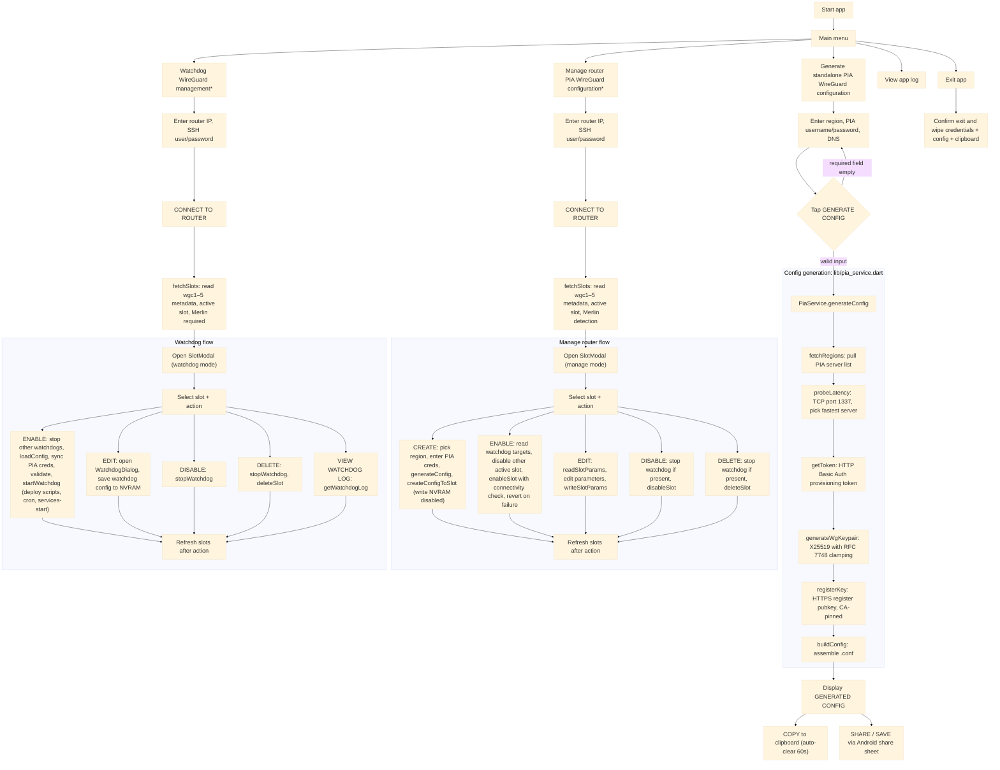

# ARCHITECTURE.md

- [1. How it works](#1-how-it-works)
- [2. App processing flow](#2-app-processing-flow)
  - [2.1. Overview](#21-overview)
  - [2.2. Detail](#22-detail)
- [3. Router WireGuard NVRAM fields](#3-router-wireguard-nvram-fields)
  - [3.1. Field reference](#31-field-reference)
  - [3.2. Stock `vpnc_clientlist`](#32-stock-vpnc_clientlist)
- [4. Wireguard SSH commands](#4-wireguard-ssh-commands)
  - [4.1. Merlin](#41-merlin)
  - [4.2. Stock](#42-stock)
    - [4.2.1 Create and enable a slot](#421-create-and-enable-a-slot)
    - [4.2.2 Enable existing slot](#422-enable-existing-slot)
    - [4.2.3 Stop/Disable](#423-stopdisable)
    - [4.2.4 Delete](#424-delete)
- [5. Watchdog details](#5-watchdog-details)
  - [5.1. Shell script](#51-shell-script)
  - [5.2. Cron entries](#52-cron-entries)
  - [5.3. Watchdog NVRAM fields](#53-watchdog-nvram-fields)
  - [5.4. Sample `cfg-pia-wg` output](#54-sample-cfg-pia-wg-output)
- [6. Network traffic](#6-network-traffic)
- [7. Output \& session destruction](#7-output--session-destruction)
- [8. Build provenance (the About screen)](#8-build-provenance-the-about-screen)
  - [8.1. The channel](#81-the-channel)
  - [8.2. Where each field comes from](#82-where-each-field-comes-from)
  - [8.3. Gradle-side notes](#83-gradle-side-notes)
  - [8.4. GNU licence text](#84-gnu-licence-text)

## 1. How it works

The provisioning logic in `lib/pia_service.dart` is a direct Dart translation of the command line version's [Go code](https://github.com/ExponentiallyDigital/pia-wireguard-cfg/blob/main/main.go), implementing the same steps in the same order:

1. **Server discovery**: pulls the complete endpoints mapping directly from serverlist.piaservers.net/vpninfo/servers/v6. The payload splits at the first newline boundary to discard the payload block signature.
2. **Latency probes**: dispatches immediate TCP probes to port 1337 across regional candidate blocks to calculate routing latency.
3. **Session tokens**: challenges the central API through a standard POST request over TLS, securing an execution token from basic user parameters.
4. **Keypair issuance**: generate WireGuard (WG) keypair using X25519 with RFC 7748 scalar clamping  
   (k[0] &= 248, k[31] &= 127, k[31] |= 64)
5. **Secure registration**: submits the dynamic public key configuration to the chosen low-latency endpoint via an HTTPS API (port 1337). The step utilises the dynamically resolved PIA root certificate, matching the specific Common Name (CN) mapping fields rather than raw IP routing addresses. The certificate is not hardcoded, so that it stays current when PIA rotates it.
6. **Config assembly**: transforms payload metadata returns into localised .conf specifications utilising Unix line endings (\n) for cross-compatibility.

---

## 2. <a name='Appprocessingflow'></a>App processing flow


```mermaid
graph TD
%%{init: {
  'theme': 'base',
  'themeVariables': {
    'fontSize': '24px'
  },
  'flowchart': {
    'subGraphTitleMargin': { 'top': 1,
    'bottom': 15}
  }
}}%%
    A["Start app"] --> B["Main menu"]
    B --> C["Generate standalone PIA WireGuard configuration"]
    B --> D["Manage router PIA WireGuard configuration*"]
    B --> E["Watchdog WireGuard management*"]
    B --> F["View app log"]
    B --> G["Exit app"]

    C --> H["Enter region, PIA username/password, DNS"]
    H --> I{"Tap GENERATE CONFIG"}
    I -->|"required field empty"| H
    I -->|"valid input"| J["PiaService.generateConfig"]

    subgraph GEN["Config generation: lib/pia_service.dart"]
        J --> J1["fetchRegions: pull PIA server list"]
        J1 --> J2["probeLatency: TCP port 1337, pick fastest server"]
        J2 --> J3["getToken: HTTP Basic Auth provisioning token"]
        J3 --> J4["generateWgKeypair: X25519 with RFC 7748 clamping"]
        J4 --> J5["registerKey: HTTPS register pubkey, CA-pinned"]
        J5 --> J6["buildConfig: assemble .conf"]
    end

    J6 --> K["Display GENERATED CONFIG"]
    K --> L["COPY to clipboard (auto-clear 60s)"]
    K --> M["SHARE / SAVE via Android share sheet"]

    D --> D1["Enter router IP, SSH user/password"]
    D1 --> D2["CONNECT TO ROUTER"]
    D2 --> D3["fetchSlots: read wgc1–5 metadata, active slot, Merlin detection"]
    D3 --> D4["Open SlotModal (manage mode)"]

    subgraph MGR["Manage router flow"]
      D4 --> D5["Select slot + action"]
      D5 --> D5a["CREATE: pick region, enter PIA creds, generateConfig, createConfigToSlot (write NVRAM disabled)"]
      D5 --> D5b["ENABLE: read watchdog targets, disable other active slot, enableSlot with connectivity check, revert on failure"]
      D5 --> D5c["EDIT: readSlotParams, edit parameters, writeSlotParams"]
      D5 --> D5d["DISABLE: stop watchdog if present, disableSlot"]
      D5 --> D5e["DELETE: stop watchdog if present, deleteSlot"]
      D5a --> D5f["Refresh slots after action"]
      D5b --> D5f
      D5c --> D5f
      D5d --> D5f
      D5e --> D5f
    end

    E --> E1["Enter router IP, SSH user/password"]
    E1 --> E2["CONNECT TO ROUTER"]
    E2 --> E3["fetchSlots: read wgc1–5 metadata, active slot, Merlin required"]
    E3 --> E4["Open SlotModal (watchdog mode)"]

    subgraph WD["Watchdog flow"]
      E4 --> E5["Select slot + action"]
      E5 --> E5a["ENABLE: stop other watchdogs, loadConfig, sync PIA creds, validate, startWatchdog (deploy scripts, cron, services-start)"]
      E5 --> E5b["EDIT: open WatchdogDialog, save watchdog config to NVRAM"]
      E5 --> E5c["DISABLE: stopWatchdog"]
      E5 --> E5d["DELETE: stopWatchdog, deleteSlot"]
      E5 --> E5e["VIEW WATCHDOG LOG: getWatchdogLog"]
      E5a --> E5f["Refresh slots after action"]
      E5b --> E5f
      E5c --> E5f
      E5d --> E5f
      E5e --> E5f
    end

    G --> R["Confirm exit and wipe credentials + config + clipboard"]
```

> [!NOTE]
> WireGuard configuration is backed up before any destructive/configuration activity, and restored if any issue is detected.

### 2.1. Overview

When you select a PIA region and push it to your router, the app connects directly to your router over your home network and switches your VPN tunnel to the new location.

It first checks whether a VPN tunnel is already running, stops it cleanly, writes the new VPN server details into the router's permanent memory, and then starts the new tunnel. The app watches the router until it confirms the tunnel is active, then checks that internet traffic is actually flowing through it by verifying the public IP address your router is using. If anything goes wrong at any point, the app restores the router to the state it was in before you started.

### 2.2. Detail

The push operation establishes an SSH session to the router and uses `wg show interfaces` to detect any currently active WireGuard client slot.

- If an existing slot config is present in NVRAM, the current `wgcN_*` keys are backed up before any changes are made.
- The active tunnel is stopped by disabling its `enforce` and `enable` NVRAM flags, committing, then issuing `service "stop_wgc N"; service start_vpnrouting0` targeted at that slot.
- The new NVRAM configuration is written for the target slot. `ep_addr_r` and `rip` are explicitly cleared since these are populated dynamically by the firmware after tunnel establishment.
- After a nvram commit, the new tunnel is started via `service "restart_wgc N"; service start_vpnrouting0`.
- The app then polls `wg show interfaces` to confirm the interface is active, followed by pinging the user supplied ping targets (defaults to 8.8.8.8 & 1.1.1.1) through the tunnel to confirm routed connectivity.
- If the ping fails, a recovery block restores and re-enables the previously active slot.

## 3. <a name='RouterWireGuardNVRAMfields'></a>Router WireGuard NVRAM fields

Merlin exposes 17 nvram fields per WireGuard slot, stock exposes 12.

### 3.1. Field reference

| Field | Merlin | Stock | Default | Description |
|---|:-:|:-:|---|---|
| `wgcN_addr` | Yes | Yes | – | Local tunnel IP address assigned by the VPN server, in CIDR notation (e.g. `10.1.2.3`). |
| `wgcN_aips` | Yes | Yes | `0.0.0.0/0` | Allowed IP addresses. |
| `wgcN_alive` | Yes | Yes | `25` (seconds) | Persistent keepalive interval. |
| `wgcN_desc` | Yes | **No** | – | Slot's PIA region name. Must match the actual PIA region name for the watchdog function to operate. |
| `wgcN_dns` | Yes | Yes | `"9.9.9.9, 149.112.112.112"` | Two DNS servers to use, actual values are set in the cfg-pia-wg app. |
| `wgcN_enable` | Yes | Yes | – | `1` enables this slot, `0` disables it. |
| `wgcN_enforce` | Yes | **No** | – | `1` enables the killswitch on this slot, `0` disables it. Blocks routed clients if the tunnel goes down. Stock exposes no UI to alter this - when running on stock this field will be ignored. |
| `wgcN_ep_addr` | Yes | Yes | – | FQDN or public IP of the remote PIA WireGuard peer endpoint. |
| `wgcN_ep_addr_r` | Yes | Yes | – | Resolved numeric IP if `wgcN_ep_addr` is a DNS name (identical value if `wgcN_ep_addr` is already an IP). Set when the interface initialises. |
| `wgcN_ep_port` | Yes | Yes | `1337` | Endpoint port. |
| `wgcN_fw` | Yes | **No** | – | `1` enables the inbound firewall on this slot, `0` disables it. |
| `wgcN_mtu` | Yes | Yes | `1420` | Maximum transmission unit. |
| `wgcN_nat` | Yes | Yes | – | `1` enables NAT, `0` disables it. |
| `wgcN_ppub` | Yes | Yes | – | PIA VPN server public key. |
| `wgcN_priv` | Yes | Yes | – | PIA user's private key. |
| `wgcN_psk` | Yes | Yes | – | Reserved for a preshared key, not used by PIA. |
| `wgcN_rip` | Yes | **No** | – | Router's current external public IP address as seen by the internet. |

**Note: `wgcN_alive`:** Merlin sets this to 25 by default. Stock only defaults to 25 if the field is not explicitly set; the field itself is otherwise optional.

### 3.2. Stock `vpnc_clientlist`

On stock firmware, several WireGuard slot parameters are consolidated into a single nvram setting, `vpnc_clientlist`, rather than being stored as individual `wgcN_` values. This setting is a delimited string holding up to five VPN profiles, one per slot.

**Delimiters:**

- Records (profiles) are separated by `<`. The first record has no leading delimiter; each subsequent record is prefixed by `<`.
- Fields within a record are separated by `>`.

**Field schema** (applies to every record):

| Index | Field        | Meaning                                   |
| :---: | ------------ | ----------------------------------------- |
|   0   | description  | slot description (set to PIA region name) |
|   1   | protocol     | always `WireGuard`                        |
|   2   | slot number  | maps to `wgcN_` (e.g. `5` = `wgc5_`)      |
|   3   | vpn username | ignore                                    |
|   4   | vpn password | ignore, WebUI sets to router admin pwd    |
|   5   | vpn state    | `1` = active, `0` = disabled              |
|   6   | vpnc_idx     | `10 - slot number`, maps to `vpncN_*`     |
|   7   | region       | ignore, always empty, purpose unconfirmed |
|   8   | conn type    | ignore, always empty, purpose unconfirmed |
|   9   | tunnel       | always `0`, purpose unconfirmed           |
|  10   | wan_idx      | always `0`, purpose unconfirmed           |
|  11   | source       | created by GUI = `Web`, app = `cfg-pia-wg`|

**Worked example:**

```text
$nvram show vpnc_clientlist
pia-aus_melbourne>WireGuard>5>>password>1>5>>>0>0>cfg-pia-wg<pia-aus>WireGuard>4>>password>0>6>>>0>0>cfg-pia-wg<pia-au_brisbane-pf>WireGuard>3>>password>0>7>>>0>0>cfg-pia-wg<pia-au_adelaide-pf>WireGuard>2>>password>0>8>>>0>0>cfg-pia-wg<pia-aus_perth>WireGuard>1>>password>0>9>>>0>0>cfg-pia-wg
```

| Index | Web UI slot 1     | Web UI slot 2 | Web UI slot 3      | Web UI slot 4      | Web UI slot 5 |
| :---: | ----------------- | ------------- | ------------------ | ------------------ | ------------- |
|   0   | pia-aus_melbourne | pia-aus       | pia-au_brisbane-pf | pia-au_adelaide-pf | pia-aus_perth |
|   1   | WireGuard         | WireGuard     | WireGuard          | WireGuard          | WireGuard     |
|   2   | 5                 | 4             | 3                  | 2                  | 1             |
|   3   | –                 | –             | –                  | –                  | –             |
|   4   | password          | password      | password           | password           | password      |
|   5   | 1                 | 0             | 0                  | 0                  | 0             |
|   6   | 5                 | 6             | 7                  | 8                  | 9             |
|   7   | –                 | –             | –                  | –                  | –             |
|   8   | –                 | –             | –                  | –                  | –             |
|   9   | 0                 | 0             | 0                  | 0                  | 0             |
|  10   | 0                 | 0             | 0                  | 0                  | 0             |
|  11   | cfg-pia-wg        | cfg-pia-wg    | cfg-pia-wg         | cfg-pia-wg         | cfg-pia-wg    |

## 4. Wireguard SSH commands

To manage Wireguard Merlin uses VPN Director, stock ASUS uses VPN Fusion. These are similar but different: using nvram settings to store configuration parameters, but differs in how these are applied and used. There's scant reference detail I could find on how stock officially manages things and a **lot** more by having access to Merlin's source code, so the below is my understanding which may be incorrect and have gaps.

### 4.1. Merlin

Operations are performed by setting nvram fields on specific slots and making calls with service commands...

`<************** PLACEHOLDER - add full details here **************>`

### 4.2. Stock

VPN Fusion abstracts the underlying per slot calls to manipulate WG VPNs. Parse the slot from `vpnc_client_list` and set the `vpnc_unit` to be acted on, then exec the `service` command:

```text
        vpnc_clientlist
              │
              ├── parse profile
              │    ├── protocol = WireGuard
              │    ├── slot = N
              │    └── ...
              │
             set
    vpnc_unit=(5 - slot)
              │
              ▼
            exec
  stop_vpnc OR restart_vpnc
              │
              ▼
          VPN Fusion
              │
              ▼
             wgc5
```

In the above, wgc5 is vpnc_unit 0 (wgc4 is unit 1, wgc3 is unit 2 etc).

#### 4.2.1 Create and enable a slot

Creating the first slot in the WebUI adds the below keys and populates settings.

The below examples are for `wgc5`, which is the first WG VPN created. **NB** the first slot created is numbered `5` and the last is `1`.

  1. set `wgcN_*` values:

  ```bash
  # Primary keys
  wgc5_addr=10.119.0.18/32          # local tunnel IP address assigned by the VPN server
  wgc5_aips=0.0.0.0/0               # allowed IP addresses
  wgc5_alive=25                     # tunnel keep alive in seconds
  wgc5_dns=9.9.9.9,149.112.112.112  # two DNS servers
  wgc5_enable=1                     # 1=enable, 0=disable
  wgc5_ep_addr=45.130.141.215       # FQDN or public IP of the remote PIA WireGuard peer endpoint
  wgc5_ep_addr_r=45.130.141.215     # resolved numeric IP if `wgcN_ep_addr` is a DNS name; set when the interface initialises
  wgc5_ep_port=1337                 # end point port; PIA WG uses port 1337
  wgc5_mtu=                         # maximum transmission unit, picked up from the conf file that created this slot (defaults to??)
  wgc5_nat=1                        # 1=enable, 0=disabled
  wgc5_ppub=PUBLIC_KEY              # PIA VPN server public key
  wgc5_priv=PRIVATE_KEY             # PIA user's private key
  wgc5_psk=                         # preshared key, not used by PIA.
  
  # VPN Fusion keys - do these get created for us?
  vpnc5_dns=9.9.9.9 149.112.112.112 # DNS servers, set when slot is enabled, unset when disabled
  vpnc5_dut_disc=5                  # unknown, unset when slot is enabled, when disabled this is the slot #
  vpnc5_sbstate_t=0                 # unknown
  vpnc5_state_t=2                   # unknown
  vpnc_unit=0                       # the unit being acted on where 0=wgc5, 1=wgc4, 2=wgc3, 3=wgc2, 4=wgc1; retains last set value.
  ```

  2. `vpnc_clientlist` is created and contains

  ```bash
  pia-aus_melbourne>WireGuard>5>>ROUTER_ADMIN_PWD>1>5>>>0>0>Web
  ```

  3. exec `service restart_vpnc`

#### 4.2.2 Enable existing slot

  1. set `wgc5_enable=1`
  2. set `vpnc_unit=0` where `N` is `0`=wgc5, `1`=wgc4, `2`=wgc3, `3`=wgc2, `4`=wgc1
  3. set `vpnc_clientlist` field 6 (vpn state) to `1` (active)
  4. exec `service restart_vpnc`

  `service restart_default_wan` is run by the UI when "apply to all devices" is enabled/disabled.

There is **no** `start_vpnc` command.

#### 4.2.3 Stop/Disable

  1. set `wgcN_enable=0`
  2. set `vpnc_unit=N` where `N` is `0`=wgc5, `1`=wgc4, `2`=wgc3, `3`=wgc2, `4`=wgc1
  3. set `vpnc_clientlist` field 6 (vpn state) to `0` (disabled)
  4. exec `service stop_vpnc`

#### 4.2.4 Delete

Deleting a slot set to `apply to all devices` executes

```bash
service restart_default_wan
service restart_vpnc_dev_policy
```

Deleting the last WG slot executes

```bash
service restart_vpnc_dev_policy
```

`<************** PLACEHOLDER **************>`
ARE THE BELOW SET BY VPN FUSION CALLS?

 `vpncN_*` values are

  ```bash
  vpnc5_dut_disc=5   # retained after reboot
  vpnc5_sbstate_t=0  # removed after reboot
  vpnc5_state_t=2    # removed after reboot

`wgcN_*` are **not** removed when a profile is deleted.
```

---•

## 5. <a name='Watchdogdetails'></a>Watchdog details

Enabling the watchdog deploys

`<************** PLACEHOLDER - update with stock details **************>`

1. a slot-specific shell script `/jffs/scripts/watchdog_wgcN.sh`
2. cron entries via `/jffs/scripts/services-start`.

### 5.1. <a name='Shellscript'></a>Shell script

The shell script checks connectivity via the VPN tunnel on a periodic basis using two ping targets

- `8.8.8.8` (Google)
- `1.1.1.1` (Cloudflare)

If connectivity fails, the interface is reconfigured with back off.

### 5.2. <a name='Cronentries'></a>Cron entries

A `cru` (`crontab`) entry drives the configurable periodic health check. An additional job rotates the watchdog router log file at midnight. To avoid filling the JFFS partition, all logging is stored in `/tmp`. Watchdog logs do not persist after a reboot or power loss.

```bash
*/5 * * * * /jffs/scripts/watchdog_wgc1.sh #watchdog_wgc1#
0 0 * * * mv /tmp/watchdog_wgc1.log /tmp/watchdog_wgc1.log.old && touch /tmp/watchdog_wgc1.log #watchdog_log_rotate_wgc1#
```

### 5.3. <a name='WatchdogNVRAMfields'></a>Watchdog NVRAM fields

All watchdog configuration is stored on your router's NVRAM. Defaults are as follows:

```bash
# slot specific
wgcN_wd_check_interval=5
wgcN_wd_email_enabled=0
wgcN_wd_email_from=
wgcN_wd_email_subject=cfg-pia-wg alert
wgcN_wd_email_to=
wgcN_wd_primary_ip=8.8.8.8
wgcN_wd_secondary_ip=1.1.1.1
wgcN_wd_smtp_pass=
wgcN_wd_smtp_server=
wgcN_wd_smtp_user=
# global
cfg-pia-wg_password=
cfg-pia-wg_user=
```

(where `N` is the slot number 1-5)

### 5.4. Sample `cfg-pia-wg` output

Standalone configuration file, suitable for importing into various WireGuard clients/routers:

```none
[Interface]
PrivateKey = <freshly generated private key>
Address    = <client IP/32 assigned by PIA>
DNS        = 9.9.9.9, 149.112.112.112
MTU        = 1420

[Peer]
PublicKey           = <server public key from PIA>
Endpoint            = <server IP:port from PIA>
PersistentKeepalive = 25
AllowedIPs          = 0.0.0.0/0
```

---

## 6. <a name='Networktraffic'></a>Network traffic

Below are detailed representations of the app's network calls, with illustrative, not real, IP addresses.

.svg>)

.svg>)

---

## 7. <a name='Outputsessiondestruction'></a>Output & session destruction

Generated configuration data is managed via:

- **Ephemeral verification:** displayed on-screen inside a text viewport for visual validation.
- **Transient streaming:** shareable using Android's system share sheet (e.g., via "Save to Files" or encrypted side-channels).
- **Clipboard sanitisation:** tapping **COPY** invokes a 60-second timer that clears the clipboard storage space automatically.
- **Application exit:** all application exit paths flush credentials and scrub configs from memory before application shutdown.

---

## 8. <a name='BuildprovenancetheAboutscreen'></a>Build provenance (the About screen)

`lib/screens/about_screen.dart` exists so a bug reportor can identify which binary is running. Displays the commit, branch/tag, CI run, build type, and install source.

### 8.1. <a name='Thechannel'></a>The channel

`com.exponentiallydigital.pia_wireguard_cfga/build_info`, registered in `MainActivity.configureFlutterEngine` and answering a single method, `getBuildInfo`, with a flat `Map<String, String>`.

Everything is a `String` deliberately: a uniform map crosses `StandardMessageCodec` without mixed-type surprises and needs no per-key casting in `lib/build_info_service.dart`. Any field the host cannot determine comes back as the literal `unknown` rather than null.

`loadBuildInfo()` handles `MissingPluginException` and `PlatformException`, returning `BuildInfo.unknown()`. With `flutter test` no native side is registered, so every test takes that path.

### 8.2. <a name='Whereeachfieldcomesfrom'></a>Where each field comes from

| Field | Source |
| --- | --- |
| `versionName`, `buildNumber` | `PackageManager` at runtime (`longVersionCode` on API 28+) |
| `installer` | `getInstallSourceInfo()` on API 30+, else `getInstallerPackageName()`; mapped to a friendly label, falling back to the raw package name |
| `buildType` | `BuildConfig.BUILD_TYPE` is AGP-generated; can be `debug`, `profile` (Flutter adds it) or `release` |
| `cpuAbi` | `Build.SUPPORTED_ABIS[0]` is the *device's* preferred ABI, since `flutter build apk` ships a universal APK |
| `osVersion` | `RELEASE_OR_CODENAME` on API 30+, else `RELEASE`, plus `SDK_INT` |
| `buildTimestamp`, `commitHash`, `commitDate`, `gitBranch`, `runnerId`, `compileSdk`, `kotlinVersion` | `BuildConfig`, injected by `android/app/build.gradle.kts` at configuration time |

### 8.3. <a name='Gradle-sidenotes'></a>Gradle-side notes

`buildFeatures { buildConfig = true }` is required, AGP 8+ defaults it to `false`, and AGP 9 removed the `android.defaults.buildfeatures.buildconfig` escape hatch. Once enabled, AGP generates `DEBUG`, `APPLICATION_ID`, `BUILD_TYPE`, `VERSION_CODE` and `VERSION_NAME` itself; only the seven custom fields are declared by hand.

- **git** runs through `providers.exec` (a raw `ProcessBuilder` would be a configuration-cache violation) as `git -C <android/>`, so it never depends on the daemon's working directory. Every failure path: git absent from `PATH`, no `.git` in a source tarball, degrades to `unknown` instead of failing the build.
- **`gitBranch`** prefers `GITHUB_REF_NAME` and rejects a literal `HEAD` from the git fallback: `release.yml` triggers on tag pushes, which leaves a detached HEAD where `rev-parse --abbrev-ref` returns `HEAD`, never the tag.
- **`buildTimestamp`** is wall-clock at configuration time, which means `GenerateBuildConfig` is never up to date and every build recompiles and repackages the app module. That is an accepted trade for exact build provenance; `GIT_COMMIT_DATE` is delivered alongside it as a reproducible cross-check.
- **`kotlinVersion`** comes from `getKotlinPluginVersion()`, falling back to `KotlinBasePlugin.pluginVersion`. The Kotlin plugin is deliberately *not* added to the app's `plugins {}` block as Flutter's Gradle plugin applies it, and declaring it again makes Flutter log an AGP-9 migration warning at error level on every build.
- **`buildConfigField`'s value is emitted verbatim** into `BuildConfig.java`, so `javaStringLiteral()` escapes every string. These values come from git and the environment: a branch named `foo"bar` would otherwise produce uncompilable generated Java.
- No new dependencies, so the STRICT `gradle.lockfile` set is untouched. This is also why the Kotlin side hand-rolls the `longVersionCode` branch rather than using `androidx.core`'s `PackageInfoCompat`.

### 8.4. <a name='Thelicencetext'></a>GNU licence text

`lib/license_text.dart` holds `./LICENSE` a verbatim raw-string constant, generated at development time, not loaded at runtime and not registered as an asset.

---
