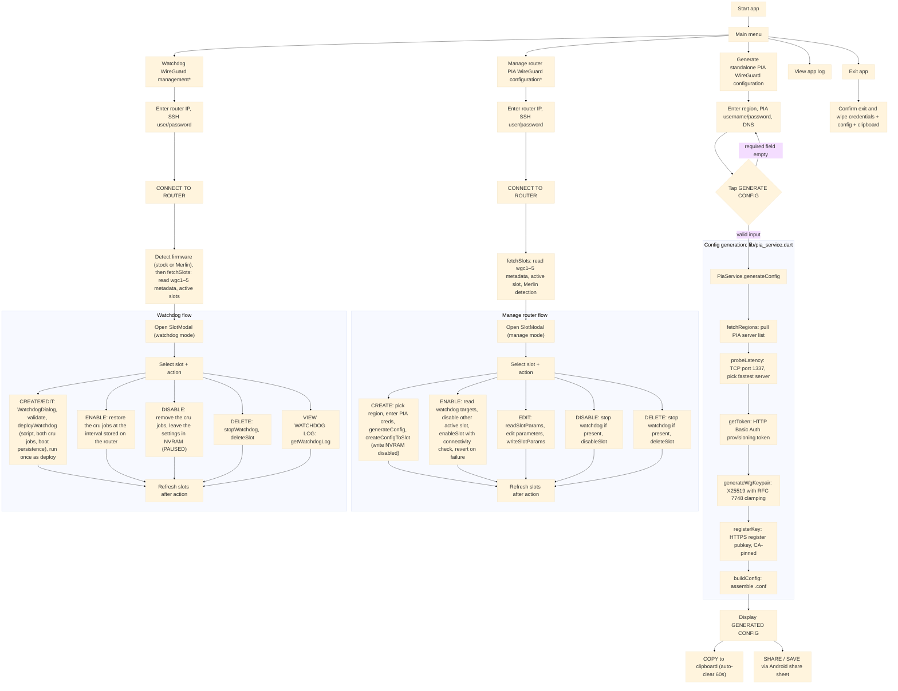

# ARCHITECTURE.md

- [1. How it works](#1-how-it-works)
- [2. App processing flow](#2-app-processing-flow)
  - [2.1. Overview](#21-overview)
  - [2.2. Detail](#22-detail)
- [3. Router WireGuard NVRAM fields](#3-router-wireguard-nvram-fields)
  - [3.1. Field reference](#31-field-reference)
  - [3.2. Stock `vpnc_clientlist`](#32-stock-vpnc_clientlist)
- [4. Wireguard SSH commands](#4-wireguard-ssh-commands)
  - [4.1. Merlin](#41-merlin)
    - [4.1.1. Enable](#411-enable)
    - [4.1.2. Disable](#412-disable)
    - [4.1.3. Delete](#413-delete)
    - [4.1.4. What only Merlin has](#414-what-only-merlin-has)
    - [4.1.5. Firmware detection](#415-firmware-detection)
  - [4.2. Stock](#42-stock)
    - [4.2.1 Create and enable a slot](#421-create-and-enable-a-slot)
    - [4.2.2 Enable existing slot](#422-enable-existing-slot)
    - [4.2.3 Stop/Disable](#423-stopdisable)
    - [4.2.4 Delete](#424-delete)
    - [4.2.5 VPN Fusion](#425-vpn-fusion)
- [5. Watchdog details](#5-watchdog-details)
  - [5.1. Shell script](#51-shell-script)
    - [5.1.1. Backoff](#511-backoff)
    - [5.1.2. Email alerting](#512-email-alerting)
  - [5.2. Cron entries](#52-cron-entries)
  - [5.3. Watchdog NVRAM fields](#53-watchdog-nvram-fields)
  - [5.4. Sample `cfg-pia-wg` output](#54-sample-cfg-pia-wg-output)
- [6. Network traffic](#6-network-traffic)
- [7. Output \& session destruction](#7-output--session-destruction)
- [8. Build provenance (the About screen)](#8-build-provenance-the-about-screen)
  - [8.1. The channel](#81-the-channel)
  - [8.2. Where each field comes from](#82-where-each-field-comes-from)
  - [8.3. Gradle-side notes](#83-gradle-side-notes)
  - [8.4. GNU licence text](#84-gnu-licence-text)

## 1. How it works

The provisioning logic in `lib/pia_service.dart` is a direct Dart translation of the command line version's [Go code](https://github.com/ExponentiallyDigital/pia-wireguard-cfg/blob/main/main.go), implementing the same steps in the same order:

1. **Server discovery**: pulls the complete endpoints mapping directly from serverlist.piaservers.net/vpninfo/servers/v6. The payload splits at the first newline boundary to discard the payload block signature.
2. **Latency probes**: dispatches immediate TCP probes to port 1337 across regional candidate blocks to calculate routing latency.
3. **Session tokens**: challenges the central API through a standard POST request over TLS, securing an execution token from basic user parameters.
4. **Keypair issuance**: generate WireGuard (WG) keypair using X25519 with RFC 7748 scalar clamping  
   (k[0] &= 248, k[31] &= 127, k[31] |= 64)
5. **Secure registration**: submits the dynamic public key configuration to the chosen low-latency endpoint via an HTTPS API (port 1337). The step utilises the dynamically resolved PIA root certificate, matching the specific Common Name (CN) mapping fields rather than raw IP routing addresses. The certificate is not hardcoded, so that it stays current when PIA rotates it.
6. **Config assembly**: transforms payload metadata returns into localised .conf specifications utilising Unix line endings (\n) for cross-compatibility.

---

## 2. <a name='Appprocessingflow'></a>App processing flow


```mermaid
graph TD
%%{init: {
  'theme': 'base',
  'themeVariables': {
    'fontSize': '24px'
  },
  'flowchart': {
    'subGraphTitleMargin': { 'top': 1,
    'bottom': 15}
  }
}}%%
    A["Start app"] --> B["Main menu"]
    B --> C["Generate standalone PIA WireGuard configuration"]
    B --> D["Manage router PIA WireGuard configuration*"]
    B --> E["Watchdog WireGuard management*"]
    B --> F["View app log"]
    B --> G["Exit app"]

    C --> H["Enter region, PIA username/password, DNS"]
    H --> I{"Tap GENERATE CONFIG"}
    I -->|"required field empty"| H
    I -->|"valid input"| J["PiaService.generateConfig"]

    subgraph GEN["Config generation: lib/pia_service.dart"]
        J --> J1["fetchRegions: pull PIA server list"]
        J1 --> J2["probeLatency: TCP port 1337, pick fastest server"]
        J2 --> J3["getToken: HTTP Basic Auth provisioning token"]
        J3 --> J4["generateWgKeypair: X25519 with RFC 7748 clamping"]
        J4 --> J5["registerKey: HTTPS register pubkey, CA-pinned"]
        J5 --> J6["buildConfig: assemble .conf"]
    end

    J6 --> K["Display GENERATED CONFIG"]
    K --> L["COPY to clipboard (auto-clear 60s)"]
    K --> M["SHARE / SAVE via Android share sheet"]

    D --> D1["Enter router IP, SSH user/password"]
    D1 --> D2["CONNECT TO ROUTER"]
    D2 --> D3["fetchSlots: read wgc1–5 metadata, active slot, Merlin detection"]
    D3 --> D4["Open SlotModal (manage mode)"]

    subgraph MGR["Manage router flow"]
      D4 --> D5["Select slot + action"]
      D5 --> D5a["CREATE: pick region, enter PIA creds, generateConfig, createConfigToSlot (write NVRAM disabled)"]
      D5 --> D5b["ENABLE: read watchdog targets, disable other active slot, enableSlot with connectivity check, revert on failure"]
      D5 --> D5c["EDIT: readSlotParams, edit parameters, writeSlotParams"]
      D5 --> D5d["DISABLE: stop watchdog if present, disableSlot"]
      D5 --> D5e["DELETE: stop watchdog if present, deleteSlot"]
      D5a --> D5f["Refresh slots after action"]
      D5b --> D5f
      D5c --> D5f
      D5d --> D5f
      D5e --> D5f
    end

    E --> E1["Enter router IP, SSH user/password"]
    E1 --> E2["CONNECT TO ROUTER"]
    E2 --> E3["Detect firmware (stock or Merlin), then fetchSlots: read wgc1–5 metadata, active slots"]
    E3 --> E4["Open SlotModal (watchdog mode)"]

    subgraph WD["Watchdog flow"]
      E4 --> E5["Select slot + action"]
      E5 --> E5a["CREATE/EDIT: WatchdogDialog, validate, deployWatchdog (script, both cru jobs, boot persistence), run once as deploy"]
      E5 --> E5b["ENABLE: restore the cru jobs at the interval stored on the router"]
      E5 --> E5c["DISABLE: remove the cru jobs, leave the settings in NVRAM (PAUSED)"]
      E5 --> E5d["DELETE: stopWatchdog, deleteSlot"]
      E5 --> E5e["VIEW WATCHDOG LOG: getWatchdogLog"]
      E5a --> E5f["Refresh slots after action"]
      E5b --> E5f
      E5c --> E5f
      E5d --> E5f
      E5e --> E5f
    end

    G --> R["Confirm exit and wipe credentials + config + clipboard"]
```

> [!NOTE]
> WireGuard configuration is backed up before any destructive/configuration activity, and restored if any issue is detected.

### 2.1. Overview

When you select a PIA region and push it to your router, the app connects directly to your router over your home network and switches your VPN tunnel to the new location.

It first checks whether a VPN tunnel is already running, stops it cleanly, writes the new VPN server details into the router's permanent memory, and then starts the new tunnel. The app watches the router until it confirms the tunnel is active, then checks that internet traffic is actually flowing through it by verifying the public IP address your router is using. If anything goes wrong at any point, the app restores the router to the state it was in before you started.

### 2.2. Detail

The push operation establishes an SSH session to the router and uses `wg show interfaces` to detect any currently active WireGuard client slot.

- If an existing slot config is present in NVRAM, the current `wgcN_*` keys are backed up before any changes are made.
- The active tunnel is stopped by disabling its `enforce` and `enable` NVRAM flags, committing, then issuing `service "stop_wgc N"; service start_vpnrouting0` targeted at that slot.
- The new NVRAM configuration is written for the target slot. `ep_addr_r` and `rip` are explicitly cleared since these are populated dynamically by the firmware after tunnel establishment.
- After a nvram commit, the new tunnel is started via `service "restart_wgc N"; service start_vpnrouting0`.
- The app then polls `wg show interfaces` to confirm the interface is active, followed by pinging the user supplied ping targets (defaults to 8.8.8.8 & 1.1.1.1) through the tunnel to confirm routed connectivity.
- If the ping fails, a recovery block restores and re-enables the previously active slot.

## 3. <a name='RouterWireGuardNVRAMfields'></a>Router WireGuard NVRAM fields

Merlin exposes 17 nvram fields per WireGuard slot, stock exposes 12.

Alongside the per-slot fields, the app keeps a handful of **global** `cfg_pia_wg_*` fields that are not tied to a slot. Every NVRAM variable the app writes must be described here.

| Field                      | Written by                          | Default      | Description                                                                                                                                                                                                               |
| -------------------------- | ----------------------------------- | ------------ | ------------------------------------------------------------------------------------------------------------------------------------------------------------------------------------------------------------------------- |
| `cfg_pia_wg_user`          | Watchdog deploy                     | –            | Your PIA username. Needed on the router because the watchdog re-authenticates with PIA unattended; stored in plaintext (see SECURITY.md).                                                                                 |
| `cfg_pia_wg_password`      | Watchdog deploy                     | –            | Your PIA password, same reasoning and same caveat.                                                                                                                                                                        |
| `cfg_pia_wg_sdate`         | First watchdog deploy or test email | today's date | `yyyy-mm-dd` the app first configured this router. Reported as the "Since ..." date in the HISTORY section of every alert email, so the counters below have a period to be counted over. Seeded once and never rewritten. |
| `cfg_pia_wg_reconfig_ok`   | Watchdog script                     | `0`          | Lifetime count of successful re-configurations, across all slots. Incremented by the deployed script when a tunnel is rebuilt.                                                                                            |
| `cfg_pia_wg_reconfig_fail` | Watchdog script                     | `0`          | Lifetime count of failed re-configuration attempts, across all slots. Incremented when the script aborts.                                                                                                                 |

The two counters are committed once per alert, never per check: `nvram commit` writes flash, and a tunnel that is broken for hours would otherwise commit every cooldown.

### 3.1. Field reference

| Field            | Merlin | Stock  | Default                      | Description                                                                                                                                                                                                                                                                             |
| ---------------- | :----: | :----: | ---------------------------- | --------------------------------------------------------------------------------------------------------------------------------------------------------------------------------------------------------------------------------------------------------------------------------------- |
| `wgcN_addr`      |  Yes   |  Yes   | –                            | Local tunnel IP address assigned by the VPN server, in CIDR notation (e.g. `10.1.2.3`).                                                                                                                                                                                                 |
| `wgcN_aips`      |  Yes   |  Yes   | `0.0.0.0/0`                  | Allowed IP addresses.                                                                                                                                                                                                                                                                   |
| `wgcN_alive`     |  Yes   |  Yes   | `25` (seconds)               | Persistent keepalive interval.                                                                                                                                                                                                                                                          |
| `wgcN_desc`      |  Yes   | **No** | –                            | Slot's PIA region name, stored with a `pia-` prefix (e.g. `pia-aus_melbourne`) so the app's VPNs stand out among any others on the router. The watchdog strips the prefix (`REGION="${DESC#pia-}"`) before its region lookup, so the remainder must still match a real PIA region name. |
| `wgcN_dns`       |  Yes   |  Yes   | `"9.9.9.9, 149.112.112.112"` | Two DNS servers to use, actual values are set in the cfg-pia-wg app.                                                                                                                                                                                                                    |
| `wgcN_enable`    |  Yes   |  Yes   | –                            | `1` enables this slot, `0` disables it.                                                                                                                                                                                                                                                 |
| `wgcN_enforce`   |  Yes   | **No** | –                            | `1` enables the killswitch on this slot, `0` disables it. Blocks routed clients if the tunnel goes down. Stock exposes no UI to alter this - when running on stock this field will be ignored.                                                                                          |
| `wgcN_ep_addr`   |  Yes   |  Yes   | –                            | FQDN or public IP of the remote PIA WireGuard peer endpoint.                                                                                                                                                                                                                            |
| `wgcN_ep_addr_r` |  Yes   |  Yes   | –                            | Resolved numeric IP if `wgcN_ep_addr` is a DNS name (identical value if `wgcN_ep_addr` is already an IP). Set when the interface initialises.                                                                                                                                           |
| `wgcN_ep_port`   |  Yes   |  Yes   | `1337`                       | Endpoint port.                                                                                                                                                                                                                                                                          |
| `wgcN_fw`        |  Yes   | **No** | –                            | `1` enables the inbound firewall on this slot, `0` disables it.                                                                                                                                                                                                                         |
| `wgcN_mtu`       |  Yes   |  Yes   | `1420`                       | Maximum transmission unit.                                                                                                                                                                                                                                                              |
| `wgcN_nat`       |  Yes   |  Yes   | –                            | `1` enables NAT, `0` disables it.                                                                                                                                                                                                                                                       |
| `wgcN_ppub`      |  Yes   |  Yes   | –                            | PIA VPN server public key.                                                                                                                                                                                                                                                              |
| `wgcN_priv`      |  Yes   |  Yes   | –                            | PIA user's private key.                                                                                                                                                                                                                                                                 |
| `wgcN_psk`       |  Yes   |  Yes   | –                            | Reserved for a preshared key, not used by PIA.                                                                                                                                                                                                                                          |
| `wgcN_rip`       |  Yes   | **No** | –                            | Router's current external public IP address as seen by the internet.                                                                                                                                                                                                                    |

**Note: `wgcN_alive`:** Merlin sets this to 25 by default. Stock only defaults to 25 if the field is not explicitly set; the field itself is otherwise optional.

### 3.2. Stock `vpnc_clientlist`

On stock firmware, several WireGuard slot parameters are consolidated into a single nvram setting, `vpnc_clientlist`, rather than being stored as individual `wgcN_` values. This setting is a delimited string holding up to five VPN profiles, one per slot.

**Delimiters:**

- Records (profiles) are separated by `<`. The first record has no leading delimiter; each subsequent record is prefixed by `<`.
- Fields within a record are separated by `>`.

**Field schema** (applies to every record):

| Index | Field        | Meaning                                    |
| :---: | ------------ | ------------------------------------------ |
|   0   | description  | slot description (set to PIA region name)  |
|   1   | protocol     | always `WireGuard`                         |
|   2   | slot number  | maps to `wgcN_` (e.g. `5` = `wgc5_`)       |
|   3   | vpn username | ignore                                     |
|   4   | vpn password | ignore, WebUI sets to router admin pwd     |
|   5   | vpn state    | `1` = active, `0` = disabled               |
|   6   | vpnc_idx     | `10 - slot number`, maps to `vpncN_*`      |
|   7   | region       | ignore, always empty, purpose unconfirmed  |
|   8   | conn type    | ignore, always empty, purpose unconfirmed  |
|   9   | tunnel       | always `0`, purpose unconfirmed            |
|  10   | wan_idx      | always `0`, purpose unconfirmed            |
|  11   | source       | created by GUI = `Web`, app = `cfg-pia-wg` |

**Worked example:**

```text
$nvram show vpnc_clientlist
pia-aus_melbourne>WireGuard>5>>password>1>5>>>0>0>cfg-pia-wg<pia-aus>WireGuard>4>>password>0>6>>>0>0>cfg-pia-wg<pia-au_brisbane-pf>WireGuard>3>>password>0>7>>>0>0>cfg-pia-wg<pia-au_adelaide-pf>WireGuard>2>>password>0>8>>>0>0>cfg-pia-wg<pia-aus_perth>WireGuard>1>>password>0>9>>>0>0>cfg-pia-wg
```

| Index | Web UI slot 1     | Web UI slot 2 | Web UI slot 3      | Web UI slot 4      | Web UI slot 5 |
| :---: | ----------------- | ------------- | ------------------ | ------------------ | ------------- |
|   0   | pia-aus_melbourne | pia-aus       | pia-au_brisbane-pf | pia-au_adelaide-pf | pia-aus_perth |
|   1   | WireGuard         | WireGuard     | WireGuard          | WireGuard          | WireGuard     |
|   2   | 5                 | 4             | 3                  | 2                  | 1             |
|   3   | –                 | –             | –                  | –                  | –             |
|   4   | password          | password      | password           | password           | password      |
|   5   | 1                 | 0             | 0                  | 0                  | 0             |
|   6   | 5                 | 6             | 7                  | 8                  | 9             |
|   7   | –                 | –             | –                  | –                  | –             |
|   8   | –                 | –             | –                  | –                  | –             |
|   9   | 0                 | 0             | 0                  | 0                  | 0             |
|  10   | 0                 | 0             | 0                  | 0                  | 0             |
|  11   | cfg-pia-wg        | cfg-pia-wg    | cfg-pia-wg         | cfg-pia-wg         | cfg-pia-wg    |

### 3.3. Device assignment (stock)

How stock binds a LAN device to a VPN profile, and the NVRAM lists involved. Measured on hardware 2026-09-06 and 2026-09-07 by diffing NVRAM either side of each WebUI action; see `.claude/plans/plan_vpn_device_assignments.md` for the method and for what is still unverified.

> [!NOTE]
> Every IP address, hostname and MAC address in this section is invented, including in the sample records. Real values are never recorded in this repository.

The app does not write any of this yet. It is documented here because it is the reference the feature is being built against, and because two of the keys - `vpnc_dev_policy_list` and `vpnc_default_wan` - are ones `scripts/clearall.sh` already touches.
### 3.3.1 `vpnc_default_wan`

An integer naming the VPN that unassigned devices use. It is **index 6 (0-based)** of that profile's `vpnc_clientlist` record - the same number the `vpncN_*` runtime keys are indexed by, not the slot number and not `vpnc_unit`.

```text
vpnc_default_wan=9
vpnc_clientlist=pia-aus_melbourne>WireGuard>1>>password>1>9>>>0>0>cfg-pia-wg
                                                            ^ index 6 = 9
```

So `vpnc_default_wan=9` means slot 1, `pia-aus_melbourne`. Confirm what `0` means (phase 0).

### 3.3.2 Shared format

`dhcp_staticlist` and `custom_clientlist` are both single NVRAM strings using `<` as the record separator and `>` as the field separator. Values are stored **percent-encoded** - the WebUI runs `decodeURIComponent()` on read - so names containing `<`, `>` or spaces come back escaped.

### 3.3.3 `dhcp_staticlist`

Four fields per record, always with a leading `<`:

```text
<MAC>IP>DNS>Hostname
```

| Idx | Field | Notes |
| ---: | --- | --- |
| 0 | MAC | Uppercase, colon separated |
| 1 | IP | The reserved lease |
| 2 | DNS | Per client DNS server, empty for most entries |
| 3 | Hostname | Optional, pushed into dnsmasq as the lease name |

Sample:

```text
<00:01:02:03:04:05>192.168.1.2>><05:04:03:02:01:00>192.168.1.30>>hostname2<FF:F0:E0:D0:C0:B0>192.168.1.40>>hostname5<0A:0B:0C:0D:0E:0F>192.168.1.60>>hostname6
```

Trailing fields are treated as empty if absent, so `<MAC>IP` alone is valid and the UI fills in `""` for DNS and hostname.

> [!NOTE]
> On 384.13 through the 386 branch, ASUS and Merlin briefly split hostnames into a separate `dhcp_hostnames` variable (`<MAC>hostname`). Current firmware is back on the reunified four-field layout, but any older script found on the forums may assume the split.

#### 3.3.3a Reserved or not - the distinction the screen needs

**Do not use the WebUI `IP Method` column as a design input.** It is not stable, and it does not mean what it appears to.

Observed 2026-09-07 on one network across a few hours, with no configuration change in between: the column first showed two values (`Automatic IP`, `MAC-IP Binding`) and later showed three, having reclassified some devices to `Static IP`. Those devices were **exactly the ones wired to an AiMesh node**, and none of them had a DHCP reservation - the LAN -> DHCP Server page listed only the four genuinely reserved devices throughout.

So `Static IP` is very unlikely to mean "this device is configured with a static address". The reading that fits the evidence is **"the router sees this address in use but has no current lease record binding it"** - which is what a client behind a mesh node looks like once the main router's view of that lease has aged or been relayed. That is an inference from one network, not a measurement.

What matters is the consequence, which does not depend on the inference being right:

- **A device can change `IP Method` on its own.** Anything derived from it would silently change with it.
- **`Static IP` does not imply a stable address.** Those devices are on ordinary DHCP leases; treating them as already-pinned would produce exactly the silent assignment decay this feature must avoid.

**Use `dhcp_staticlist` membership instead**, which is authoritative, stable, and the thing the firmware itself keys the reservation on:

| Test | Means | Assigning it |
| --- | --- | --- |
| MAC is in `dhcp_staticlist` | reserved, address pinned | cheap - no `dhcp_staticlist` write, so no whole-LAN bounce |
| MAC is not | ordinary lease, address can move | needs a reservation created first - the expensive path in 3.3.6 |

Two states, not three. On the measured network that is four devices cheap and six expensive, rather than the seven-and-three an `IP Method` reading would have suggested.

> [!CAUTION]
> **Devices behind an AiMesh node are seen differently by the main router - RESOLVED 2026-09-08, and it does not block assignment.**
>
> AiMesh nodes report their **wireless** clients up to the main router; a device on a node's **ethernet** port is bridged transparently and never registers as a mesh client. The kernel says so directly - `<MAC> not mesh client, can't update it's ip` - for exactly the wired-behind-node devices the WebUI also labelled `Static IP`. One phenomenon, two symptoms: the AiMesh client table has no IP binding for them, so the client-tracking code cannot label them and cannot update them.
>
> **The app's own sources are unaffected**, checked on hardware for a wired-behind-node device:
>
> | Source | Has it? |
> | --- | --- |
> | `/jffs/nmp_cl_json.js` | yes - `online: 1`, `wireless: 0`, and **no `ip` field at all** |
> | `/tmp/nmp_cache.js` | yes, with the IP and the user's name for it |
> | `/proc/net/arp` | yes, on `br0` |
>
> So such a device can be listed and assigned. It also confirms the two-source design in 2.1 is **necessary rather than tidy**: `nmp_cl_json.js` carries no address, so the IP has to come from `nmp_cache.js` for every device, not just these.
>
> The kernel messages themselves are cosmetic. They appear only in `dmesg`, never in `/tmp/syslog.log`, because `/proc/sys/kernel/printk` reads `5 4 1 7` - only priorities below 5 are forwarded, and these are informational.

> [!NOTE]
> **The guest network is a separate bridge** (`br1`, a different subnet) and is isolated from the LAN by design. Whether guest devices should appear in the assignment list at all is an open question - they cannot reach the LAN, and routing them through a VPN slot is a different proposition from routing a LAN device. Decide before the screen is built rather than discovering it from a bug report.
Two behaviours confirmed 2026-09-06:

- **Removing a reservation is as disruptive as adding one.** Deleting one entry in the WebUI dropped a 5 GHz laptop hard enough to kill an RDP session running over it. Any `dhcp_staticlist` write goes through the heavy path, in both directions - which is what makes item 9 worth testing.
- **A device keeps its address after its reservation is removed.** The tablet held the same IP on a plain lease afterwards, reappearing in the client list as `Automatic IP`. So removing a reservation does not immediately break an assignment keyed on that IP - it just stops guaranteeing it, and the breakage arrives silently at some later renewal. That is a worse failure than an immediate one, and it is an argument for the app never removing a reservation on unassign.

> [!NOTE]
> A real example of the fragile combination has been observed: a device with a **randomised MAC** (locally-administered bit set) that also holds a **reservation**. It looks pinned and is not; the reservation dies at the next MAC rotation and the assignment goes with it, silently.
>
> The WebUI does **not** flag this. Its `Device Type` column carries a vendor or DHCP-fingerprint string (`Microsoft`, `Sony Interactive Entertainment Inc.`, `android-dhcp-17`, and sometimes the literal `Loading manufacturer..`, a transient UI state that leaks into the export). It is not an enum and nothing in it identifies a randomised address, so the locally-administered-bit check is the app's own work, not something to read off the firmware.

> [!NOTE]
> **Nothing in the client list identifies the AiMesh node or the router itself** - the WebUI simply omits both from the export. So excluding them from the assignable list needs a signal from elsewhere; check what `/jffs/nmp_cl_json.js` carries for them before assuming.

---
### 3.3.4 `custom_clientlist`

Up to nine fields per record. The **first record has no leading `<`**, so split on `<` and discard empty chunks rather than assuming index 0 is junk:

```text
Name>MAC>Group>Type>Callback>Keeparp>AppGroup>AppAge>AppGroupID
```

| Idx | Field | Notes |
| ---: | --- | --- |
| 0 | Name | User assigned display name |
| 1 | MAC | Uppercase |
| 2 | Group | Always written as `0` by the UI |
| 3 | Type | Icon index into the device type list in `client_function.js` |
| 4 | Callback | ROG device property, preserved on edit, otherwise empty |
| 5 | Keeparp | ROG device property, preserved on edit, otherwise empty |
| 6 | AppGroup | Parental controls / app tags, empty unless used |
| 7 | AppAge | Parental controls / app tags, empty unless used |
| 8 | AppGroupID | Parental controls / app tags, empty unless used |

Sample:

```text
hostname1>00:01:02:03:04:05>0>4>>>>><hostname2>05:04:03:02:01:00>0>60>>>>><hostname3>AA:BB:CC:DD:EE:FF>0>60>>>>><hostname4>FF:F0:E0:D0:C0:B0>0>9>>>>>
```

**Records are NOT a fixed nine indexes.** Measured 2026-09-06 on a six-record list, the counts were 9, 9, 9, 8, 6 and 6 - the WebUI writes some trailing empties and drops others, apparently depending on which firmware version created the entry. A parser that requires nine indexes rejects most of a real list.

```text
device1>AA:BB:CC:DD:EE:FF>0>60>>>>><device4>0A:0B:0C:0D:0E:0F>0>4>>>><RT-AC68U>05:04:03:02:01:00>0>24>>
```

Split on `<`, then on `>`, and treat any index past the end as empty. Group type `0` means unknown and gives a generic icon.

### 3.3.5 Practical notes

- **The two lists are independent.** A MAC can appear in one and not the other, and renaming in `custom_clientlist` does not change the DHCP hostname. The sample data above shows it both ways: `hostname4` is only in `custom_clientlist`, `hostname5` and `hostname6` only in `dhcp_staticlist`.
- **MAC is the only stable identifier.** Hostnames are not unique and are editable in one list without changing the other.
- **NVRAM has a hard size ceiling.** After `nvram set` you need `nvram commit`, and a silently truncated write is the usual failure mode once a list gets long.

### 3.3.6 `vpnc_dev_policy_list` - the assignment

**SETTLED 2026-09-06** by `scripts/probe-device-assignment.sh`: eight WebUI actions, each diffed against a snapshot either side, with two control steps supplying the noise set. Records separated by `<`, indexes by `>`.

```text
enabled>IP>?>vpnc_idx>
```

| Idx | Field | Notes |
| ---: | --- | --- |
| 0 | enabled | `1` assigned, `0` not. **Both forms occur** - see below |
| 1 | **IP address** | the device LAN IP - **not its MAC** |
| 2 | ? | empty on every record observed, purpose still unknown |
| 3 | vpnc_idx | **index 6 of the target profile `vpnc_clientlist` record** - not the slot number, and not the row index |
| 4 | - | trailing empty, written unconditionally |

Worked example. Two profiles, wgc1 at clientlist index 6 = `9` and wgc5 at index 6 = `5`:

```text
vpnc_clientlist=pia-aus_melbourne>WireGuard>1>>password>1>9>>>0>0>cfg-pia-wg<pia-aus_perth>WireGuard>5>>password>0>5>>>0>0>cfg-pia-wg
vpnc_dev_policy_list=1>192.168.1.20>>9><1>192.168.1.22>>5>
```

`192.168.1.20` is on wgc1 and `192.168.1.22` is on wgc5. **Index 3 is the third of the three indexes a profile carries** - alongside the slot number and the clientlist row (`vpnc_unit`) - so resolving it needs the clientlist read first. Getting it wrong assigns the device to a different tunnel, or to one that does not exist.

#### How a change is written

| Action | Before | After |
| --- | --- | --- |
| Assign one device | *(empty)* | `1>192.168.1.20>>5>` |
| Assign a second to the same tunnel | `1>192.168.1.20>>5>` | `1>192.168.1.20>>5><1>192.168.1.21>>5>` |
| **Move** `.20` from wgc5 to wgc1 | `1>192.168.1.20>>5><1>192.168.1.21>>5>` | `1>192.168.1.21>>5><1>192.168.1.20>>9>` |
| Unassign `.21` | `1>192.168.1.21>>5><1>192.168.1.20>>9>` | `1>192.168.1.20>>9>` |

> [!IMPORTANT]
> **A move is a delete plus an append, not an edit in place.** Record order is not stable across a change, so the app must rebuild the whole list from its own model and write it in one go, keyed on IP. Any code that patches the string positionally, or assumes a device keeps its index, will corrupt the list the first time a user moves a device.

> [!IMPORTANT]
> **A record being present does not mean the device is assigned.** On a freshly rebuilt router that had never had a `wgc` slot configured, the list already read:
>
> ```text
> 0>192.168.1.20>>0<0>192.168.1.21>>0<0>192.168.1.22>>0<0>192.168.1.23>>0
> ```
>
> Four records, all `enabled=0` and `vpnc_idx=0`, one for each device holding a **DHCP reservation** (the router itself and the mesh node excluded). So the firmware seeds a disabled placeholder per reserved device, and separately the probe showed unassigning can remove a record outright. **Both forms mean the same thing.**
>
> Two consequences, and the first is a security bug waiting to happen:
>
> - **Read index 0, never mere presence.** A parser that treats "in the list" as "assigned" reports every reserved device as being on a VPN when none of them are.
> - **Preserve records the app did not create.** Writing only the app's own assignments would drop the placeholders the firmware maintains. Rebuild the list from the existing one with the app's changes applied, rather than from the app's model alone.

#### 3.3.6a The starting state, before any VPN exists

Observed on a rebuilt router with `wgc1` freshly created and nothing assigned (2026-09-07):

- **"Internet Connection" is itself an entry in the server list**, marked *Default Connection*, with **"Apply to all devices" ON**.
- Its device list holds exactly the **four devices that have a DHCP reservation** - the same four that appear as `0>IP>>0>` records in `vpnc_dev_policy_list`.
- The device picker offers **all** known devices, reserved or not, with those four ticked.
- A newly created VPN profile starts with **no devices assigned**.

So the placeholder records are very likely not "seeded and disabled" but **devices bound to the Internet connection**, index `0` being the WAN. That reading fits the evidence and has not been verified - either way the rule in the box above holds, because index 0 says unassigned-from-a-VPN in both readings.

#### Reservations are created by ANY assignment, and never removed - MEASURED 2026-09-08

Assigning devices in the WebUI and then unassigning them again produced this, with the policy list left empty:

```text
dhcp_staticlist=<AA:BB:CC:DD:EE:FF>192.168.1.20>>hostname1<...> 4 named, typed by hand
                <0A:0B:0C:0D:0E:0F>192.168.1.21>>              6 new, hostname EMPTY
vpnc_dev_policy_list=                                          nothing assigned
```

Three things follow, and all three change the design:

- **Assigning to the "Internet Connection" profile creates a reservation too.** It is not VPN-specific: binding a device to *any* profile pins its address, because every profile is keyed by IP. So the expensive path is reached by an action that does not look like it involves a VPN at all.
- **Unassigning does NOT remove the reservation.** This was previously an open sub-question answered only by inference; here the policy list is empty and all ten reservations remain. Reservations accumulate and are never cleaned up.
- **The cost is per device, once, ever.** After a user has assigned devices even briefly, every one of them is reserved, and from then on every assignment - and reassignment - takes the cheap path. The whole-LAN bounce is a first-touch cost, not a recurring one.

> [!NOTE]
> The corollary for the app: a router that has ever used VPN Fusion is likely to have a reservation for every device already, so the expensive path is the exception in practice. A **freshly reset** router is where it bites - which is exactly the state a new user is in. Do not let the rarity argue away the warning.

#### `vpnc_dev_policy_list_tmp`

Confirmed: it holds the **previous committed value** of `vpnc_dev_policy_list`. After every one of the eight steps, `_tmp` equalled the list as it stood before that step. It is the WebUI rollback copy.

The app should write it the same way - set `_tmp` to the outgoing value, then set the list - so a WebUI visit afterwards does not find a stale rollback point pointing at a configuration that never existed.

#### Service calls

Exactly three, in this order, for an assignment change to a device that **already has a DHCP reservation**:

```sh
service stop_vpnc                    # the tunnel must be down first - see below
service restart_vpnc_dev_policy      # applies the new list
service restart_vpnc                 # brings the tunnel back
```

But when the device has **no reservation** and the firmware has to create one, the middle call becomes a chained pair and the cost changes completely:

```text
notify_rc restart_net_and_phy;restart_vpnc_dev_policy;
```

`restart_net_and_phy` restarts the network **and the physical layer**. Every switch port bounces, which takes down anything wired downstream - a second router, an AP, a switch, and everything behind it - and it renews the WAN lease, which on a residential connection usually means a new public address. Confirmed 2026-09-06: the LAN dropped at `20:11:41`, `udhcpc_wan` re-leased at `20:11:58`, and DDNS registered a new address at `20:12:08`. The `restart_vpnc_dev_policy`-only steps earlier in the same run caused none of that.

And for "apply to all devices", the same shape with the middle call swapped:

```sh
service stop_vpnc
service restart_default_wan          # applies vpnc_default_wan
service restart_vpnc
```

All of these go through `notify_rc`, which queues and returns immediately, so none of them is finished when the call returns - the same trap that produced the watchdog deploy race in 409. Verify by polling, do not sleep and hope.

#### `vpnc_default_wan` uses the same identifier

Turning on "apply to all devices" for wgc1 set `vpnc_default_wan=9` - the clientlist index 6 again, not the slot. Turning it off set it back to `0`. So `0` means plain WAN and any other value is an index-6 identifier, which settles the open question in 3.3.1.

#### Assigning a device with no DHCP reservation creates one

The device used for the final step had no reservation. Assigning it added one to `dhcp_staticlist`:

```text
<AA:BB:CC:DD:EE:FF>192.168.1.22>>
```

MAC, IP, empty DNS, **empty hostname**. That follows from the binding being by IP: the firmware has to pin the address before a policy on it means anything. Two consequences for the app:

- Assigning a device is not a read-only act on `dhcp_staticlist`. If the app writes `vpnc_dev_policy_list` itself, it must add the reservation too, or the assignment decays the moment the lease moves.
- For a device using **MAC randomisation** the reservation is pinned to the address it happens to be using now, so it breaks silently at the next rotation. Warn, or refuse.

> [!IMPORTANT]
> **The tunnel must be disabled before its assignments can be changed.** Confirmed on hardware: the WebUI will not apply an assignment to a running profile, and every observed sequence starts with `stop_vpnc`.
>
> **A per-device assignment falls through to the DEFAULT CONNECTION when its tunnel drops.**
> CONFIRMED 2026-09-08 by running the same test twice with different defaults.
>
> ```text
> default = Internet          default = wgc1 (another tunnel)
> unassigned  : dev eth0      unassigned  : dev wgc1
> assigned,up : dev wgc5      assigned,up : dev wgc5
> assigned,DN : dev eth0      assigned,DN : dev wgc1        <- the discriminator
> ```
>
> The second run is decisive: with the tunnel down the device went to **wgc1, not the WAN**. So the
> rule is not "falls back to the internet" but "the `ip rule` is torn down with its interface and
> traffic falls through to the default connection". The first run only looked like a leak because
> the default happened to be the internet.
>
> | Default connection | Tunnel drops | Result | Evidence |
> | --- | --- | --- | --- |
> | Internet | falls to WAN | traffic **leaks** | measured 2026-09-08 14:10 |
> | a different, working tunnel | falls to that tunnel | still encrypted, different exit | measured 2026-09-08 14:40 |
> | the same tunnel | default is dead too | **no internet, no leak** | predicted by the rule; matches the maintainer's years of running exactly this, and is the fault this app was written to fix. Not measured in this harness |
>
> It also retires the "two mechanisms" reading: `vpnc_default_wan` appeared to fail closed on
> 2026-09-05 only because the default WAS the tunnel. One rule, three outcomes, chosen by a setting.
>
> **What this gives the app.** Assignment alone is not a kill switch, and must never be described as
> one. But fail-closed behaviour is *reachable*, and now on evidence rather than hope: pin the
> devices to a tunnel AND make that tunnel the default connection. That is a recommendation the app
> can make. The watchdog then bounds how long the outage lasts - which is the whole origin of this
> project, where a stale PIA config took a network off the internet until a config was rebuilt by
> hand. Assignment, default connection and watchdog are one story, not three features.

> [!NOTE]
> **SUPERSEDED 2026-09-08 - the heavy path is avoidable.** Measured: writing the reservation and
> the policy record, then calling only `restart_dnsmasq` and `restart_vpnc_dev_policy`, applied
> the assignment with **nothing bouncing** - the WAN address was unchanged, the syslog carried no
> `restart_net_and_phy`, and a wired SSH session did not drop. The WebUI's heavy call is simply
> heavier than the job needs, and the app can do better than the WebUI here. The two-cost model
> below is kept for the reasoning, but the app should always use the light pair.
>
> **A second, independent signal says the same thing.** A day of syslog was searched for the
> Broadcom multicast-snooping error `bcm_mcast_netlink_process_snoop_cfg,884: interface N could
> not be found`. It appears in three bursts of ~120 lines each, and every one follows a
> `restart_net_and_phy` within ten seconds. Nothing else provokes it - `restart_vpnc`,
> `stop_vpnc`, `restart_vpnc_dev_policy` on its own, `restart_default_wan`, `restart_wgs` and
> `restart_firewall` all ran repeatedly in the same log and produced none. The heavy call tears
> down every network device at once, so `mcpd` retries its snooping config against interface
> indexes that no longer exist until the rebuild settles.
>
> This is an ASUS defect and not one the app can repair - but the app never triggers it, because
> the light pair does not rebuild the network stack. The number in the message is a kernel
> `ifindex`, which is never reused within a boot and resets on reboot; it identifies nothing the
> app owns and needs no handling.

> [!WARNING]
> **The WebUI applies an assignment one of two very different ways.**
>
> - **Device already has a DHCP reservation:** `stop_vpnc` / `restart_vpnc_dev_policy` / `restart_vpnc`. VPN routing bounces for assigned devices. Everything else is untouched. Cheap.
> - **Device has no reservation:** the firmware creates one, which drags in `restart_net_and_phy` - every switch port bounces, downstream routers and APs drop with everything behind them, and the WAN re-leases. Expensive, and it hits devices that have nothing to do with the assignment.
>
> So the app should offer devices that already hold a reservation as the ordinary case, and treat "create a reservation for this device" as a distinct, explicitly confirmed action that warns the whole network will drop for a minute. `restart_default_wan`, used by "apply to all devices", was measured as harmless by comparison - it did not drop anything during the run.

---

## 4. Wireguard SSH commands

To manage Wireguard Merlin uses VPN Director, stock ASUS uses VPN Fusion. These are similar but different: using nvram settings to store configuration parameters, but differs in how these are applied and used. There's scant reference detail I could find on how stock officially manages things and a **lot** more by having access to Merlin's source code, so the below is my understanding which may be incorrect and have gaps.

### 4.1. Merlin

VPN Director exposes each slot directly: there is no clientlist and no unit indirection. Write the `wgcN_*` keys, commit, then act on the slot **by its own number**.

```text
   nvram set wgcN_*      (17 keys, section 3.1)
          │
   nvram commit          always BEFORE the service call, so the
          │              service cannot read a half-written slot
          ▼
        exec
  service "start_wgc N"  OR  service "stop_wgc N"
          │
          ▼
  service restart_vpnrouting0   (start)
  service start_vpnrouting0     (stop)
          │
          ▼
        wgcN
```

#### 4.1.1. Enable

```bash
nvram set wgcN_enable=1
nvram commit
service "start_wgc N"; service restart_vpnrouting0
```

Then poll `wg show interfaces` until `wgcN` appears. The app tries five times at two-second intervals and reverts to disabled if it never comes up — the `service` call is queued through `notify_rc` and returns immediately, so a prompt return says nothing about the tunnel.

#### 4.1.2. Disable

```bash
nvram set wgcN_enable=0
nvram commit
service "stop_wgc N"; service start_vpnrouting0
```

Note the asymmetry: **`restart_vpnrouting0` on the way up, `start_vpnrouting0` on the way down.** Then poll until `wgcN` leaves `wg show interfaces` — unsetting keys before it has gone lets the firmware re-create `wgcN_enable` behind you.

#### 4.1.3. Delete

Disable as above, wait for the interface to go, then `nvram unset` all 17 `wgcN_*` keys plus `wgcN_wd_primary_ip` / `wgcN_wd_secondary_ip`, and commit. There are no `vpncN_*` runtime keys to clean up on Merlin.

#### 4.1.4. What only Merlin has

- `wgcN_enforce` (kill switch), `wgcN_fw` (inbound firewall), `wgcN_rip` — `kMerlinOnlySlotKeys`. Writing them on stock creates keys nothing reads and DELETE does not clean up.
- `wgcN_desc` as a real firmware field. On stock the app writes it anyway, as a key of its own, because the watchdog script needs the region name from a bare `nvram get`.
- The JFFS custom-scripts partition, which the watchdog needs for reboot persistence:

  ```bash
  nvram get jffs2_scripts   # both must be 1
  nvram get jffs2_on
  ```

  The app sets and commits them if they are not already on. Stock has no equivalent and no `/jffs/scripts` hook directory, so the watchdog persists its cron entries differently there — see section 5.2.

#### 4.1.5. Firmware detection

`nvram get 3rd-party` returns `merlin` on Merlin and is empty on stock. Detected once per app session; every router command branches on the result.

### 4.2. Stock

VPN Fusion abstracts the underlying per slot calls to manipulate WG VPNs. Find the profile's **row** in `vpnc_clientlist`, set `vpnc_unit` to that row's 0-based index, then exec the `service` command:

```text
        vpnc_clientlist
              │
              ├── row 0 ── slot 5 ─┐
              ├── row 1 ── slot 1  │  find the row whose
              └── row N ── slot M  │  index 2 == target slot
              │                    │
             set ◄─────────────────┘
   vpnc_unit=(row index)
              │
              ▼
            exec
  stop_vpnc OR restart_vpnc
              │
              ▼
          VPN Fusion
              │
              ▼
             wgcN
```

> [!IMPORTANT]
> `vpnc_unit` is the **row index**, not `5 - slot`.
>
> The WebUI can only create profiles in slot order 5,4,3,2,1, so in any list it built row 0 is slot 5, row 1 is slot 4, and so on — the row index and `5 - slot` are the same number, which is why the `5 - slot` rule looked correct.
>
> `cfg-pia-wg` lets the user pick any slot, so its lists can be in any order and only the row index holds. Measured: with rows `[slot 5, slot 1]`, enabling the slot-1 profile from the WebUI writes `vpnc_unit=1`; `5 - slot` would give `4`, a row that does not exist, and nothing comes up.
>
> Row index is a strict generalisation — it agrees with `5 - slot` on every WebUI-ordered list.

The runtime state keys are indexed differently again: `vpncN_state_t` / `vpncN_dns` / `vpncN_sbstate_t` use **index 6** of the profile's `vpnc_clientlist` record, *not* the slot number and *not* `vpnc_unit`.

> [!IMPORTANT]
> One profile carries three different indexes. For `aus_perth` in slot 1, sitting at row 1 with index 6 = 9:
>
> | Index | Value | Used by |
> |---|:-:|---|
> | slot number | 1 | `wgc1_*` keys, `service` targets |
> | clientlist row | 1 | `vpnc_unit` |
> | clientlist index 6 | 9 | `vpnc9_state_t`, `vpnc9_sbstate_t`, `vpnc9_dut_disc` |
>
> Measured: enabling then deleting wgc1 left `vpnc9_*` behind. Slot 5 is the trap - there the slot number and index 6 are both 5, so a reading taken only from wgc5 cannot tell them apart.

#### 4.2.1 Create and enable a slot

Creating the first slot in the WebUI adds the below keys and populates settings.

The below examples are for `wgc5`, which is the first WG VPN created. **NB** the first slot created is numbered `5` and the last is `1`.

  1. set `wgcN_*` values:

  ```bash
  # Primary keys
  wgc5_addr=10.119.0.18/32          # local tunnel IP address assigned by the VPN server
  wgc5_aips=0.0.0.0/0               # allowed IP addresses
  wgc5_alive=25                     # tunnel keep alive in seconds
  wgc5_dns=9.9.9.9,149.112.112.112  # two DNS servers
  wgc5_enable=1                     # 1=enable, 0=disable
  wgc5_ep_addr=45.130.141.215       # FQDN or public IP of the remote PIA WireGuard peer endpoint
  wgc5_ep_addr_r=45.130.141.215     # resolved numeric IP if `wgcN_ep_addr` is a DNS name; set when the interface initialises
  wgc5_ep_port=1337                 # end point port; PIA WG uses port 1337
  wgc5_mtu=                         # maximum transmission unit, picked up from the conf file that created this slot (defaults to??)
  wgc5_nat=1                        # 1=enable, 0=disabled
  wgc5_ppub=PUBLIC_KEY              # PIA VPN server public key
  wgc5_priv=PRIVATE_KEY             # PIA user's private key
  wgc5_psk=                         # preshared key, not used by PIA.
  
  # VPN Fusion keys - do these get created for us?
  vpnc5_dns=9.9.9.9 149.112.112.112 # DNS servers, set when slot is enabled, unset when disabled
  vpnc5_dut_disc=5                  # unknown, unset when slot is enabled, when disabled this is the slot #
  vpnc5_sbstate_t=0                 # unknown
  vpnc5_state_t=2                   # TBC. interface exists=2
  vpnc_unit=0                       # the unit being acted on where 0=wgc5, 1=wgc4, 2=wgc3, 3=wgc2, 4=wgc1; retains last set value.
  ```

  2. `vpnc_clientlist` is created and contains

  ```bash
  pia-aus_melbourne>WireGuard>5>>ROUTER_ADMIN_PWD>1>5>>>0>0>Web
  ```

  3. exec `service restart_vpnc`

#### 4.2.2 Enable existing slot

  1. set `wgcN_enable=1`
  2. set `vpnc_clientlist` index 5 (vpn state) to `1` (active) — do this **before** step 3, since a slot with no profile gains a new row here and the unit is that row's index
  3. set `vpnc_unit=N` where `N` is the 0-based index of the slot's row in `vpnc_clientlist` (see 4.2)
  4. exec `service restart_vpnc`

  `service restart_default_wan` is run by the UI when "apply to all devices" is enabled/disabled.

There is **no** `start_vpnc` command, which is why enable uses `restart_vpnc`.

#### 4.2.3 Stop/Disable

  1. set `wgcN_enable=0`
  2. set `vpnc_clientlist` index 5 (vpn state) to `0` (disabled)
  3. set `vpnc_unit=N` where `N` is the 0-based index of the slot's row in `vpnc_clientlist` (see 4.2)
  4. exec `service stop_vpnc`

> [!WARNING]
> `restart_vpnc` does **not** stop a tunnel. Using it here clears `wgcN_enable` and index 5 — so the WebUI reports the profile disconnected — while the interface stays up and keeps appearing in `wg show interfaces`. Deleting a slot must issue `stop_vpnc` too, and must resolve `vpnc_unit` *before* the row is removed from `vpnc_clientlist`.

#### 4.2.4 Delete

Deleting a slot set to `apply to all devices` executes

```bash
service restart_default_wan
service restart_vpnc_dev_policy
```

Deleting the last WG slot executes

```bash
service restart_vpnc_dev_policy
```

#### 4.2.5 VPN Fusion

 `vpncN_*` values are

  ```bash
  vpnc5_dut_disc=5   # retained after reboot
  vpnc5_sbstate_t=0  # removed after reboot
  vpnc5_state_t=2    # removed after reboot
  ```

  `wgcN_*` are **not** removed when a profile is deleted.

---

## 5. <a name='Watchdogdetails'></a>Watchdog details

Deploying a watchdog writes three things to the router, plus the settings in section 5.3:

1. a slot-specific shell script, `/jffs/cfg-pia-wg/watchdog_wgcN.sh`
2. two `cru` entries — the periodic check and a nightly log rotation
3. reboot persistence for those entries, which differs by firmware (section 5.2)

The app then runs the script once by hand, as `watchdog_wgcN.sh deploy`, so the watchdog is live immediately rather than at its next scheduled tick.

`/jffs/cfg-pia-wg` is the app's own directory on both firmwares. It also holds the cached PIA CA certificate, and on stock the user-installed `jq` and `mailsend-go` binaries. It is deliberately **not** `/jffs/scripts`, which is Merlin's hook directory and does not exist on stock.

Watchdogs run per slot and concurrently — two slots can each have their own, with independent intervals and email settings.

### 5.1. <a name='Shellscript'></a>Shell script

Each run asks one question: is this tunnel carrying traffic?

1. **Handshake.** `wg show wgcN latest-handshakes` — a handshake newer than 300 s means the peer is answering. This is the only firmware-independent liveness signal, and it is the primary one.
2. **Ping fallback.** If there is no recent handshake, ping the two configured targets *through the interface* (`ping -I wgcN`), by default `8.8.8.8` and `1.1.1.1`. This is a Merlin fallback: on stock the router's own traffic is not routed into `wgcN`, so a failed ping there says nothing.

> [!NOTE]
> Ping alone used to be the whole test. On stock it fails even when the tunnel is perfectly healthy, which produced reconfigure after reconfigure — and enough PIA token requests to get the account temporarily refused. The handshake check is what fixed it.

A healthy check writes the time to `/tmp/watchdog_last_ping_success_wgcN`, resets the backoff counter and exits.

A failed check reconfigures: fetch a PIA token, fetch the region's server list, ping every candidate and take the lowest latency, generate a fresh keypair, register the public key with `addKey`, write the 16 `wgcN_*` values, and restart the interface. Full flow in section 2.2.

#### 5.1.1. Backoff

PIA answers **HTTP 403** after sustained re-registration and clears on its own after tens of minutes. Retrying at a fixed interval is what provokes and prolongs that, so the wait grows with each consecutive failed attempt and resets on success:

| Consecutive failures | Wait before the next attempt |
| ---: | --- |
| 1 | 2 min |
| 2 | 4 min |
| 3 | 8 min |
| 4 | 16 min |
| 5 | 30 min |
| 6 | 60 min |
| 7 and beyond | 90 min — the cap |

The counter in `/tmp/watchdog_backoff_wgcN` counts attempts **actually made**, not checks that found a fault: a run the backoff turns away leaves it untouched, so a rung means the same thing whatever the check interval. A run inside the wait logs `Backing off after N failed attempts: Xs of Ys elapsed` and exits — a long silent gap in the log otherwise reads as a watchdog that has stopped.

#### 5.1.2. Email alerting

Optional, per slot, and sent from the user's own SMTP account — nothing is routed through a third party. Merlin uses BusyBox `sendmail` over `openssl s_client`; stock uses `mailsend-go`, since BusyBox sendmail is not viable there.

Three events send mail:

| Event | Subject | Notes |
| --- | --- | --- |
| Deploy | `<subject>: SUCCESS - wgcN:pia-<region>` | The `deploy` run always mails, **even when it finds the tunnel already healthy** - it is the user's proof that alerting works, at the moment they set it up rather than months later during an outage. It reports `Event: watchdog deployed` whichever path it took, counts as neither a successful nor a failed reconfigure, and omits the outage and attempt rows - there was no outage. Where the tunnel was already up no addKey ran either, so the endpoint comes from `wgcN_ep_addr`/`_ep_port` with no server name or latency. |
| Reconfigure succeeded | `<subject>: SUCCESS - wgcN:pia-<region>` | Outage duration, kill-switch state, the new server and its latency, attempt number. |
| Reconfigure failed | `<subject>: FAILED - wgcN:pia-<region>` | Adds a `WHAT TO DO` block and the last ten lines of the router-side watchdog log, so the evidence travels with the alert. |

A fourth, the **test email**, is sent by the app from the watchdog configuration screen and uses the same layout.

Times carry a **numeric UTC offset** (`+1000`), never a zone name. `%Z` prints whatever the zone is *called*, and cron inherits `TZ` from init - on ASUS that is `/etc/TZ`, a POSIX string like `UTC-10DST,...` which literally names the zone "UTC" while offsetting by +10. Every cron-fired alert therefore labelled a correct local time as UTC, while manual and app-fired ones said AEST, because a dropbear login shell sets no `TZ` at all and falls back to `/etc/localtime`.

An alert that **could not be sent** is counted in `/tmp/watchdog_unsent_wgcN` and reported by the next email that does get through (`2 earlier alert(s) could not be sent, the most recent at ...`). An alert about lost connectivity is the one most likely to be undeliverable - a downed default tunnel takes DNS with it - and a stale alert arriving hours later is worse than a line of context on a live one.

Every message is plain text with four sections — `WHAT HAPPENED`, `ROUTER`, `HISTORY`, and on failures `WHAT TO DO` and `ROUTER LOG` — ordered answer first, action second, evidence last. `HISTORY` reports the lifetime counters from section 3. Worked examples are in [README.md section 5.3.1](README.md#531-email-alerts).

> [!NOTE]
> The failure email's router-log excerpt can contain the PIA **username** (`Requesting PIA token for user ...`). It never contains the password or the token — the script logs the token's length only.

### 5.2. <a name='Cronentries'></a>Cron entries

A `cru` (`crontab`) entry drives the configurable periodic health check. An additional job rotates the watchdog router log file at midnight. To avoid filling the JFFS partition, all logging is stored in `/tmp`. Watchdog logs do not persist after a reboot or power loss.

```bash
*/5 * * * * /jffs/cfg-pia-wg/watchdog_wgc1.sh #watchdog_wgc1#
0 0 * * * mv /tmp/watchdog_wgc1.log /tmp/watchdog_wgc1.log.old && touch /tmp/watchdog_wgc1.log #watchdog_log_rotate_wgc1#
```

`cru` entries do not survive a reboot, so both lines are also written somewhere that runs at boot — and that is the one place the two firmwares differ:

| Firmware | Boot hook |
| --- | --- |
| Merlin | `/jffs/scripts/services-start`, created and made executable if absent |
| Stock | `/opt/etc/init.d/S50downloadmaster` — a script stock already runs at boot and on a firewall restart, which the app replaces |

Stock has no user-script hook of its own, so the app **replaces** `S50downloadmaster` wholesale with its own template (`lib/s50_template.dart`), carrying across only the `cru` lines it finds between the `# ********** REPLACEMENT START/END **********` markers of the previous copy. Whatever else the file held is discarded.

> [!IMPORTANT]
> **Settled design - do not change it.** This approach was arrived at after weeks of evaluating the alternatives on stock, and it is the one that works. Treat a proposal to replace it as needing that whole evaluation redone, not as a cleanup.
>
> **It does replace a working Download Master installation.** A real `S50downloadmaster` is 52,525 bytes and the app template is around 700, measured either side of an install 2026-09-07. Harmless for the documented setup, where Download Master is installed and then left alone; not harmless for someone who actually downloads with it. `README.md` section 4.1 says so, without going into how.
>
> Reinstalling or updating Download Master restores the original and removes the app boot persistence with it, so the two overwrite each other in both directions. Anything that re-runs the installer needs the watchdog re-deployed afterwards.
>
> Separately in the app's favour: Download Master running alongside a VPN set to start at boot has been observed to hang the tunnel and the router startup outright.
>
> **Keep this low-key in user-facing text.** Describe the requirement and the consequence, not the mechanism - see the working agreement in `.claude/CONTEXT.md`.

The deployed copy is LF-terminated: the repo template `scripts/S50downloadmaster-TEMPLATE.sh` is CRLF, and a CRLF shebang makes the router's kernel refuse to exec it. `test/unit/s50_template_test.dart` fails if the two drift apart.

### 5.3. <a name='WatchdogNVRAMfields'></a>Watchdog NVRAM fields

All watchdog configuration is stored on your router's NVRAM. Defaults are as follows:

```bash
# slot specific
wgcN_wd_check_interval=5
wgcN_wd_email_enabled=0
wgcN_wd_email_from=
wgcN_wd_email_subject=cfg-pia-wg alert
wgcN_wd_email_to=
wgcN_wd_primary_ip=8.8.8.8
wgcN_wd_secondary_ip=1.1.1.1
wgcN_wd_smtp_pass=
wgcN_wd_smtp_server=
wgcN_wd_smtp_user=
# global (see section 3 for the full description of each)
cfg_pia_wg_password=
cfg_pia_wg_user=
cfg_pia_wg_sdate=
cfg_pia_wg_reconfig_ok=0
cfg_pia_wg_reconfig_fail=0
```

(where `N` is the slot number 1-5)

### 5.4. Sample `cfg-pia-wg` output

Standalone configuration file, suitable for importing into various WireGuard clients/routers:

```none
[Interface]
PrivateKey = <freshly generated private key>
Address    = <client IP/32 assigned by PIA>
DNS        = 9.9.9.9, 149.112.112.112
MTU        = 1420

[Peer]
PublicKey           = <server public key from PIA>
Endpoint            = <server IP:port from PIA>
PersistentKeepalive = 25
AllowedIPs          = 0.0.0.0/0
```

---

## 6. <a name='Networktraffic'></a>Network traffic

Below are detailed representations of the app's network calls, with illustrative, not real, IP addresses.

.svg>)

.svg>)

---

## 7. <a name='Outputsessiondestruction'></a>Output & session destruction

Generated configuration data is managed via:

- **Ephemeral verification:** displayed on-screen inside a text viewport for visual validation.
- **Transient streaming:** shareable using Android's system share sheet (e.g., via "Save to Files" or encrypted side-channels).
- **Clipboard sanitisation:** tapping **COPY** invokes a 60-second timer that clears the clipboard storage space automatically.
- **Application exit:** all application exit paths flush credentials and scrub configs from memory before application shutdown.

---

## 8. <a name='BuildprovenancetheAboutscreen'></a>Build provenance (the About screen)

`lib/screens/about_screen.dart` exists so a bug reportor can identify which binary is running. Displays the commit, branch/tag, CI run, build type, and install source.

### 8.1. <a name='Thechannel'></a>The channel

`com.exponentiallydigital.pia_wireguard_cfga/build_info`, registered in `MainActivity.configureFlutterEngine` and answering a single method, `getBuildInfo`, with a flat `Map<String, String>`.

Everything is a `String` deliberately: a uniform map crosses `StandardMessageCodec` without mixed-type surprises and needs no per-key casting in `lib/build_info_service.dart`. Any field the host cannot determine comes back as the literal `unknown` rather than null.

`loadBuildInfo()` handles `MissingPluginException` and `PlatformException`, returning `BuildInfo.unknown()`. With `flutter test` no native side is registered, so every test takes that path.

### 8.2. <a name='Whereeachfieldcomesfrom'></a>Where each field comes from

| Field                                                                                                | Source                                                                                                                                  |
| ---------------------------------------------------------------------------------------------------- | --------------------------------------------------------------------------------------------------------------------------------------- |
| `versionName`, `buildNumber`                                                                         | `PackageManager` at runtime (`longVersionCode` on API 28+)                                                                              |
| `installer`                                                                                          | `getInstallSourceInfo()` on API 30+, else `getInstallerPackageName()`; mapped to a friendly label, falling back to the raw package name |
| `buildType`                                                                                          | `BuildConfig.BUILD_TYPE` is AGP-generated; can be `debug`, `profile` (Flutter adds it) or `release`                                     |
| `cpuAbi`                                                                                             | `Build.SUPPORTED_ABIS[0]` is the *device's* preferred ABI, since `flutter build apk` ships a universal APK                              |
| `osVersion`                                                                                          | `RELEASE_OR_CODENAME` on API 30+, else `RELEASE`, plus `SDK_INT`                                                                        |
| `buildTimestamp`, `commitHash`, `commitDate`, `gitBranch`, `runnerId`, `compileSdk`, `kotlinVersion` | `BuildConfig`, injected by `android/app/build.gradle.kts` at configuration time                                                         |

### 8.3. <a name='Gradle-sidenotes'></a>Gradle-side notes

`buildFeatures { buildConfig = true }` is required, AGP 8+ defaults it to `false`, and AGP 9 removed the `android.defaults.buildfeatures.buildconfig` escape hatch. Once enabled, AGP generates `DEBUG`, `APPLICATION_ID`, `BUILD_TYPE`, `VERSION_CODE` and `VERSION_NAME` itself; only the seven custom fields are declared by hand.

- **git** runs through `providers.exec` (a raw `ProcessBuilder` would be a configuration-cache violation) as `git -C <android/>`, so it never depends on the daemon's working directory. Every failure path: git absent from `PATH`, no `.git` in a source tarball, degrades to `unknown` instead of failing the build.
- **`gitBranch`** prefers `GITHUB_REF_NAME` and rejects a literal `HEAD` from the git fallback: `release.yml` triggers on tag pushes, which leaves a detached HEAD where `rev-parse --abbrev-ref` returns `HEAD`, never the tag.
- **`buildTimestamp`** is wall-clock at configuration time, which means `GenerateBuildConfig` is never up to date and every build recompiles and repackages the app module. That is an accepted trade for exact build provenance; `GIT_COMMIT_DATE` is delivered alongside it as a reproducible cross-check.
- **`kotlinVersion`** comes from `getKotlinPluginVersion()`, falling back to `KotlinBasePlugin.pluginVersion`. The Kotlin plugin is deliberately *not* added to the app's `plugins {}` block as Flutter's Gradle plugin applies it, and declaring it again makes Flutter log an AGP-9 migration warning at error level on every build.
- **`buildConfigField`'s value is emitted verbatim** into `BuildConfig.java`, so `javaStringLiteral()` escapes every string. These values come from git and the environment: a branch named `foo"bar` would otherwise produce uncompilable generated Java.
- No new dependencies, so the STRICT `gradle.lockfile` set is untouched. This is also why the Kotlin side hand-rolls the `longVersionCode` branch rather than using `androidx.core`'s `PackageInfoCompat`.

### 8.4. <a name='Thelicencetext'></a>GNU licence text

`lib/license_text.dart` holds `./LICENSE` a verbatim raw-string constant, generated at development time, not loaded at runtime and not registered as an asset.

---
