# cfg-pia-wg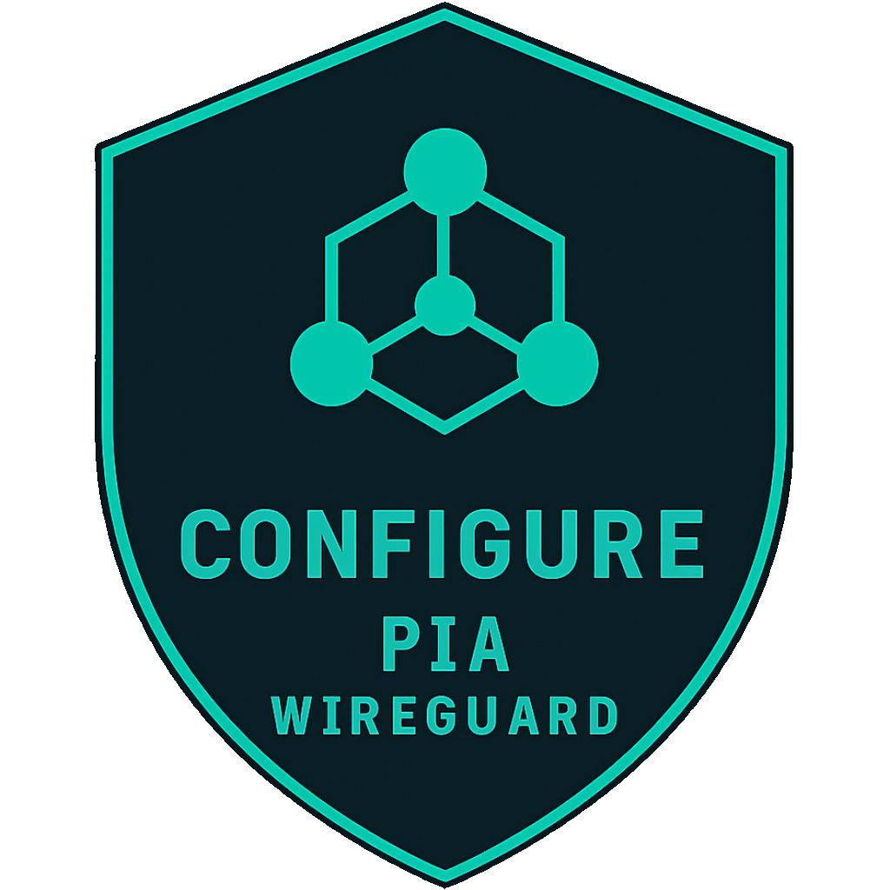

<a href="https://github.com/ExponentiallyDigital/cfg-pia-wg/releases" target="_blank" rel="noopener noreferrer"></a> <a href="https://www.android.com/" target="_blank" rel="noopener noreferrer"></a> <a href="https://github.com/ExponentiallyDigital/cfg-pia-wg/blob/main/LICENSE" target="_blank" rel="noopener noreferrer"></a> <a href="https://github.com/ExponentiallyDigital/cfg-pia-wg/releases" target="_blank" rel="noopener noreferrer"></a><br><a href="https://github.com/ExponentiallyDigital/ExponentiallyDigital/security/policy" target="_blank" rel="noopener noreferrer"></a> <a href="https://sonarcloud.io/project/overview?id=ExponentiallyDigital_cfg-pia-wg" target="_blank" rel="noopener noreferrer"></a> <a href="https://sonarcloud.io/project/overview?id=ExponentiallyDigital_cfg-pia-wg" target="_blank" rel="noopener noreferrer"></a> <a href="https://sonarcloud.io/project/overview?id=ExponentiallyDigital_cfg-pia-wg" target="_blank" rel="noopener noreferrer"><br><a href="https://sonarcloud.io/summary/new_code?id=ExponentiallyDigital_cfg-pia-wg" target="_blank" rel="noopener noreferrer"></a> <a href="https://sonarcloud.io/project/overview?id=ExponentiallyDigital_cfg-pia-wg" target="_blank" rel="noopener noreferrer"></a> <a href="https://sonarcloud.io/project/overview?id=ExponentiallyDigital_cfg-pia-wg" target="_blank" rel="noopener noreferrer"></a> <a href="https://sonarcloud.io/project/overview?id=ExponentiallyDigital_cfg-pia-wg" target="_blank" rel="noopener noreferrer"></a>

---

A native Android app that generates, and optionally applies, ready-to-use WireGuard configuration files for the Private Internet Access (PIA) VPN service. It authenticates with PIA's provisioning API, selects the lowest-latency server in your chosen region, generates a fresh WireGuard keypair, and allows saving the complete `.conf` to the clipboard or share/save to a user specified app/location.

If you have an ASUS router running [Asuswrt-Merlin](https://www.asuswrt-merlin.net/) firmware, you can also **manage** WireGuard configs directly on your router and deploy a **_self-healing_** watchdog with optional email alerting that makes your configuration truly "set and forget"!

This app is based on my standalone [pia-wireguard-cfg](https://github.com/ExponentiallyDigital/pia-wireguard-cfg) command line tool.

## Why use this?

Creating a valid PIA WireGuard config manually requires authenticating with several live APIs, writing WireGuard keys, and assembling connection metadata correctly. **cfg-pia-wg** automates that work and adds router-side **_slot management_** and **_self-healing_** watchdog support for Merlin-firmware ASUS routers.

## Features

- **Standalone PIA config generation:** choose a region, enter PIA username/password and DNS values, then generate a complete `.conf` file.
- **Secure clipboard handling:** copying generated config starts a visible 60-second countdown, then clears the clipboard automatically.
- **Share/save support:** share generated `.conf` via Android share sheet and save it to a file location of your choice.
- **Router slot management:** connect to an ASUS router over SSH, inspect `wgc1`–`wgc5` slots, and `CREATE`, `ENABLE`, `EDIT`, `DISABLE`, or `DELETE` WireGuard slot configurations.
- **Merlin watchdog management:** configure and deploy a router-side watchdog to periodically verify and self-heal VPN connectivity, manage cron/script deployment, and view router-side watchdog logs.
- **No persistent credential storage:** PIA credentials, router SSH credentials, and generated configs are stored only in volatile application memory and are never written to permanent storage.
- **Automated lowest-latency server selection**: measures live latency across all available servers in your selected target region, ensuring that you provision with the fastest node.
- **Native task-switcher protection** `(FLAG_SECURE)`: enforces native OS-level window flags to block third-party screenshot capturing and automatically obfuscates/blanks the app layout view inside the Android Recent Apps / Task Switcher interface.
- **Input field hardening**: user credential entry textboxes disable predictive dictionary caching, auto-correction tracking assistance, and keyboard learning behaviours, alongside native selection overrides to block background clipboard scraping.
- **Exit app safety:** all exit paths prompt for confirmation then wipe in-memory credentials/clipboard.
- **Industrial-strength professional build chain**: all releases undergo automated [SonarQube](https://docs.sonarsource.com/sonarqube-server) compliance (checks code quality and test coverage), open-source dependency scanning via [OSV](https://github.com/google/osv-scanner) (Google's vulnerability database that flags out-of-date third-party packages), automated version updates via [Dependabot](https://docs.github.com/code-security/dependabot) (monitors and patches insecure or outdated dependencies), binary analysis via [MobSF](https://github.com/MobSF/mobile-security-framework-mobsf) (scans compiled mobile binaries for platform-specific security flaws), and static analysis using [CodeQL](https://github.com/github/codeql-action) (analyses code structure to catch semantic gaps and injection risks). Locked action hashes ensure that automated builds execute with specific tool versions.

---

## Pre-built releases

This app has been submitted to the Google Play Store; a link will be placed **`<here>`** when it is available.

If you want to download a pre-built release from [GitHub](https://github.com/ExponentiallyDigital/cfg-pia-wg/releases), the file you need is **`cfg_pia_wireguard-<version>_release.apk`**.

Each release includes the following versioned files:

| file                                                    | description                                        |
| ------------------------------------------------------- | -------------------------------------------------- |
| **`cfg_pia_wireguard-<version>_release.apk`**           | optimised signed release APK                       |
| **`cfg_pia_wireguard-<version>_debug.apk`**             | debug APK for testing                              |
| **`cfg_pia_wireguard-<version>_google-play-store.aab`** | Android App Bundle for the Play Store              |
| **`cfg-pia-wg-<version>_sbom.spdx.json`**               | software bill of materials (SPDX format)           |
| **`README.html`**                                       | offline documentation (generated from this README) |
| **`LICENSE`**                                           | license file                                       |

The installable pre-built apps above have [GitHub Attestations](https://github.com/ExponentiallyDigital/cfg-pia-wg/attestations) for [build provenance](https://slsa.dev/spec/draft/build-provenance) verification.

---

## Prerequisites & requirements

For anything more than basic copy/past config generation with **Generate PIA WireGuard configuration**, this tool requires [Merlin Firmware](https://www.asuswrt-merlin.net/) on your ASUS router. Additionally:

1. Enable the SSH server. This is used by the **Manage** and **Watchdog** functions. Enable this on your router via

```text
Administration\System\Service -> "Enable SSH" (LAN only is recommended).
```

2. Enable the `JFFS` partition. Used by **Manage** and **Watchdog** functions:

```text
Administration\System\Basic Config -> "Enable JFFS custom scripts and config"
```

3. Watchdog and tunnel verification use ICMP ping from the router's WAN and WireGuard interfaces.

## Using the app

The app opens to a main menu with five choices:

- Generate PIA WireGuard configuration
- Manage router PIA WireGuard configuration
- Watchdog WireGuard management
- View app log
- Exit app

<p align="center">
  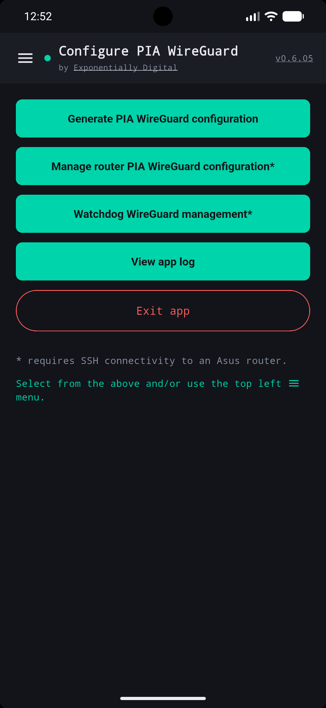
  <figcaption><center>Main menu</center></figcaption>
</p>

### 1. Generate a PIA WireGuard configuration

1. Tap **Generate PIA WireGuard configuration**.
2. Choose a region from the filterable region list.
3. Enter your PIA username, password, and DNS values.
4. Tap **GENERATE CONFIG** once all required fields are filled.
5. The generated WireGuard configuration is displayed in a selectable but read-only text area.

<p align="center">
  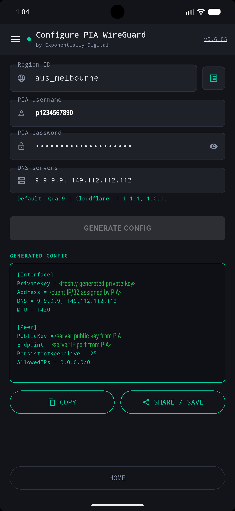
  <figcaption><center>Standalone config generation</center></figcaption>
</p>

6. Tap **COPY** to copy the config to the clipboard, or **SHARE / SAVE** to export the file via Android sharing.

### 2. Manage router PIA WireGuard configuration

This enables full management of WireGuard slots.

1. Tap **Manage router PIA WireGuard configuration**.
2. Enter router IP, SSH username, and SSH password (defaults are prefilled if available).
3. Tap **CONNECT TO ROUTER**.

<p align="center">
  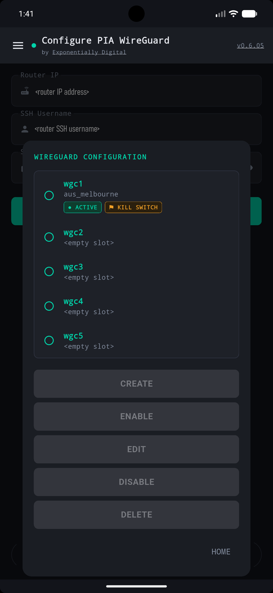
  <figcaption><center>Router slot management</center></figcaption>
</p>

4. Select a slot and choose one of the slot actions:

- **CREATE**:
  - first, select a region:<p align="center">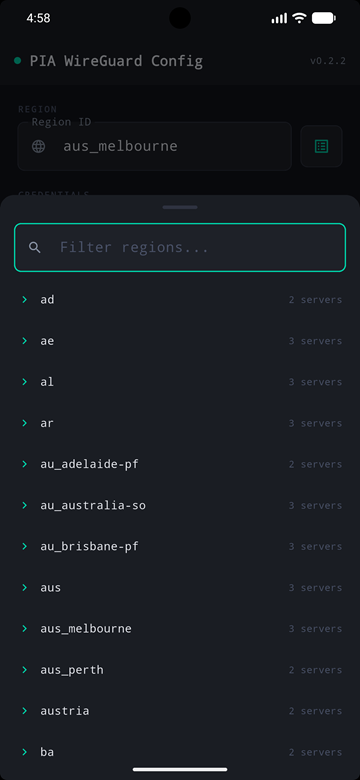<figcaption><center>Region selection</center></figcaption></p>
  - Then supply PIA credentials and preferred DNS server addresses:<p align="center">
    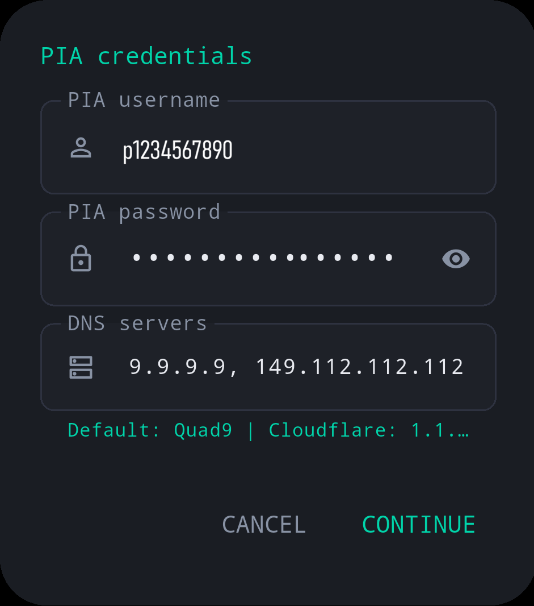<figcaption><center>Supply credentials and DNS</center></figcaption></p>
  - The slot's configuration is then generated and saved, but <u>**not**</u> enabled.
    <br>

- **ENABLE**: activates the slot and verifies the interface by using two ping targets over the new VPN interface, not the WAN interface. If the connectivity check fails, the slot is reverted to disabled. Recommended connectivity checking addresses are
  - `8.8.8.8` or `8.8.4.4` (Google primary and secondary DNS)
  - `1.1.1.1` or `1.0.0.1` (CloudFlare primary and secondary DNS)

<p align="center">
  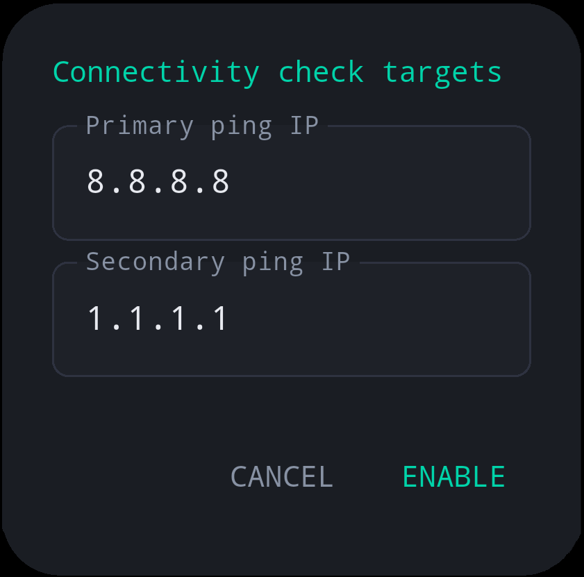
  <figcaption><center>Ping targets</center></figcaption>
</p>

- **EDIT**: allows updating WireGuard slot parameters and saves them back to router NVRAM.

<p align="center">
  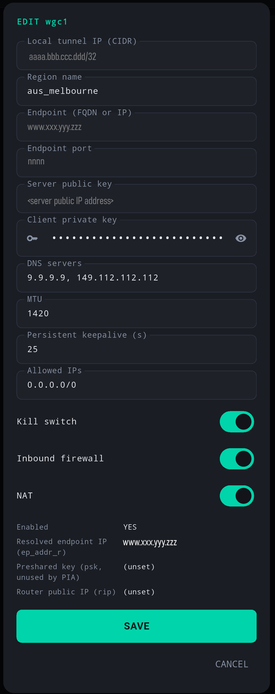
  <figcaption><center>Editing a slot</center></figcaption>
</p>

- **DISABLE**: disable the selected slot.
- **DELETE**: remove the slot configuration and disable any associated watchdog.

### 3. Watchdog WireGuard management

This manages a self-healing watchdog. In the event that your WireGuard configuration expires, it is automatically renewed and an optional email alert sent when connectivity has been restored.

1. Tap **Watchdog WireGuard management**.
2. Enter router IP, SSH username, and SSH password.
3. Tap **CONNECT TO ROUTER**.

<p align="center">
  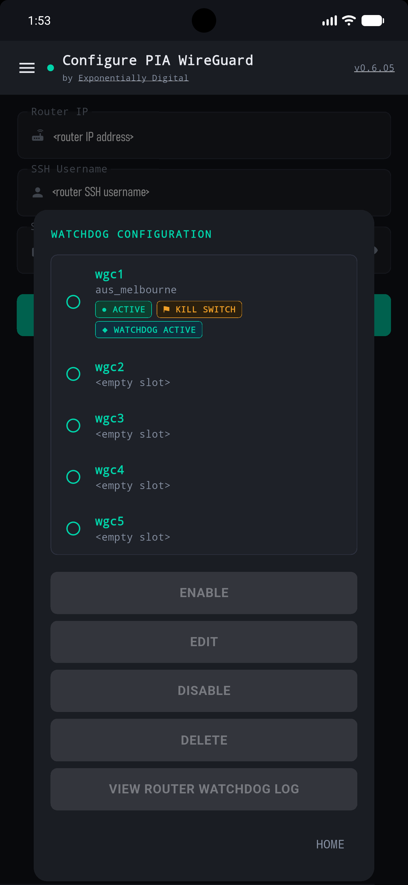
  <figcaption><center>Watchdog management</center></figcaption>
</p>

4. Select a slot and use the watchdog actions:
   - **ENABLE**: deploy router-side watchdog scripts and cron jobs for the selected slot.
   - **EDIT**: save watchdog settings and region metadata to NVRAM.

<p align="center">
  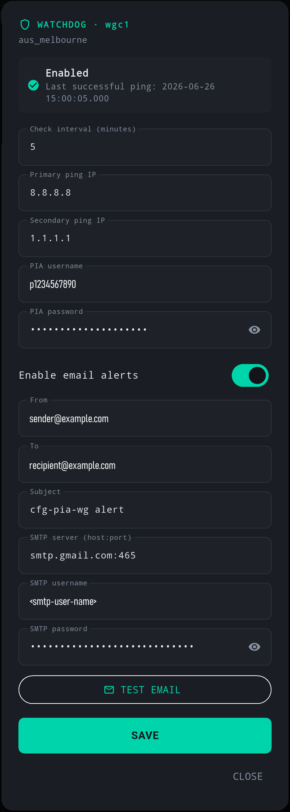
  <figcaption><center>Configuring a watchdog</center></figcaption>
</p>

> [!TIP]
> See [TESTING.md](https://github.com/ExponentiallyDigital/cfg-pia-wg/blob/main/TESTING.md) for email troubleshooting approaches.

- **DISABLE**: remove watchdog jobs and scripts for the slot.
- **DELETE**: remove the watchdog and clear the slot configuration.
- **VIEW WATCHDOG LOG**: inspect the router-side watchdog log. Logs are rotated at midnight retaining the current and previous logs and do not persist if the router is rebooted or a power loss occurs.

### 4. View app log

Use the **View app log** screen to inspect in-app log entries and clear them with **CLEAR LOG**.

<p align="center">
  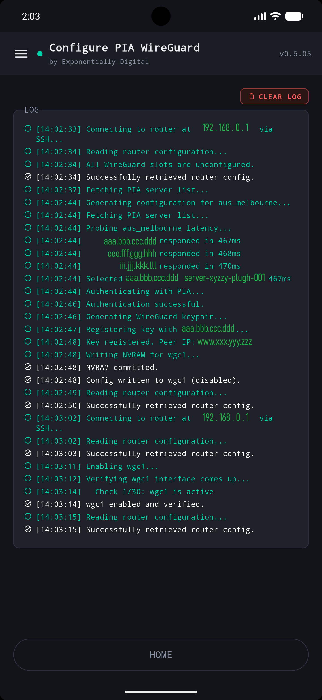
  <figcaption><center>App log</center></figcaption>
</p>

### 5. Exit app

The **Exit app** action confirms before closing the app, and it wipes all volatile session data plus the system clipboard.

### Hamburger menu

You can quickly jump between functions via a hamburger menu, always shown in the <span style="color: green; font-weight: bold;">top left corner</span> of each screen:

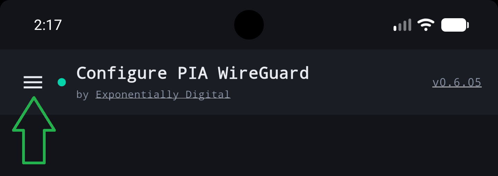

This can be useful to check the application's log during operations.

<p align="center">
  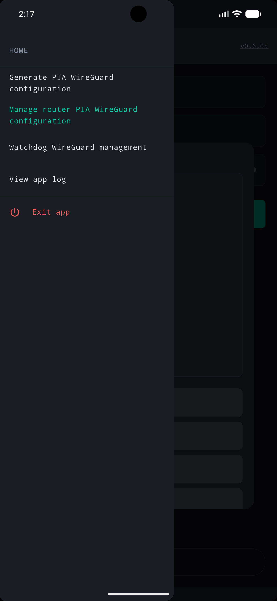
  <figcaption><center>Hamburger Menu</center></figcaption>
</p>

---

## Notes

- **No persistent credential storage:** PIA credentials and generated configs are held in memory only while the app is running.
- **Clipboard auto-clear:** copied config is cleared after 60 seconds.
- **Pre-shared keys**: PIA WireGuard does not use pre-shared keys. When pushing a config to the router, this field is always set to empty unless a push fails, then its original value is restored.
- **Time-to-live constraints**: PIA WireGuard configs expire every few weeks per PIA's token handling, requiring you to regenerate a config file periodically (which is why this app exists!).
- **Key safety**: generated configs contains private encryption keys. Treat them like passwords and manage them securely.

> [!IMPORTANT]
> This app supports a maximum of one active WireGuard VPN at any time
>
> When you save a config to your router, that "slot" will become the active VPN **replacing** any previously active slot.
>
> Any slot with a kill switch will be **deactivated** and the kill switch, NAT, and firewalling (if enabled) will be applied to the **newly** enabled slot.

> [!WARNING]
> When manually adding a VPN via the router's web GUI, the watchdog function requires the VPN description match the PIA region name exactly eg `aus_melbourne`.

---

## What does `cfg-pia-wireguard` "do" to my router?

A great question to ask as anything that talks to your router programatically should be under extreme scrutiny. A lot of thinking, research, and analysis went into implementing the two features to manage your router's VPN configuration and deploy a watchdog. Please see [ARCHITECTURE.md](https://github.com/ExponentiallyDigital/cfg-pia-wg/blob/main/ARCHITECTURE.md) for full details including a flow chart of user interactions and two diagrams showing network calls and representative IP traffic flows.

---

## App permissions

The app uses the following Android permissions:

### Internet (android.permission.INTERNET)

Required to:

- authenticate with Private Internet Access (PIA)
- retrieve VPN server information
- generate WireGuard configuration profiles
- perform latency and connectivity tests

No user traffic is routed through this application. The app communicates only with PIA provisioning and API endpoints required to generate configuration files.

### Network state (android.permission.ACCESS_NETWORK_STATE)

Required to:

- detect whether the device currently has network connectivity
- avoid unnecessary network requests when offline
- provide better error handling and diagnostics

### Storage access

The application can export generated WireGuard configuration files to the device.

#### Write external storage (android.permission.WRITE_EXTERNAL_STORAGE)

- used only on legacy Android versions (Android 9 and earlier)
- allows exported configuration files to be written to the Downloads folder

#### Read external storage (android.permission.READ_EXTERNAL_STORAGE)

- used only on older Android versions where required by the operating system
- allows the application to verify exported configuration files

---

## Security

We take credential safety and application hardening seriously. Please see the [SECURITY.md](./SECURITY.md) for details on our secure development practices, data handling lifecycle, and instructions on how to privately report potential vulnerabilities.

---

## Privacy

This application does not collect analytics, advertising identifiers, or personal usage data. Authentication credentials are used only to communicate with Private Internet Access services required to generate configuration files.

---

## Bugs and feature requests

Found a bug or want to request a feature? [Open an issue here](https://github.com/ExponentiallyDigital/cfg-pia-wg/issues).

---

## Donations

Kindly consider a [PayPal](https://www.paypal.com/donate/?hosted_button_id=QJYPGRLG2RPBS) or [Patreon](https://www.patreon.com/cw/ExponentiallyDigital) donation to help support development.

---

## Support

This tool is unsupported and may cause objects in mirrors to be closer than they appear. Batteries not included.

---

## Trademark and affiliation notice

This is an independent, open-source utility released under the GNU General Public License v3.0. It requires an active Private Internet Access (PIA) account subscription to authenticate with the provisioning endpoints. This application is not affiliated with, endorsed by, sponsored by, or associated with Private Internet Access, WireGuard or ASUS. WireGuard® is a registered trademark of Jason A. Donenfeld. Private Internet Access and PIA are trademarks of their respective owner. ASUS is a trademark of ASUSTek Computer Inc.

---

## License

This program is free software: you can redistribute it and/or modify it under the terms of the GNU General Public License as published by the Free Software Foundation, either version 3 of the License, or (at your option) any later version.

This program is distributed in the hope that it will be useful, but WITHOUT ANY WARRANTY; without even the implied warranty of MERCHANTABILITY or FITNESS FOR A PARTICULAR PURPOSE. See the GNU General Public License for more details.

You should have received a copy of the GNU General Public License along with this program. If not, see <https://www.gnu.org/licenses/>.

Copyright (C) 2026 Andrew Newbury.
