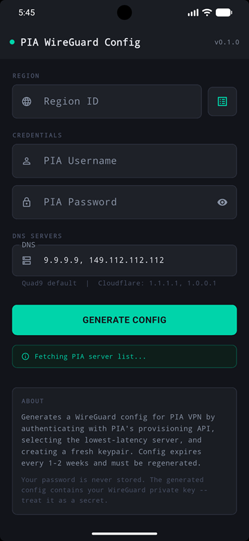
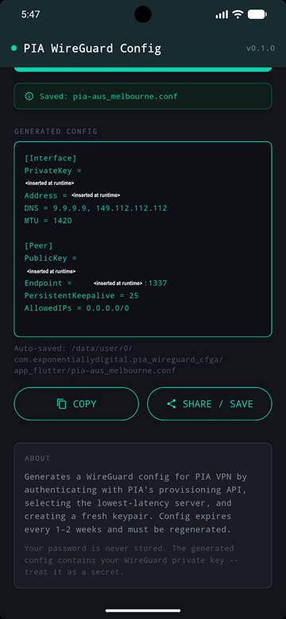

# pia-wireguard-cfga

GUI Android APK equivalent of https://github.com/ExponentiallyDigital/pia-wireguard-cfg

Implements the identical Private Internet Access (PIA) WireGuard provisioning flow as the Go CLI tool, wrapped in a native Android GUI built with Flutter and Dart.

## Pre-Built Releases

If you do not want to compile the application from scratch, pre-packaged release archives are available under the **Releases** section of this GitHub repository.

Each release contains a compiled, production-ready `.zip` archive containing:

- The optimized Android application (`pia-wireguard-cfga-release.apk`)
- The cryptographic verification checksum (`pia-wireguard-cfga-release.sha1`)
- Offline documentation (`README.html`, `README.md`, and `LICENSE`)

## Features

- **Automated Lowest-Latency Server Selection:** Measures live TCP latency against port 1337 across all available servers in your selected target region, ensuring you always provision against the fastest node.
- **Cryptographically Secure Keypair Generation:** Dynamically generates an ephemeral WireGuard keypair using `x25519` with proper RFC 7748 scalar clamping directly inside the runtime environment.
- **Dynamic Certificate Pinning:** Fetches PIA's trusted root CA certificate dynamically at runtime from the `pia-foss/manual-connections` repository. No hardcoded certificates ensure operations continue smoothly even if PIA rotates authority roots.
- **Credential Safety:** Your PIA password is entered interactively at execution and used strictly to request a short-lived HTTP Basic Auth provisioning token. Credentials are never written to disk, stored, or logged.
- **Modern Adaptive Styling:** Fully supports Android 8.0+ Adaptive Icons using a native multi-layered presentation conforming to a dark-mode theme aesthetic (`#12141A`).
- **Android Permisions:** none are requested/required.

## Interface

App screen:


Filterable region selection:


Generated config file:


## Build Setup

If you prefer to compile and test the application locally, follow the configuration steps below.

### Prerequisites

- **Flutter SDK:** Version 3.10 or later ([Flutter Installation Guide](https://flutter.dev/docs/get-started/install))
- **Android SDK / Studio:** Configured with Java Development Kit (JDK 17)
- A connected physical Android device (with USB Debugging enabled) or an active Android Virtual Device (AVD) Emulator.

### 1. Install Dependencies

Pull the tracking package constraints defined within the project manifests:

```bash
flutter pub get
```

### 2. Generate Asset Assets (Launcher Icons)

The app leverages the `flutter_launcher_icons` framework to generate adaptive foreground and background configurations for Android launchers. Before your initial compilation, generate the native resource files:

```Bash
dart run flutter_launcher_icons
```

### 3. Run Locally for Testing

To run a hot-reloaded debug instance directly onto your attached mobile workspace:

```Bash
flutter run
```

### 4. Build Release APK

To create a standalone production compilation targeted for distribution:

```Bash
flutter build apk --release
```

#### Local Output Destinations:

- Standard Flutter Pipeline Archive: build/app/outputs/flutter-apk/app-release.apk

- Gradle Pipeline Build Output: build/app/outputs/apk/release/pia-wireguard-cfga-release.apk

### 5. Sideload

To push the compiled binaries directly onto your phone via Android Debug Bridge (ADB):

```Bash
adb install build/app/outputs/flutter-apk/app-release.apk
```

or sideload via your favorite app (I prefer X-plore).

## How it works

The provisioning logic in `lib/pia_service.dart` is a direct Dart translation of the command line version's [ Go code](https://github.com/ExponentiallyDigital/pia-wireguard-cfg/blob/main/main.go), implementing the same steps in the same order:

1. Server Discovery: Pulls the complete endpoints mapping directly from serverlist.piaservers.net/vpninfo/servers/v6. The payload splits at the first newline boundary to discard the payload block signature.
2. Latency Probes: Dispatches immediate TCP probes to port 1337 across regional candidate blocks to calculate routing latency.
3. Session Tokens: Challenges the central API through a standard POST request over TLS, securing an execution token from basic user parameters.
4. KeyPair Issuance: Generate WireGuard keypair using X25519 with RFC 7748 scalar clamping
   (k[0] &= 248, k[31] &= 127, k[31] |= 64)
5. Secure Registration: Submits the dynamic public key configuration to the chosen low-latency endpoint via an HTTPS API (port 1337). The step utilizes the dynamically resolved PIA root certificate, matching the specific Common Name (CN) mapping fields rather than raw IP routing addresses. The certificate is not hardcoded, so that it stays current when PIA rotates it.
6. Config Assembly: Transforms payload metadata returns into localized .conf specifications utilizing Unix line endings (\n) for cross-compatibility.

### Sample output

```
[Interface]
PrivateKey = <freshly generated private key>
Address    = <client IP assigned by PIA>
DNS        = 9.9.9.9, 149.112.112.112
MTU        = 1420

[Peer]
PublicKey           = <server public key from PIA>
Endpoint            = <server IP:port from PIA>
PersistentKeepalive = 25
AllowedIPs          = 0.0.0.0/0
```

## Output

The generated config is:

- Displayed in the app for review.
- Auto-saved to the app's documents directory (only acessible by the app itself).
- Shareable via Android's share sheet (use "Save to Files", send via email, etc.).
- Copyable to the clipboard.

## Notes

- Time-to-Live Constraints: Config allocations generated under this lifecycle model expire every 1-2 weeks under PIA's standard structural token design, requiring you to open the app and regenerate a config file periodically.
- Key Safety: The generated string payloads reveal your private encryption keys. Manage files securely and avoid leaving copies in unsecured spaces.
- Network Requirements: An active internet connection is mandatory to resolve remote lookup tables and register credentials with API endpoints.

## Package dependencies

| Package         | Purpose                                        |
| --------------- | ---------------------------------------------- |
| `http`          | HTTP calls to PIA APIs                         |
| `x25519`        | WireGuard keypair generation                   |
| `path_provider` | App documents directory                        |
| `share_plus`    | Share/save config file via Android share sheet |

## Development "to do" list

1. refactor versioning (currently in 2 places)
2. create homescreen icon on install (revisit if/when released to playstore)

## Contributing

Contributions are welcome. To contribute:

1. Fork the repository
2. Create a feature branch (git checkout -b feature/AmazingFeature)
3. Commit your changes (git commit -m 'Add some AmazingFeature')
4. Ensure code formatting is clean (flutter format . and flutter analyze)
5. Push to the branch (git push origin feature/AmazingFeature)
6. Open a Pull Request

## Bugs and feature requests

Found a bug or want to request a feature?
[Open an issue here](https://github.com/ExponentiallyDigital/pia-wireguard-cfga/issues)

## Support

This tool is unsupported and may cause objects in mirrors to be closer than they appear. Batteries not included.

## License

This program is free software: you can redistribute it and/or modify it under the terms of the GNU General Public License as published by the Free Software Foundation, either version 3 of the License, or (at your option) any later version.

This program is distributed in the hope that it will be useful, but WITHOUT ANY WARRANTY; without even the implied warranty of MERCHANTABILITY or FITNESS FOR A PARTICULAR PURPOSE. See the GNU General Public License for more details.

You should have received a copy of the GNU General Public License along with this program. If not, see <https://www.gnu.org/licenses/>.

/Copyright (C) 2026 Andrew Newbury
