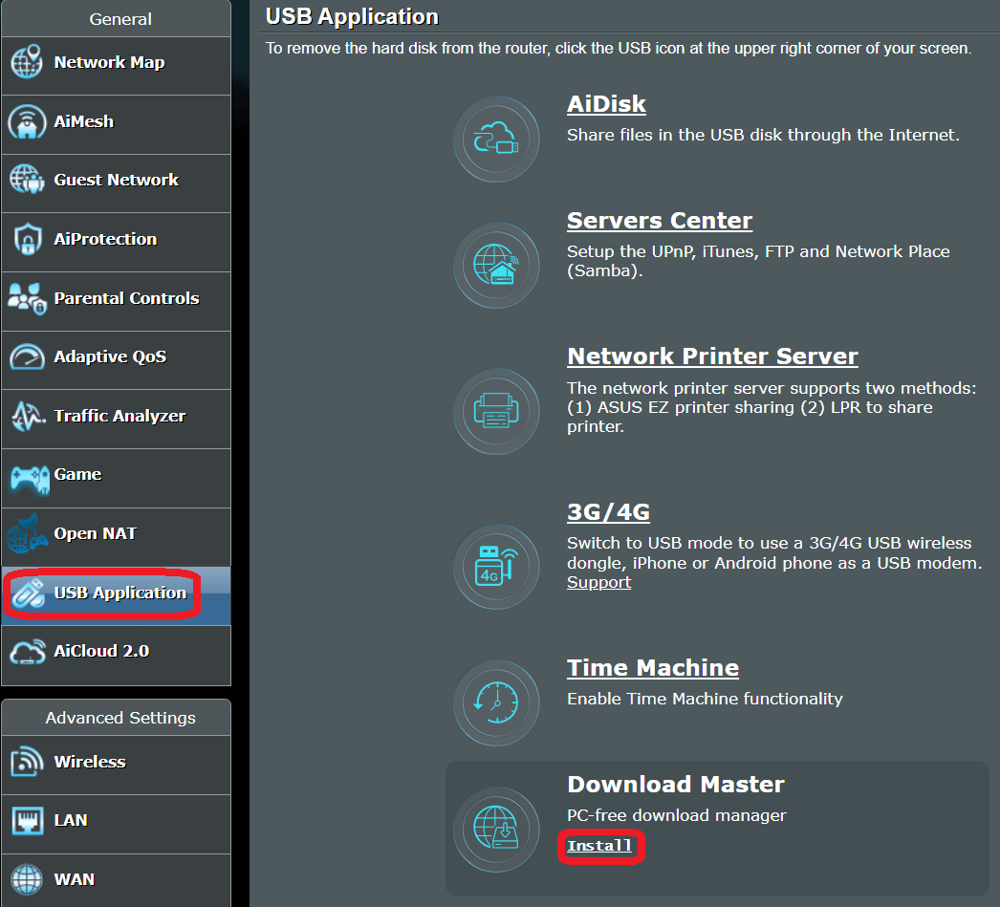
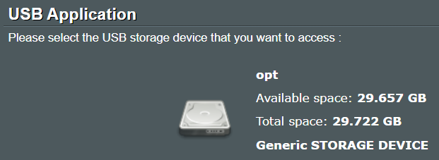
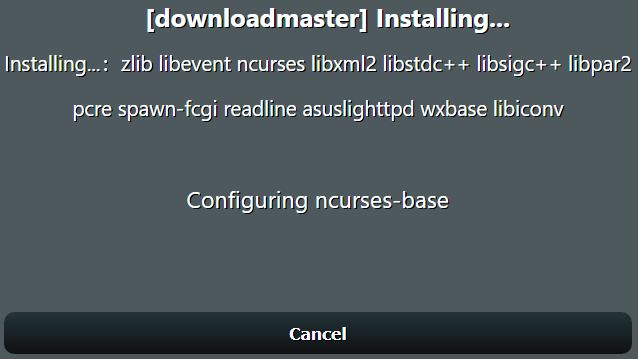
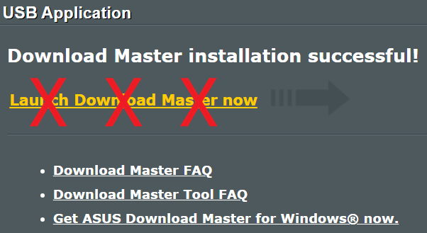
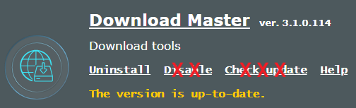

# CFG-PIA-WG
<a href="https://github.com/ExponentiallyDigital/cfg-pia-wg/releases" target="_blank" rel="noopener noreferrer"></a> 
<a href="https://www.android.com/" target="_blank" rel="noopener noreferrer"></a> 
<a href="https://github.com/ExponentiallyDigital/cfg-pia-wg/blob/main/LICENSE" target="_blank" rel="noopener noreferrer"></a> 
<a href="https://github.com/ExponentiallyDigital/ExponentiallyDigital/security/policy" target="_blank" rel="noopener noreferrer"></a> 
</br>
<a href="https://github.com/ExponentiallyDigital/cfg-pia-wg/releases" target="_blank" rel="noopener noreferrer"></a>
<a href="https://github.com/ExponentiallyDigital/cfg-pia-wg" target="_blank" rel="noopener noreferrer"></a>
<a href="https://github.com/ExponentiallyDigital/cfg-pia-wg/commits/main" target="_blank" rel="noopener noreferrer"></a>
<a href="https://sonarcloud.io/project/overview?id=ExponentiallyDigital_cfg-pia-wg" target="_blank" rel="noopener noreferrer"></a>
<br>
<a href="https://sonarcloud.io/project/overview?id=ExponentiallyDigital_cfg-pia-wg" target="_blank" rel="noopener noreferrer"></a> 
<a href="https://sonarcloud.io/project/overview?id=ExponentiallyDigital_cfg-pia-wg" target="_blank" rel="noopener noreferrer"></a> 
<a href="https://sonarcloud.io/project/overview?id=ExponentiallyDigital_cfg-pia-wg" target="_blank" rel="noopener noreferrer"></a> 
<a href="https://sonarcloud.io/summary/new_code?id=ExponentiallyDigital_cfg-pia-wg" target="_blank" rel="noopener noreferrer"></a> 
<a href="https://sonarcloud.io/project/overview?id=ExponentiallyDigital_cfg-pia-wg" target="_blank" rel="noopener noreferrer"></a> 
<a href="https://sonarcloud.io/project/overview?id=ExponentiallyDigital_cfg-pia-wg" target="_blank" rel="noopener noreferrer"></a> 
<a href="https://sonarcloud.io/project/overview?id=ExponentiallyDigital_cfg-pia-wg" target="_blank" rel="noopener noreferrer"></a>

---

- [1. Why use this?](#1-why-use-this)
  - [1.1. Why use WireGuard?](#11-why-use-wireguard)
- [2. Features](#2-features)
- [3. Pre-built release](#3-pre-built-release)
- [4. Prerequisites \& requirements](#4-prerequisites--requirements)
  - [4.1. Enabling prequisites](#41-enabling-prequisites)
    - [Why Download Master is needed](#why-download-master-is-needed)
    - [Preparing the USB stick](#preparing-the-usb-stick)
    - [Installing Download Master](#installing-download-master)
    - [Installing the helper binaries](#installing-the-helper-binaries)
- [5. Using the app](#5-using-the-app)
  - [5.1. Generate a PIA WireGuard configuration](#51-generate-a-pia-wireguard-configuration)
  - [5.2. Manage router PIA WireGuard configuration](#52-manage-router-pia-wireguard-configuration)
  - [5.3. Watchdog WireGuard management](#53-watchdog-wireguard-management)
    - [5.3.1. Email alerts](#531-email-alerts)
  - [5.4. VPN device assignment](#54-vpn-device-assignment)
  - [5.5. View app log](#55-view-app-log)
  - [5.6. Exit app](#56-exit-app)
  - [5.7. Hamburger menu](#57-hamburger-menu)
  - [5.8. About](#58-about)
- [6. Notes](#6-notes)
- [7. What does the app do to my router?](#7-what-does-the-app-do-to-my-router)
- [8. App permissions](#8-app-permissions)
  - [8.1. Internet (android.permission.INTERNET)](#81-internet-androidpermissioninternet)
  - [8.2. Network state (android.permission.ACCESS\_NETWORK\_STATE)](#82-network-state-androidpermissionaccess_network_state)
  - [8.3. Storage access](#83-storage-access)
    - [8.3.1. Write external storage (android.permission.WRITE\_EXTERNAL\_STORAGE)](#831-write-external-storage-androidpermissionwrite_external_storage)
    - [8.3.2. Read external storage (android.permission.READ\_EXTERNAL\_STORAGE)](#832-read-external-storage-androidpermissionread_external_storage)
- [9. Security](#9-security)
  - [9.1. How to check the watchdog script yourself](#91-how-to-check-the-watchdog-script-yourself)
- [10. Privacy](#10-privacy)
- [11. Bugs and feature requests](#11-bugs-and-feature-requests)
- [12. Donations](#12-donations)
- [13. Support](#13-support)
- [14. Trademark and affiliation notice](#14-trademark-and-affiliation-notice)
- [15. License](#15-license)

A native Android app that generates and optionally applies ready-to-use WireGuard (WG) configuration files for the Private Internet Access (PIA) VPN service. It authenticates with PIA's provisioning API, selects the lowest-latency server in your chosen region, generates a fresh WG keypair, and lets you copy the complete `.conf` to the clipboard, or share or save it to an app or location of your choice.

If you have an ASUS router — stock firmware or [Asuswrt-Merlin](https://www.asuswrt-merlin.net/) — you can also **manage** WG configs directly on your router and deploy a **self-healing** watchdog with optional email alerting that makes your configuration truly "set and forget".

This app is based on my command line Windows/Linux app [cfg-pia-wg-cmd](https://github.com/ExponentiallyDigital/cfg-pia-wg-cmd).

## 1. Why use this?

Creating a valid PIA WG config by hand requires expertise in API authentication, WG key generation and correctly assembling connection metadata. **cfg-pia-wg** automates that work and adds router-side **slot management** (organising WG configs across the router's five WG VPN client configuration slots) and **self-healing** watchdog support for ASUS routers running either stock or Merlin firmware.

### 1.1. Why use WireGuard?

PIA's WG configs are ephemeral and expire without warning. While OpenVPN offers long-lived configs, the protocol is CPU-intensive, which on many routers becomes a bottleneck limiting throughput.

Switching to WG reduces overhead, allowing your hardware to operate closer to your actual ISP's provisioned speed. In a real-world test with a 500 Mbps plan (546 Mbps measured baseline), speeds jumped from a peak of 136 Mbps on OpenVPN to 499 Mbps with WG on the same hardware, a 75–81% throughput sacrifice under OpenVPN:

<p align="center">
  
  <br>
  VPN protocol comparison
</p>

**cfg-pia-wg** makes the switch to high-performance WG effortless, no separate PC/CLI app required.

## 2. Features

- **Standalone PIA config generation:** choose a region, enter PIA username/password and DNS values, then generate a complete `.conf` file.
- **Secure clipboard handling:** when copying a generated config, a visible 60-second countdown starts, then clears the clipboard automatically at expiry.
- **Share/save support:** share generated `.conf` via the Android share function and save it to a file location of your choice.
- **Router slot management:** connect to an ASUS router over SSH and inspect `wgc1`–`wgc5` slots. Create, enable, edit, disable, or delete WG slot configurations directly.
- **Watchdog management:** deploy a router-side watchdog that monitors and self-heals your WG VPN connection, with configurable checks, optional email alerts and access to the watchdog's log. Works on stock and Merlin; on stock it additionally needs `jq`, `mailsend-go` and DownloadMaster (see [4. Prerequisites](#4-prerequisites--requirements)).
- **Email alerts worth reading:** each alert says how long the tunnel was down, whether the kill switch held while it was, which server it reconnected to and how fast, and - when it could not reconnect - what to try and the tail of the router's own log. Sent from your own SMTP account; see [5.3.1](#531-email-alerts) for examples.
- **One remembered setting:** a successful router connect stores the router LAN address - and nothing else - in the app private storage, so you do not retype it every session. Clear it with **FORGET ROUTER IP** on the ABOUT screen. See [SECURITY.md](SECURITY.md).
- **No persistent credential storage (app):** PIA credentials, router SSH credentials and generated configs are stored only in volatile application memory and are never written to your device's storage.
- **Watchdog credential storage (router):** deploying the watchdog stores the necessary PIA credentials in router NVRAM so it can monitor and self-heal independently of the app. This is a deliberate trade-off for "set and forget" operation, see [ARCHITECTURE.md](https://github.com/ExponentiallyDigital/cfg-pia-wg/blob/main/ARCHITECTURE.md) and [SECURITY.md](https://github.com/ExponentiallyDigital/cfg-pia-wg/blob/main/SECURITY.md) for details.
- **Automated lowest-latency server selection:** measures live latency across all available servers in your selected region, ensuring that you provision with the fastest node.
- **Native task-switcher protection:** `(FLAG_SECURE)` enforces native OS-level window flags to block third-party screenshot capturing and automatically obscures the app layout view inside the Android Recent Apps / Task Switcher interface. Debug builds skip the flag so the app can be captured while testing; every release build sets it.
- **Password manager support:** every credential field accepts autofill from your device's password manager (KeePass, Bitwarden, Google Password Manager - whatever is registered as the autofill service). PIA, router SSH and SMTP logins are kept in separate autofill groups, so your manager can hold a different entry for each and you pick between them. A "save password?" prompt is offered only after credentials have actually worked, never when you back out of a form.
- **Input field hardening:** user credential entry textboxes disable predictive text caching, auto-correction, and keyboard learning behaviours.
- **Exit app safety:** all exit paths prompt for confirmation then wipe in-memory credentials and the system clipboard.
- **Professional-grade build chain:** all releases undergo automated security and quality checks with
  - [SonarQube](https://docs.sonarsource.com/sonarqube-cloud) - code quality and test coverage;
  - [OSV](https://github.com/google/osv-scanner) - open-source dependency scanning against Google's vulnerability database flagging out-of-date third-party packages;
  - [Dependabot](https://docs.github.com/code-security/dependabot) - automates version updates to monitor and patch insecure or outdated dependencies;
  - [MobSF](https://github.com/MobSF/mobile-security-framework-mobsf) - performs static binary security analysis on the app's source code checking for platform-specific vulnerabilities;
  - [CodeQL](https://github.com/github/codeql-action) - static analysis of the code's structure to catch semantic gaps and injection risks; and
  - Pinned GitHub Action hashes across [release.yml](https://github.com/ExponentiallyDigital/cfg-pia-wg/blob/main/.github/workflows/release.yml), [promote.yml](https://github.com/ExponentiallyDigital/cfg-pia-wg/blob/main/.github/workflows/promote.yml), and [quality_and_security.yml](https://github.com/ExponentiallyDigital/cfg-pia-wg/blob/main/.github/workflows/quality_and_security.yml) ensure automated builds execute with specific, verified tool versions.

---

## 3. Pre-built release

This app is available from the Google Play Store -> [cfg-pia-wg](https://play.google.com/store/apps/details?id=com.exponentiallydigital.pia_wireguard_cfga).

If you want to build your own, see [BUILDING.md](https://github.com/ExponentiallyDigital/cfg-pia-wg/blob/main/BUILDING.md).

---

## 4. Prerequisites & requirements

From version 0.9, this app extends support to Stock ASUS firmware; [Merlin Firmware](https://www.asuswrt-merlin.net/) continues to be supported.

If you don't have an ASUS router, you can still use the `Generate PIA WireGuard configuration` function to create standalone PIA configuration files from your phone/tablet. If that's you, you can skip to [5. Using the app](#5-using-the-app).

### 4.1. Enabling prequisites

To manage WireGuard configs and/or deploy a watchdog, you'll need to do a one time set up:

1. Enable the SSH server via your web browser - this setting is not available in the ASUS app - go to

```text
Advanced Settings\Administration\System\Service -> "Enable SSH" (LAN only is recommended).
```

If you change the SSH port from the default 22 - the router's own web interface suggests you do - enter the router address in the app as `address:port`, for example `192.168.50.1:2222`. A plain address means port 22.

2. If your'e on recent stock firmware skip to the next step. If you're using Merlin, enable the `JFFS` partition. This _should_ be enabled by default on ASUS routers running firmware version 378.50 or newer. This allows the watchdog script and settings to survive reboots/power cycling:

```text
Advanced Settings\Administration\System\Basic Config -> "Enable JFFS custom scripts and config"
```

3. Install the `jq` and `mailsend-go` helper apps.

**On Merlin**, SSH into the router and run [`scripts/get-bins.sh`](scripts/get-bins.sh). That is all - skip the rest of this step. The app cannot do this one for you: the in-app installer writes to the `/opt` area that only stock firmware has, so Merlin keeps the script.

**On stock firmware** there is one more thing to do first, and it needs a USB stick.

#### Why Download Master is needed

On stock firmware, scheduled tasks do not survive a reboot on their own. Download Master provides the `/opt` structure the app uses to keep a watchdog running across reboots and power cycles. It is a prerequisite, not something you will use.

> [!IMPORTANT]
> **Install Download Master, then leave it alone.** The app takes over part of its installation, so Download Master itself will not work afterwards - and if you reinstall or update it later, your watchdogs stop surviving reboots until you redeploy them from the app. If you actively use Download Master for downloads, this app's watchdog is not compatible with it on stock firmware.

#### Preparing the USB stick

Download Master installs onto the stick, so it needs a writable partition with a few hundred MB free.

**Format it ext4, as a single primary partition on an MBR table.** The one that catches people out is **exFAT, which will not mount at all** - and any stick over 32 GB that Windows formatted is exFAT by default. NTFS and FAT32 work; the router's own Format tool cannot make ext4, so use another machine.

Full compatibility table and the reasons behind each of those constraints: [ARCHITECTURE.md, USB storage for Download Master](ARCHITECTURE.md#usb-storage-for-download-master).

#### Installing Download Master

1. Insert the prepared USB stick into the router.
2. Log in to the router's web interface.
3. Go to **USB Application**.
4. Under **Download Master**, click **Install**.

    

5. Select the USB storage device to install onto.

    

6. The disk is checked, then the packages are downloaded, installed and configured.

    

7. It looks like this when it finishes.

    

8. **Do not launch Download Master**, and do not click **Disable** or **Check update**.

    

That is it - nothing else to configure.

#### Installing the helper binaries

**On stock firmware the app does this for you.** Open **MANAGE** or **WATCHDOG** and, if either
helper is missing, the app offers to install it. It shows what it is about to download, where it
goes, and the SHA-256 checksum it will verify before anything is put in place. `mailsend-go` is only
needed if you want email alerts.

<!-- SCREENSHOT: the INSTALL HELPERS dialog showing the two binaries, their sources and checksums -->

If your router turns out to be an architecture there is no published build for, the app says so and
you can fall back to running [`scripts/get-bins.sh`](scripts/get-bins.sh) over SSH, which is the same
script Merlin users run.
> [!TIP]
> Firmware flashing (upgrading your router's software) [_may_ require redeployment](https://github-wiki-see.page/m/RMerl/asuswrt-merlin.ng/wiki/JFFS) of PIA WG configs. Always test your VPN is active after applying a new firmware version.

4. Watchdog and tunnel verification use ICMP ping from the router's WAN and WG interfaces. You shouldn't need to do anything here, but it is required.

## 5. Using the app

> [!TIP]
> Before using the `Manage PIA WireGuard config` or `Watchdog WireGuard management` functions for the first time, it's recommended that you make a backup of your router configuration via the WebUI -> Advanced Settings -> Administration -> Restore/Save/Upload Setting -> Save setting.

The app opens to a main menu with five choices:

- Generate PIA WireGuard configuration
- Manage router PIA WireGuard configuration
- Watchdog WireGuard management
- View app log
- Exit app

Below those are two links: **how to use this app**, which opens this section of the README, and **add a Play Store app review**, which opens the app's Play Store listing.

<p align="center">
  
  <br>
  Main menu
</p>

### 5.1. Generate a PIA WireGuard configuration

1. Tap **Generate PIA WireGuard configuration**.
2. Choose a region from the filterable region list.
3. Enter your PIA username, password, and DNS values.
4. Tap **GENERATE CONFIG** once all required fields are filled.
5. The generated WG configuration is displayed in a selectable but read-only text area.

<p align="center">
  
  <br>
  Standalone config generation
</p>

1. Tap **COPY** to copy the config to the clipboard, or **SHARE / SAVE** to export the file via Android sharing. Copying a config to the clipboard starts a 60 second timer, displayed on screen, after which the clipboard is automatically cleared.

### 5.2. Manage router PIA WireGuard configuration

This enables full management of WG slots.

1. Tap **Manage router PIA WireGuard configuration**.
2. Enter router IP, SSH username, and SSH password (defaults are prefilled if available).
3. Tap **CONNECT TO ROUTER**.

> [!TIP]
> To fill the credentials from your password manager, tap a field and choose the entry it offers. Android only suggests for a field that is **empty**, so clear a field the app has already filled - the router address it remembers, for instance - before expecting a suggestion.

<p align="center">
  
  <br>
  Router slot management
</p>

1. Select a slot and choose one of the slot actions:

- **CREATE**:
  - first, select a region:
  <p align="center">
    
    <br>
    Region selection
  </p>
  - Then supply PIA credentials and preferred DNS server addresses:
  <p align="center">
    
    <br>
    Supply credentials and DNS
  </p>
  - The slot's configuration is then generated and saved, but <u>**not**</u> enabled.
    <br>

- **ENABLE:** activates the slot and verifies the interface by using two ping targets over the new VPN interface, not the WAN interface. If the connectivity check fails, the slot is reverted to disabled. Recommended connectivity checking addresses are
  - `8.8.8.8` or `8.8.4.4` (Google primary and secondary DNS)
  - `1.1.1.1` or `1.0.0.1` (CloudFlare primary and secondary DNS)

<p align="center">
  
  <br>
  Ping targets
</p>

- **EDIT:** allows updating WG slot parameters and saves them back to router NVRAM.

<p align="center">
  
  <br>
  Editing a slot
</p>

- **DISABLE:** disable the selected slot.
- **DELETE:** remove the slot configuration and disable any associated watchdog.

> [!NOTE]
> **The EDIT screen is shorter on stock firmware.** The kill switch and the inbound firewall setting are Merlin features - stock has neither, so the app does not offer them there. Everything else is the same on both.

### 5.3. Watchdog WireGuard management

This manages a self-healing watchdog. When your WG configuration inevitably expires, it is automatically renewed and an optional email alert sent when connectivity has been restored.

1. Tap **Watchdog WireGuard management**.
2. Enter router IP, SSH username, and SSH password.
3. Tap **CONNECT TO ROUTER**.

<p align="center">
  
  <br>
  Watchdog management
</p>

1. Select a slot and use the watchdog actions:
   - **CREATE/EDIT:** deploy router-side watchdog scripts and cron jobs for the selected slot.

<p align="center">
  
  <br>
  Configuring a watchdog
</p>

> [!TIP]
> See [TESTING.md](https://github.com/ExponentiallyDigital/cfg-pia-wg/blob/main/TESTING.md) for email troubleshooting approaches.

- **DELETE:** remove the watchdog and clear the slot configuration.
- **VIEW WATCHDOG LOG:** inspect the router-side watchdog log. Logs are rotated at midnight retaining the current and previous logs and do not persist if the router is rebooted or a power loss occurs.

#### 5.3.1. Email alerts

If you fill in the email fields when configuring a watchdog, the router sends you a plain-text alert whenever it rebuilds a tunnel — and one when it tries and fails. Alerts come from your own SMTP account; nothing is routed through a third party, and the app has no server of its own.

**You will need an app password, not your normal one.** Gmail and Outlook both refuse plain password sign-in from a device like this. In a Google account, turn on 2-Step Verification and then create an App password; in a Microsoft account, turn on two-step verification and then create an app password. Paste that into the SMTP password field. Full walkthrough and how to test it by hand: [TESTING.md](https://github.com/ExponentiallyDigital/cfg-pia-wg/blob/main/TESTING.md).

Use **TEST EMAIL** in the configuration dialog before you save. It sends the same kind of message through the same path, so a test that arrives is a real guarantee that alerts will too.

Every email carries the same sections: what happened, what to do about it (failures only), which router this is, and a running count of how well the watchdog has been doing.

**When a tunnel is rebuilt:**

```text
Subject: cfg-pia-wg alert: SUCCESS - wgc1:pia-aus_melbourne

Connectivity was lost and the tunnel has been rebuilt.

WHAT HAPPENED
Event: reconfigured successfully on attempt 2
Tunnel was down for: 6m 12s (last seen good 2026-09-05 14:26:41 AEST)
Kill switch: ON - no traffic left the router while it was down
Reconnected to: melbourne408 (45.134.140.101:1337), 9 ms
Interval: 5 minutes

ROUTER
Name: my-router.asuscomm.com (192.168.1.1)
Model: RT-AX88U, firmware 3.0.0.4.388_24762
Time: 2026-09-05 14:32:53 AEST
Uptime: 15:11:29 up 19:21, load average: 2.55, 2.39, 2.36
Watchdog: wgc1:pia-aus_melbourne, deployed by cfg-pia-wg <version> build <number>

HISTORY
Since 2026-09-01 this router has recorded 4 successful and 1 failed reconfigurations.

If cfg-pia-wg is useful to you, please consider submitting a review by tapping on the home screen link or via https://play.google.com/store/apps/details?id=com.exponentiallydigital.pia_wireguard_cfga

Thank you,
cfg-pia-wg by Exponentially Digital
```

**When it cannot be rebuilt**, two more sections appear — what to try, and the tail of the router's own watchdog log so you can see the attempt rather than take the summary on trust:

```text
Subject: cfg-pia-wg alert: FAILED - wgc1:pia-aus_melbourne

Connectivity was lost and the tunnel could NOT be rebuilt.

WHAT HAPPENED
Event: failed to obtain PIA token (exit 0, HTTP 403, body 34B: {"error":"rate limit exceeded"})
Tunnel has been down for: 41m 09s (last seen good 2026-09-05 13:58:12 AEST)
Kill switch: not supported on this firmware - traffic reached the internet without the VPN
Attempt: 8 since the last success, retrying per schedule, 5 minutes

WHAT TO DO
1. Check your PIA username and password in the app, under WATCHDOG then CONFIGURE.
2. Open VIEW WATCHDOG LOG in the app for the full history.
3. PIA rate-limits repeated token requests; if the code above is 403, wait 30 minutes before intervening.
4. Is your PIA billing account active?

ROUTER
Name: my-router.asuscomm.com (192.168.1.1)
Model: RT-AX88U, firmware 3.0.0.4.388_24762
Time: 2026-09-05 14:39:02 AEST
Uptime: 15:17:38 up 19:27, load average: 1.02, 1.15, 1.09
Watchdog: wgc1:pia-aus_melbourne, deployed by cfg-pia-wg <version> build <number>

HISTORY
Since 2026-09-01 this router has recorded 4 successful and 2 failed reconfigurations.

ROUTER LOG (last 10 lines)
2026-09-05 14:38:41 Checking wgc1 pia-aus_melbourne connectivity
2026-09-05 14:38:44 No handshake and both pings failed (9.9.9.9, 1.1.1.1)
2026-09-05 14:38:44 Connectivity lost; reconfiguring (attempt #8)
2026-09-05 14:38:44 WAN has internet connectivity
2026-09-05 14:38:45 Using cached CA cert
2026-09-05 14:38:45 Requesting PIA token for user p1234567
2026-09-05 14:38:46 ERROR: failed to obtain PIA token (exit 0, HTTP 403)
```

Notes on reading these:

- **Kill switch** answers the question that matters most when a tunnel drops — did anything leave the router unprotected? It has three states: on, available but not enabled, and *not supported on this firmware*. Stock ASUS firmware has no kill switch at all, so a dropped tunnel there means unprotected traffic until the watchdog restores it.
- **Interval** is read from the router, not from the form you are filling in, so it can never claim a schedule that is not actually running.
- **Since `date`** counts every re-configuration this router has made, across all slots, from the day the app first configured it.
- The router log excerpt includes your **PIA username** (never the password, and never the token). The email travels through your own mail provider, but bear it in mind before forwarding one.

> [!NOTE]
> **An alert can only be sent if the router can still reach your mail server.** A tunnel failure that also takes DNS down with it — which happens when the failed tunnel was the router's default connection — leaves the watchdog unable to resolve your SMTP host, so that alert never leaves the router. The attempt is always recorded in the router-side watchdog log, and the next email that does get through says how many were missed. If alerts matter to you, it is worth leaving at least one tunnel unassigned as the default connection.

The first email you receive will be the deployment itself — `Event: watchdog deployed` — sent even though there was nothing to fix. That is deliberate: it confirms the whole alerting path works, at the moment you set it up rather than months later during an outage.

### 5.4. VPN device assignment

**Stock firmware only.** Merlin does the same job through VPN Director, which this app does not drive.

Normally every device on your network follows the router's default connection. This screen lets you
send particular devices through a particular VPN tunnel and leave everything else alone - a games
console straight out to the internet, a laptop through Melbourne, everything else through Perth.

1. Open **VPN device assignment** from the hamburger menu.
2. Enter router IP, SSH username and password, then tap **CONNECT TO ROUTER**.
3. Every device the router knows about is listed, with what it is using now.
4. Tap a device to pick **Internet** or one of your WireGuard slots. Offline devices are listed too, greyed, at the bottom.
5. **APPLY** shows every change as `from -> to` and asks before touching anything. **DISCARD CHANGES** puts them all back.

<!-- SCREENSHOT: the device list, one device changed, APPLY and DISCARD CHANGES showing -->

**Default connection** sits at the top of the screen and covers every device you have *not* assigned.

> [!IMPORTANT]
> Changing the default connection restarts **every** tunnel on the router, so anything using a VPN
> loses its connection for about a minute. The app warns you before it does it. Assigning individual
> devices does none of this and is safe at any time.

<!-- SCREENSHOT: the default connection picker -->

Worth knowing:

- **This is not a kill switch.** If an assigned tunnel drops, its devices fall through to the default connection - so if that is **Internet**, they carry on unencrypted. Pointing the default connection at a tunnel you also assign devices to is what gets you fail-closed behaviour, and a watchdog on that tunnel is what bounds how long the outage lasts.
- A device the router has never had an address for cannot be assigned. Connect it once and come back.
- Assigning a device pins its address, so the assignment cannot drift onto a different device later. That pin stays behind when you unassign - the firmware never removes one, and neither does this app.
- A device using a **randomised MAC address** is tagged as such. Its assignment breaks silently the next time that address rotates. Phones do this per network by default; you can usually turn it off for your home Wi-Fi in the phone's network settings.
- Devices on the guest network never appear. They cannot reach your LAN, and routing them through a VPN is a different question.

### 5.5. View app log

Use the **View app log** screen to inspect in-app log entries and clear them with **CLEAR LOG**.

<p align="center">
  
  <br>
  App log
</p>

### 5.6. Exit app

The **Exit app** action confirms before closing the app, and it wipes all volatile session data plus the system clipboard.

### 5.7. Hamburger menu

You can quickly jump between functions via the hamburger menu, always shown in the <span style="color: green; font-weight: bold;">top left corner</span> of each screen:

<p align="center">
  
<br>
Hamburger Menu
</p>

This can be useful to check the application's log during operations.

<p align="center">
  
  <br>
  Hamburger Menu
</p>

Two entries are not on the main menu:

- **View router log** shows the router's own system log, newest first. Scroll up to load more, including the previous log file if the router still has it. **COPY** takes everything loaded. This is the first place to look when something on the router did not do what you expected.
- **Settings** holds the things you only do once, including **UNINSTALL** - see [What does the app do to my router?](#7-what-does-the-app-do-to-my-router).

### 5.8. About

Build information and documentation links live in the hamburger menu's **About** screen:

<p align="center">
  
  <br>
  About
</p>

The screen shows the app version and build number, the build fingerprint and the licence, and offers four actions:

- **COPY BUILD INFO** — copies the whole block as plain text, for pasting into a bug report. This is not a secret, so it does not start the 60-second clipboard countdown.
- **CREATE GITHUB ISSUE** — opens a new issue against the repository in your browser.
- **DEL PIA CERT** — deletes the cached PIA CA certificate (`/jffs/cfg-pia-wg/pia_ca.rsa.4096.crt`) from the router; the watchdog downloads a fresh copy on its next run. Nothing else is changed. About is reachable without ever visiting a router screen, so if no SSH details are held for this session it asks for them here rather than sending you away.
- **Open source: licenses** — the full licence text for every third-party component, via Flutter's licence page.

It also reports the **watchdog script version deployed on your router**, and tells you when that is
older than the copy in the app - which is the signal to redeploy. Underneath is a running history:
`Since <date>: X successful & Y unsuccessful reconfigures`, counted across every slot since the app
first configured this router.

---

## 6. Notes

- **Pre-shared keys:** PIA WG does not use pre-shared keys. When pushing a config to the router, this field is always set to empty unless a push fails, then its original value is restored.
- **Time-to-live constraints:** PIA WG configs expire without warning per PIA's token handling, requiring you to regenerate a config file periodically (which is why this app exists!).
- **Key safety:** generated configs contains private encryption keys. Treat them like passwords and manage them securely.
- **PIA maintenance:** PIA occasionally take regions offline for maintenance so you might be expecting to have an exit node in say pia-region_one, but onlines tools may show you as exiting from pia-region_two.
- **Check your VPN is working:** with services like [PIA what is my ip](https://www.privateinternetaccess.com/what-is-my-ip), [ipaddress.my](https://ipaddress.my/?lang=en_US), [2ip.io](https://2ip.io), and [showmyip.com](https://www.showmyip.com). However, these sites may cache your location in the browser and they sometimes return a stale exit region if used multiple times. To be absolutely sure, close your browser rather than just refreshing the page.
- **Watchdog shortcut:** If you deploy a _watchdog_ on an empty slot, that will also create the config for that slot in one step.
- **Change things in one place at a time.** The router's web interface writes the whole VPN list back when you press **Apply all settings**, using the copy it loaded when the page was opened - so a change made in this app can be overwritten by a web page that was open before you made it. If you use both, finish and apply in one before switching to the other, and reload the web page afterwards.
- ***Maximum VPN count:** ASUS limit two concurrent VPNs on stock firmware, this is enforced by the app. On Merlin, there is no VPN limit.

<br>

> [!NOTE]
> When manually adding a VPN via the router's web GUI, the watchdog function requires the VPN description match the PIA region name exactly eg `aus_melbourne`. If you use the watchdog function and manually set the slot description to something other than "pia-region_name", then the watchdog will fail to identify what region it should use when a reconfigure event occurs.

<br>

> [!WARNING]
> If you sell or give away your router, reset it before it leaves your hands. The watchdog stores your PIA and SMTP passwords in NVRAM in plain text, and a router handed over as-is hands those over with it. `scripts/showall.sh` will show you what is stored and `scripts/clearall.sh` removes it; both are in the [GitHub repo](https://github.com/ExponentiallyDigital/cfg-pia-wg). Deleting every VPN slot and watchdog from the app does the same job.
>
> **A factory reset does clear them.** Measured 2026-09-07 on stock firmware (RT-AX88U): marker values were written to NVRAM and committed, and neither the WebUI factory-default restore nor the WPS-button hard reset left any of them behind - including one shaped like `cfg_pia_wg_password` and one shaped like `wgcN_wd_smtp_pass`. Earlier releases of this page claimed the opposite; that claim was never tested and was wrong. Merlin has not been tested, so if you are on Merlin, use the scripts above rather than relying on the reset.

---

## 7. What does the app do to my router?

A fair question - anything that talks to your router on your behalf deserves scrutiny. Here is the
whole list.

**When you manage a slot**, it writes that slot's WireGuard settings into the router's NVRAM, and
restarts that one tunnel. Nothing else is touched, and nothing happens at all until you press a
button.

**When you deploy a watchdog**, it also writes:

- a small shell script per watched slot, in a folder of its own on the router
- two scheduled entries per slot - the check itself, and a nightly rotate of that slot's log
- the watchdog's settings in NVRAM, **including your PIA and SMTP passwords in plain text**, because the router has to be able to re-authenticate with PIA while you are asleep
- on stock firmware only, the two helper programs from section 4, into the same folder
- enough to make those schedules survive a reboot: on Merlin, two lines in the router's own startup script; on stock, which has no equivalent, the startup area that Download Master provides. **Anything it replaces is kept beside the original and put back on uninstall.**

**What it never does.** No firmware is modified. No packages are installed beyond the two helpers.
No ports are opened. None of your traffic is routed anywhere by the app, and none of it goes to us -
there is no server on our side to send it to.

**You can take it all off again.** The hamburger menu's **Settings** screen has an **UNINSTALL**
that removes the scripts, the schedules, the app's NVRAM settings and the folder, and restores the
startup files it replaced. It deliberately leaves your **VPN slots and tunnels alone** - those are
yours, and DELETE on the Manage screen is what removes them. Device assignments and the default
connection are left in place for the same reason.

**And you can read the script before you trust it** - see
[9.1. How to check the watchdog script yourself](#91-how-to-check-the-watchdog-script-yourself).

Full technical detail, including a flow chart of user interactions and diagrams of network calls and
traffic flows: [ARCHITECTURE.md](https://github.com/ExponentiallyDigital/cfg-pia-wg/blob/main/ARCHITECTURE.md).

---

## 8. App permissions

The app uses the following Android permissions:

### 8.1. Internet (android.permission.INTERNET)

Required to:

- authenticate with Private Internet Access (PIA)
- retrieve VPN server information
- generate WG configuration profiles
- perform latency and connectivity tests

No user traffic is routed through this application. The app communicates only with PIA provisioning and API endpoints required to generate configuration files.

### 8.2. Network state (android.permission.ACCESS_NETWORK_STATE)

Required to:

- detect whether the device currently has network connectivity
- avoid unnecessary network requests when offline
- provide better error handling and diagnostics

### 8.3. Storage access

The application can export generated WG configuration files to the device.

#### 8.3.1. Write external storage (android.permission.WRITE_EXTERNAL_STORAGE)

- used only on legacy Android versions (Android 9 and earlier)
- allows exported configuration files to be written to the Downloads folder

#### 8.3.2. Read external storage (android.permission.READ_EXTERNAL_STORAGE)

- used only on older Android versions where required by the operating system
- allows the application to verify exported configuration files

---

## 9. Security

We take credential safety and application hardening seriously. Please see the [SECURITY.md](./SECURITY.md) for details on our secure development practices, data handling lifecycle, and instructions on how to privately report potential vulnerabilities.

### 9.1. How to check the watchdog script yourself

This app asks a lot of you: it writes a script that holds your PIA password and runs as root on your
router, on a schedule, indefinitely. You should not have to take that on trust, and you do not have
to - the script is there to be read.

**Where it is.** `/jffs/cfg-pia-wg/watchdog_wgcN.sh`, one file per watched slot, where `N` is the
slot number. SSH into the router and `cat` it.

**It is plain shell.** Never obfuscated, never minified, never compressed or encoded. What you read
is exactly what runs. It is a few hundred lines of POSIX `sh` with comments left in.

**It matches what is in this repository.** The script is generated from a template you can read in
[`lib/router_watchdog.dart`](lib/router_watchdog.dart). The only differences between that text and
the file on your router are the slot number, the path to `jq`, and which mail command your firmware
uses - and a test in the repo fails the build if any placeholder is left unfilled. The boot script
the app installs on stock firmware has an exact copy in
[`scripts/S50downloadmaster-TEMPLATE.sh`](scripts/S50downloadmaster-TEMPLATE.sh), and another test
fails if the two ever drift apart.

**You can always tell our files from yours.** Every file the app writes to your router carries
`auto-generated by cfg-pia-wg` on its second line, and the uninstall refuses to delete a file that
does not have it.

**See everything it has stored.** [`scripts/showall.sh`](scripts/showall.sh) prints every NVRAM value
the app has written, passwords included, so you can check for yourself what is on the router.
[`scripts/clearall.sh`](scripts/clearall.sh) removes them.

---

## 10. Privacy

This application does not collect analytics, advertising identifiers, or personal usage data. Authentication credentials are used only to communicate with Private Internet Access services required to generate configuration files. See [Privacy Policy](https://exponentiallydigital.com/cfg-pia-wg/privacy.html).

---

## 11. Bugs and feature requests

Found a bug or want to request a feature? [Open an issue here](https://github.com/ExponentiallyDigital/cfg-pia-wg/issues).

The quickest route is from inside the app: **About** -> **CREATE GITHUB ISSUE** opens a new issue
with your app version, build number and firmware already filled in. **COPY BUILD INFO** on the same
screen gives you the same block to paste anywhere else.

---

## 12. Donations

Kindly consider a [PayPal](https://www.paypal.com/donate/?hosted_button_id=QJYPGRLG2RPBS) or [Patreon](https://www.patreon.com/cw/ExponentiallyDigital) donation to help support development.

---

## 13. Support

This app is unsupported and may cause objects in mirrors to be closer than they appear. Batteries not included.

---

## 14. Trademark and affiliation notice

This is an independent, open-source utility released under the GNU General Public License v3.0. It requires an active Private Internet Access (PIA) account subscription to authenticate with the provisioning endpoints. This application is not affiliated with, endorsed by, sponsored by, or associated with Private Internet Access, WireGuard or ASUS. WireGuard® is a registered trademark of Jason A. Donenfeld. Private Internet Access and PIA are trademarks of their respective owner. ASUS is a trademark of ASUSTek Computer Inc.

---

## 15. License

This program is free software: you can redistribute it and/or modify it under the terms of the GNU General Public License as published by the Free Software Foundation, either version 3 of the License, or (at your option) any later version.

This program is distributed in the hope that it will be useful, but WITHOUT ANY WARRANTY; without even the implied warranty of MERCHANTABILITY or FITNESS FOR A PARTICULAR PURPOSE. See the GNU General Public License for more details.

You should have received a copy of the GNU General Public License along with this program. If not, see <https://www.gnu.org/licenses/>.

Copyright (C) 2026 Andrew Newbury.
