<h1>
  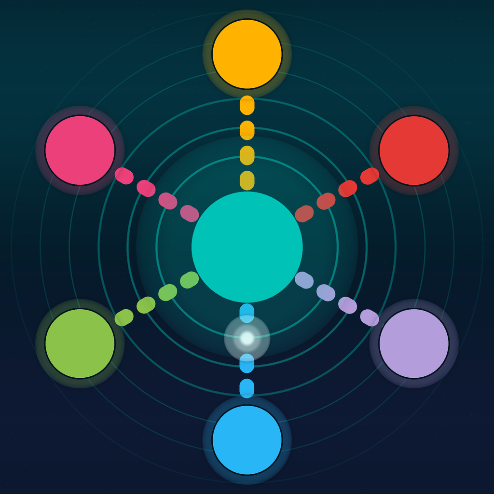
  &nbsp;CFG-PIA-WG
</h1>
<a href="https://github.com/ExponentiallyDigital/cfg-pia-wg/releases" target="_blank" rel="noopener noreferrer"></a> 
<a href="https://www.android.com/" target="_blank" rel="noopener noreferrer"></a> 
<a href="https://github.com/ExponentiallyDigital/cfg-pia-wg/blob/main/LICENSE" target="_blank" rel="noopener noreferrer"></a> 
<a href="https://github.com/ExponentiallyDigital/ExponentiallyDigital/security/policy" target="_blank" rel="noopener noreferrer"></a> 
</br>
<a href="https://github.com/ExponentiallyDigital/cfg-pia-wg/releases" target="_blank" rel="noopener noreferrer"></a>
<a href="https://github.com/ExponentiallyDigital/cfg-pia-wg" target="_blank" rel="noopener noreferrer"></a>
<a href="https://github.com/ExponentiallyDigital/cfg-pia-wg/commits/main" target="_blank" rel="noopener noreferrer"></a>
<a href="https://sonarcloud.io/project/overview?id=ExponentiallyDigital_cfg-pia-wg" target="_blank" rel="noopener noreferrer"></a>
<br>
<a href="https://sonarcloud.io/project/overview?id=ExponentiallyDigital_cfg-pia-wg" target="_blank" rel="noopener noreferrer"></a> 
<a href="https://sonarcloud.io/project/overview?id=ExponentiallyDigital_cfg-pia-wg" target="_blank" rel="noopener noreferrer"></a> 
<a href="https://sonarcloud.io/project/overview?id=ExponentiallyDigital_cfg-pia-wg" target="_blank" rel="noopener noreferrer"></a> 
<a href="https://sonarcloud.io/summary/new_code?id=ExponentiallyDigital_cfg-pia-wg" target="_blank" rel="noopener noreferrer"></a> 
<a href="https://sonarcloud.io/project/overview?id=ExponentiallyDigital_cfg-pia-wg" target="_blank" rel="noopener noreferrer"></a> 
<a href="https://sonarcloud.io/project/overview?id=ExponentiallyDigital_cfg-pia-wg" target="_blank" rel="noopener noreferrer"></a> 
<a href="https://sonarcloud.io/project/overview?id=ExponentiallyDigital_cfg-pia-wg" target="_blank" rel="noopener noreferrer"></a>

---

- [1. Why use this?](#1-why-use-this)
  - [1.1. Why use WireGuard?](#11-why-use-wireguard)
- [2. Features](#2-features)
- [3. Pre-built release](#3-pre-built-release)
- [4. Prerequisites \& requirements](#4-prerequisites--requirements)
  - [4.1. Enabling prerequisites](#41-enabling-prerequisites)
    - [4.1.1. Why Download Master is needed](#411-why-download-master-is-needed)
    - [4.1.2. Preparing the USB stick](#412-preparing-the-usb-stick)
    - [4.1.3. Installing Download Master](#413-installing-download-master)
    - [4.1.4. Installing the helper binaries](#414-installing-the-helper-binaries)
- [5. Using the app](#5-using-the-app)
  - [5.1. STANDALONE - Generate a PIA WireGuard configuration](#51-standalone---generate-a-pia-wireguard-configuration)
  - [5.2. MANAGE - Manage router PIA WireGuard configuration](#52-manage---manage-router-pia-wireguard-configuration)
    - [5.2.1. Which slot should carry your main VPN?](#521-which-slot-should-carry-your-main-vpn)
    - [5.2.2. DNS: where your lookups go](#522-dns-where-your-lookups-go)
  - [5.3. WATCHDOG - Watchdog WireGuard configuration](#53-watchdog---watchdog-wireguard-configuration)
    - [5.3.1. Email alerts](#531-email-alerts)
  - [5.4. VPN device assignment](#54-vpn-device-assignment)
    - [5.4.1. A practical `how to`](#541-a-practical-how-to)
    - [5.4.2. The `default connection`](#542-the-default-connection)
    - [5.4.3. Phones and random MAC addresses](#543-phones-and-random-mac-addresses)
    - [5.4.4. Where the device list comes from](#544-where-the-device-list-comes-from)
  - [5.5. ROUTER LOG](#55-router-log)
  - [5.6. APP LOG](#56-app-log)
  - [5.7. Settings](#57-settings)
  - [5.8. About](#58-about)
  - [5.9. EXIT - Close the app](#59-exit---close-the-app)
  - [5.10. Hamburger menu](#510-hamburger-menu)
- [6. Notes](#6-notes)
- [7. What does the app do to my router?](#7-what-does-the-app-do-to-my-router)
- [8. App permissions](#8-app-permissions)
  - [8.1. Internet (android.permission.INTERNET)](#81-internet-androidpermissioninternet)
  - [8.2. Network state (android.permission.ACCESS\_NETWORK\_STATE)](#82-network-state-androidpermissionaccess_network_state)
  - [8.3. Storage access](#83-storage-access)
    - [8.3.1. Write external storage (android.permission.WRITE\_EXTERNAL\_STORAGE)](#831-write-external-storage-androidpermissionwrite_external_storage)
    - [8.3.2. Read external storage (android.permission.READ\_EXTERNAL\_STORAGE)](#832-read-external-storage-androidpermissionread_external_storage)
  - [8.4. Billing (com.android.vending.BILLING)](#84-billing-comandroidvendingbilling)
- [9. Security](#9-security)
  - [9.1. How to check the watchdog script yourself](#91-how-to-check-the-watchdog-script-yourself)
- [10. Privacy](#10-privacy)
- [11. Bugs and feature requests](#11-bugs-and-feature-requests)
- [12. Donations](#12-donations)
- [13. Support](#13-support)
- [14. Trademark and affiliation notice](#14-trademark-and-affiliation-notice)
- [15. License](#15-license)

A native Android app for Private Internet Access (PIA) WireGuard (WG) on ASUS routers, stock firmware or [Asuswrt-Merlin](https://www.asuswrt-merlin.net/).

**Tunnels that stay up on their own.** A PIA WG configuration expires without warning, and a dead tunnel looks much like a working one until something you care about stops loading. The app deploys a **self-healing** watchdog to the router itself: it checks the tunnel on a schedule, builds a fresh configuration when the old one stops answering, and emails you what happened and how long the tunnel was down. That is what makes "set and forget" true rather than hopeful.

**The part people do not expect is the device view.** Your router thinks in SLOTS: five numbered VPN profiles, and to find out which of your devices is using one you generally have to stop it and see what breaks. **cfg-pia-wg thinks in DEVICES.** One screen lists everything on your network and what each one is using right now, and moving a device to a different VPN - or off VPN entirely - is one tap on that device. No slot numbers, nothing to stop first, and nothing to work out afterwards.

Underneath both is the plumbing: the app authenticates with PIA's provisioning API, selects the lowest-latency server in your chosen region, generates a fresh WG keypair, and either writes the result into one of the router's five WG slots or hands you the complete `.conf` to copy, share or save. That last part needs no router at all.

This app is based on my command line Windows/Linux app [cfg-pia-wg-cmd](https://github.com/ExponentiallyDigital/cfg-pia-wg-cmd).

## 1. Why use this?

Creating a valid PIA WG config by hand requires expertise in API authentication, WG key generation and correctly assembling connection metadata. **cfg-pia-wg** automates that work and adds router-side **slot management** (organising WG configs across the router's five WG VPN client configuration slots), **self-healing** watchdog support, and **per-device VPN assignment** - sending one device out through a VPN while another goes straight to the internet - for ASUS routers running either stock or Merlin firmware.

Per-device assignment is the one that changes how the router feels day to day. Instead of deciding which slot is the default and living with it, you decide per device: the work laptop through Melbourne, the games console straight out for the lowest latency it can get, the TV through the region its catalogue expects, everything else wherever the default sends it. Each change is one tap on the device itself, nothing has to be stopped first, and the list tells you afterwards where each device is actually going.

### 1.1. Why use WireGuard?

PIA's WG configs are ephemeral and expire without warning. While OpenVPN offers long-lived configs, the protocol is CPU-intensive, which on many routers becomes a bottleneck limiting throughput.

Switching to WG reduces overhead, allowing your hardware to operate closer to your actual ISP's provisioned speed. In a real-world test with a 500/50 Mbps plan (546 Mbps measured baseline), speeds jumped from a peak of 136 Mbps on OpenVPN to 499 Mbps with WG on the same hardware, a 75–81% throughput sacrifice under OpenVPN:

<p align="center">
  
  <br>
  VPN protocol comparison
</p>

**cfg-pia-wg** makes the switch to high-performance WG effortless, no separate PC/CLI app required.

## 2. Features

- **Watchdog management:** deploy a router-side watchdog that monitors and self-heals your WG VPN connection, with configurable checks, optional email alerts and access to the watchdog's log. Works on stock and Merlin; on stock it additionally needs `jq`, `mailsend-go` and DownloadMaster (see [4. Prerequisites](#4-prerequisites--requirements)).
- **Email alerts worth reading:** each alert says how long the tunnel was down, whether the kill switch held while it was, which server it reconnected to and how fast, and - when it could not reconnect - what to try and the tail of the router's own log. Sent from your own SMTP account; see [5.3.1](#531-email-alerts) for examples.
- **Per-device VPN assignment:** pick, per device, whether it leaves through a VPN tunnel or straight out to the internet, from a list of everything on your network and what each one is using right now. One tap per device, nothing to stop first, and the list says where a device's traffic really goes when its tunnel is down. Stock firmware only: Merlin does the same job through VPN Director, which this app does not drive.
- **Standalone PIA config generation:** choose a region, enter PIA username/password and DNS values, then generate a complete `.conf` file.
- **Secure clipboard handling:** when copying a generated config, a visible 60-second countdown starts, then clears the clipboard automatically at expiry.
- **Share/save support:** share a generated `.conf` via the Android share function and save it to a file location of your choice.
- **Router slot management:** connect to an ASUS router over SSH and inspect `wgc1`–`wgc5` slots. Create, enable, edit, disable, or delete WG slot configurations directly.
- **One remembered setting:** a successful router connect stores the router LAN address - and nothing else - in the app private storage, so you do not retype it every session. Clear it with **FORGET ROUTER IP** in the SETTINGS screen. See [SECURITY.md](SECURITY.md).
- **No persistent credential storage (app):** PIA credentials, router SSH credentials and generated configs are stored only in volatile application memory and are never written to your device's storage.
- **Watchdog credential storage (router):** deploying the watchdog stores the necessary PIA credentials in router NVRAM so it can monitor and self-heal independently of the app. This is a deliberate trade-off for "set and forget" operation, see [ARCHITECTURE.md](https://github.com/ExponentiallyDigital/cfg-pia-wg/blob/main/ARCHITECTURE.md) and [SECURITY.md](https://github.com/ExponentiallyDigital/cfg-pia-wg/blob/main/SECURITY.md) for details.
- **Automated lowest-latency server selection:** measures live latency across all available servers in your selected region, ensuring that you provision with the fastest node.
- **Native task-switcher protection:** `(FLAG_SECURE)` enforces native OS-level window flags to block third-party screenshot capturing and automatically obscures the app layout view inside the Android Recent Apps / Task Switcher interface. Debug builds skip the flag to enable screenshotting while testing; every release build sets it.
- **Password manager support:** every credential field accepts autofill from your device's password manager (KeePass, Bitwarden, Google Password Manager - whatever is registered as the autofill service). PIA, router SSH and SMTP logins are kept in separate autofill groups, so your manager can hold a different entry for each and you pick between them. A "save password?" prompt is offered only after credentials have actually worked, never when you back out of a form.
- **Input field hardening:** user credential entry text boxes disable predictive text caching, auto-correction, and keyboard learning behaviours.
- **Exit app safety:** all exit paths prompt for confirmation then wipe in-memory credentials and the system clipboard.
- **Professional-grade build chain:** all releases undergo automated security and quality checks with
  - [SonarQube](https://docs.sonarsource.com/sonarqube-cloud) - code quality and test coverage;
  - [OSV](https://github.com/google/osv-scanner) - open-source dependency scanning against Google's vulnerability database flagging out-of-date third-party packages;
  - [Dependabot](https://docs.github.com/code-security/dependabot) - automates updates to monitor and patch insecure or outdated dependencies;
  - [MobSF](https://github.com/MobSF/mobile-security-framework-mobsf) - performs static binary security analysis on the app's source code checking for platform-specific vulnerabilities;
  - [CodeQL](https://github.com/github/codeql-action) - static analysis of the code's structure to catch semantic gaps and injection risks; and
  - Pinned GitHub Action hashes across [release.yml](https://github.com/ExponentiallyDigital/cfg-pia-wg/blob/main/.github/workflows/release.yml), [promote.yml](https://github.com/ExponentiallyDigital/cfg-pia-wg/blob/main/.github/workflows/promote.yml), and [quality_and_security.yml](https://github.com/ExponentiallyDigital/cfg-pia-wg/blob/main/.github/workflows/quality_and_security.yml) ensure automated builds execute with specific, verified tool versions.

---

## 3. Pre-built release

This app is available from the Google Play Store -> [cfg-pia-wg](https://play.google.com/store/apps/details?id=com.exponentiallydigital.pia_wireguard_cfga).

If you want to build your own, see [BUILDING.md](https://github.com/ExponentiallyDigital/cfg-pia-wg/blob/main/BUILDING.md).

---

## 4. Prerequisites & requirements

Since build 403 (5 September 2026), this app extends support to stock ASUS firmware; [Merlin Firmware](https://www.asuswrt-merlin.net/) continues to be supported.

If you don't have an ASUS router, you can still use the `Generate PIA WireGuard configuration` function to create standalone PIA configuration files from your phone/tablet. If that's you, you can skip to [5. Using the app](#5-using-the-app).

### 4.1. Enabling prerequisites

To manage WireGuard configs and/or deploy a watchdog, you'll need to do a one time setup:

1. With the ASUS WebUi, enable the SSH server - this setting is not available in the ASUS app - go to

```text
Advanced Settings\Administration\System\Service -> "Enable SSH" (LAN only is recommended).
```

If you change the SSH port from the default 22 - the router's own web interface suggests you do - enter the router address in the app as `address:port`, for example `192.168.50.1:2222`. A plain address means port 22.

2. If you're on recent stock firmware skip to the next step. If you're using Merlin, enable the `JFFS` partition. This _should_ be enabled by default on ASUS routers running firmware version 378.50 or newer. This allows the watchdog script and settings to survive reboots/power cycling:

```text
Advanced Settings\Administration\System\Basic Config -> "Enable JFFS custom scripts and config"
```

3. Install the `jq` and `mailsend-go` helper apps.

**On Merlin there is nothing more to do - skip the rest of this step.** Merlin already ships `jq`, and it sends alert emails using tools it already has.

**On stock firmware** both are needed, and there is one more thing to do first. It needs a USB stick.

#### 4.1.1. Why Download Master is needed

On stock firmware, scheduled tasks do not survive a reboot on their own. Download Master provides the `/opt` structure the app uses to keep a watchdog running across reboots and power cycles. It is a prerequisite, not something you will use.

> [!IMPORTANT]
> **Install Download Master, then leave it alone.** The app takes over part of its installation, so Download Master itself will not operate afterwards: this app's watchdog is not compatible with it on stock firmware. Reinstalling or updating DM will stop any deployed watchdogs from surviving reboots until you redeploy them from the app.

#### 4.1.2. Preparing the USB stick

Download Master installs onto the stick, so it needs a writable partition with a few hundred MB free.

**Format it as NTFS, a single primary partition on an MBR table.** Windows makes NTFS natively. Don't use **exFAT** as it won't work - any stick over 32 GB that Windows formatted is exFAT by default, so check rather than assume. ext4 and FAT32 also work.

Full compatibility table and the reasons behind each of those constraints: [ARCHITECTURE.md, USB storage for Download Master](ARCHITECTURE.md#usb-storage-for-download-master).

#### 4.1.3. Installing Download Master

1. Insert the prepared USB stick into the router.
2. Log in to the router's web interface.
3. Go to **USB Application**.
4. Under **Download Master**, click **Install**.

<p align="center">
  
  <br>
</p>

5. Select the USB storage device to install onto.

<p align="center">
  
  <br>
</p>

6. The disk is checked, and DM packages are downloaded, installed and configured.

<p align="center">
  
  <br>
</p>

7. It looks like this when it finishes.

<p align="center">
  
  <br>
</p>

8. **Do not launch Download Master**, and do not click **Disable** or **Check update**.

<p align="center">
  
  <br>
</p>

#### 4.1.4. Installing the helper binaries

**On stock firmware the app does this for you.** Open **MANAGE** or **WATCHDOG** and, if either helper is missing, the app offers to install it. It shows what it is about to download, where it goes, and the SHA-256 checksum it will verify before anything is put in place. `mailsend-go` is only needed if you want email alerts.


<br>
<p align="center">
  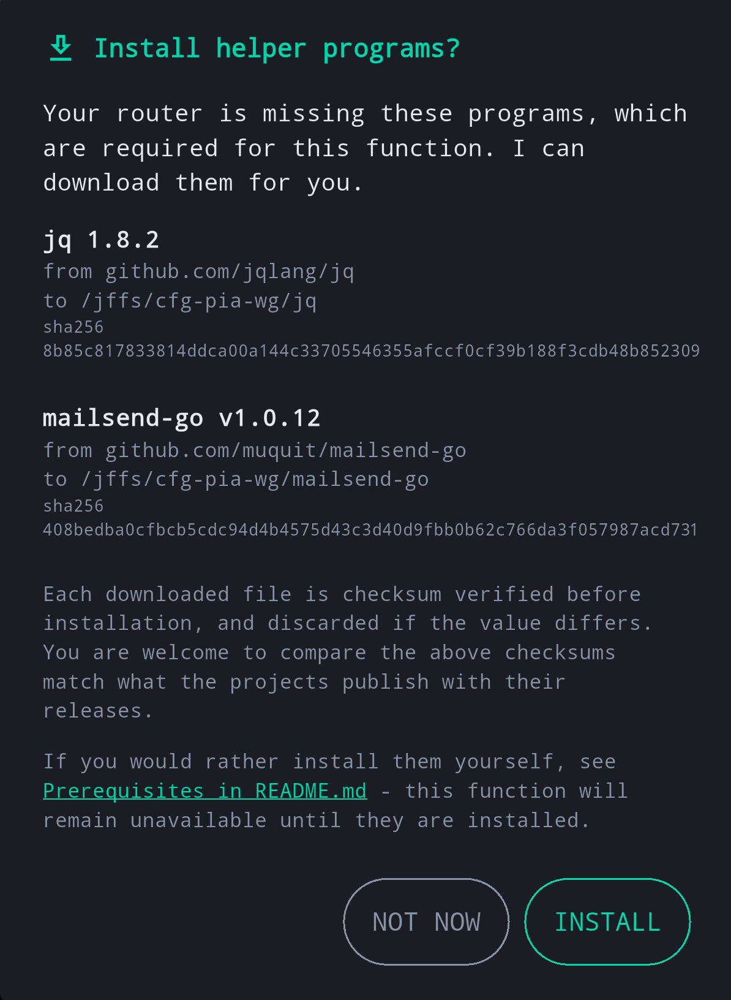
  <br>
  Install helper programs
</p><br>


If your router uses an architecture there is no published build for, the app says so and you can fall back to installing them by hand over SSH with [`scripts/get-bins.sh`](scripts/get-bins.sh). That script is for stock only; Merlin needs neither binary.
> [!NOTE]
> Firmware flashing (upgrading your router's software) [_may_ require redeployment](https://github-wiki-see.page/m/RMerl/asuswrt-merlin.ng/wiki/JFFS) of PIA WG configs. Always test your VPN is active after applying a new firmware version

- Watchdog and tunnel verification use ICMP ping from the router's WAN and WG interfaces. You shouldn't need to do anything here, but it is required.

## 5. Using the app

> [!TIP]
> Before using the `MANAGE` or `WATCHDOG` functions for the first time, it's recommended that you make a backup of your router configuration via the WebUI -> Advanced Settings -> Administration -> Restore/Save/Upload Setting -> Save setting.

The app opens with nine options:

- STANDALONE
- MANAGE
- WATCHDOG
- DEVICE ASSIGNMENT
- ROUTER LOG
- APP LOG
- SETTINGS
- ABOUT
- EXIT

Below that are two links: **how to use this app**, which opens this section of the README, and **add a Play Store app review**, which opens the app's Play Store listing.

<p align="center">
  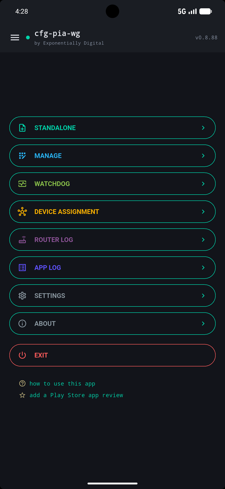
  <br>
  Main menu
</p>

### 5.1. STANDALONE - Generate a PIA WireGuard configuration

1. Tap **STANDALONE**.
2. Choose a region from the filterable region list.
3. Enter your PIA username, password, and DNS values.
4. Tap **GENERATE CONFIG** once all required fields are filled.
5. The generated WG configuration is displayed in a selectable but read-only text area.

<p align="center">
  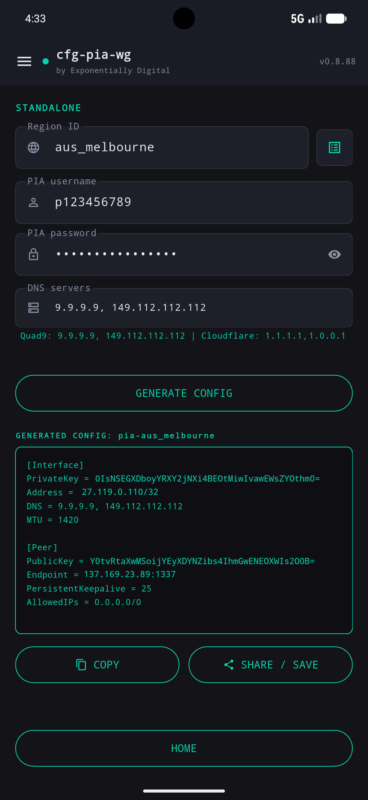
  <br>
  Standalone config generation
</p>

6. Tap **COPY** to copy the config to the clipboard, or **SHARE / SAVE** to export the file via Android sharing. Copying a config to the clipboard starts a 60 second timer, displayed on screen, after which the clipboard is automatically cleared.

### 5.2. MANAGE - Manage router PIA WireGuard configuration

This enables full management of WG slots.

1. Tap **MANAGE**.
2. If prompted, enter router IP:port, SSH username, and SSH password. The **address** is filled in for you if you've successfully connected previously. Your username and password are _never_ stored. Tap **CONNECT TO ROUTER**.

> [!TIP]
> To fill the credentials from your preferred password manager, tap the username or password field and choose the entry offered. Typically, suggestions are only given for **empty** fields, by default these are empty, so they should prompt, but [YMMV](https://www.merriam-webster.com/slang/ymmv) with your particular password manager. And some can be _very_ particular!

3. Select a slot and choose one of the slot actions:
<br>
<p align="center">
  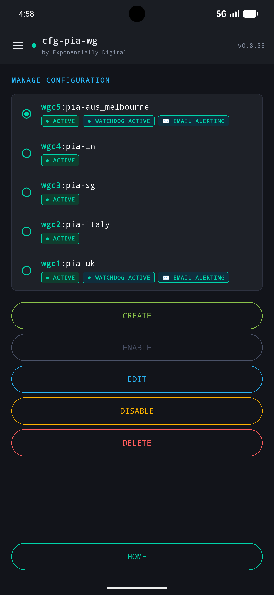
  <br>
  Router slot management
</p><br>

- **CREATE**
  - First, select a region:
  <br>
  <p align="center">
    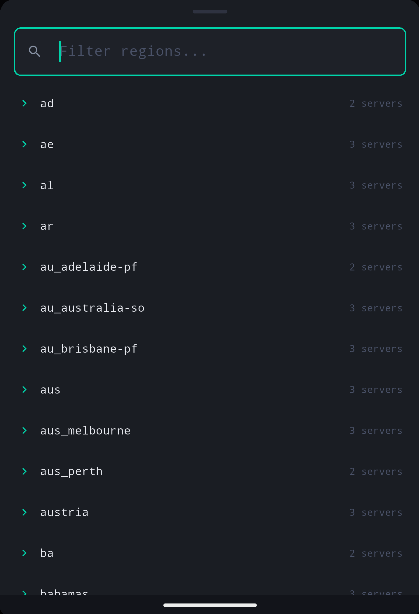
    <br>
    Region selection
  </p><br>

  - Then enter PIA credentials and preferred DNS server addresses. On stock firmware, assigned devices use only the **first** DNS server:
  <br>
  <p align="center">
    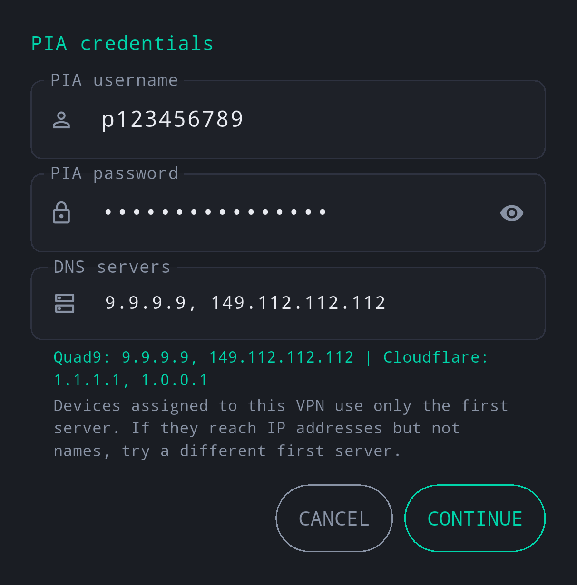
    <br>
    Supply credentials and DNS
  </p><br>

  - The slot's configuration is then created and saved, but _**not**_ enabled. If you're overwriting a previous region's slot it's stopped first; if there's a problem, the prior config is restored.
  <br>
  <p align="center">
    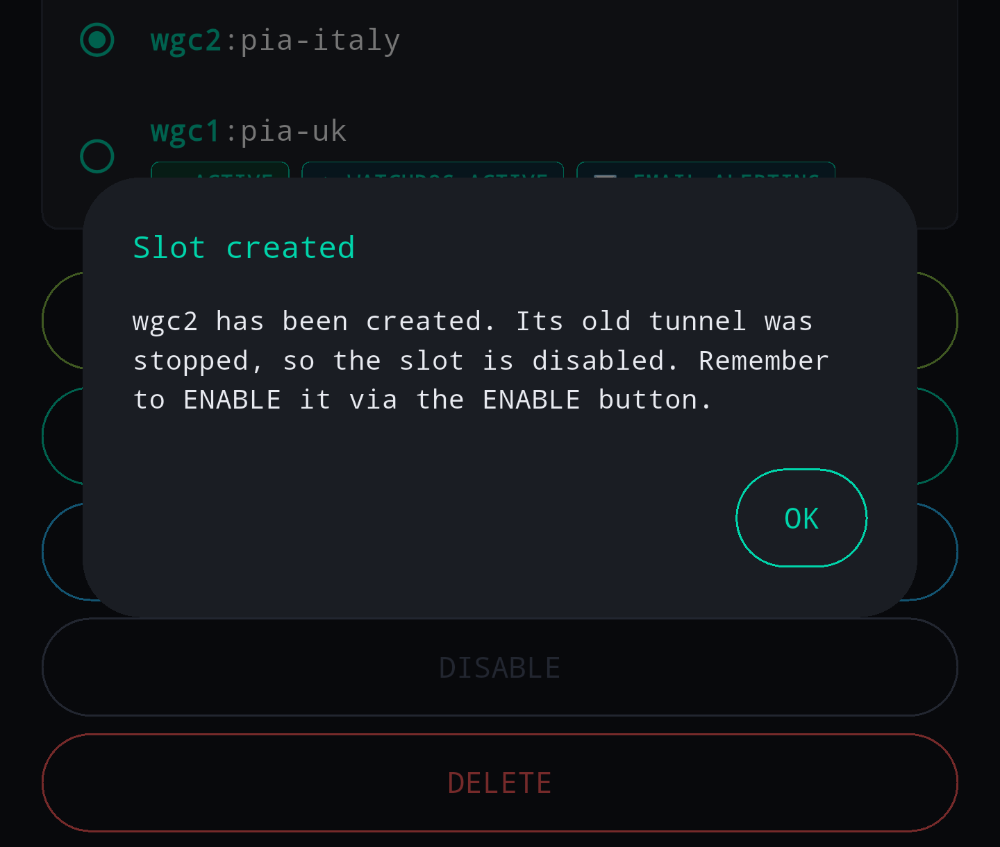
    <br>
    Slot created
  </p><br>

- **ENABLE:** activates the slot and verifies the interface by using two ping targets over the new VPN interface, not the WAN interface. If the connectivity check fails, the slot is reverted to disabled. Recommended connectivity checking addresses are
  - `8.8.8.8` or `8.8.4.4` (Google primary and secondary DNS)
  - `1.1.1.1` or `1.0.0.1` (Cloudflare primary and secondary DNS)

<p align="center">
  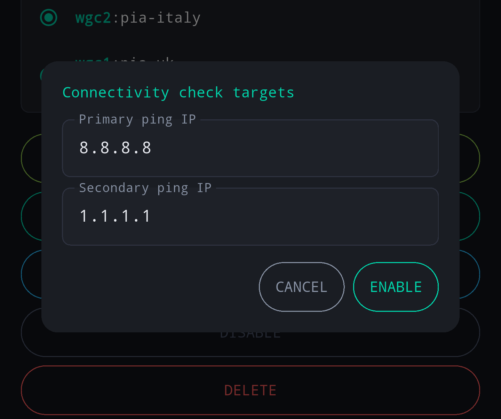
  <br>
  Ping targets
</p><br>

- **EDIT:** allows updating WG slot parameters and saves them back to router NVRAM.
<p align="center">
  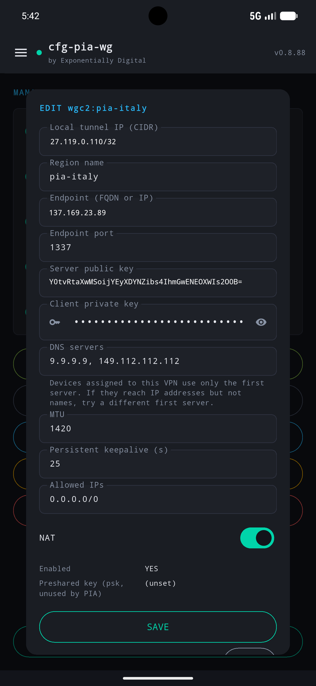
  <br>
  Editing a slot
</p><br>

- **DISABLE:** disable the selected slot, with confirmation. Any watchdog on the slot is also stopped.
- **DELETE:** remove the slot configuration and disable any associated watchdog.

> [!TIP]
> Merlin firmware also offers a kill switch and inbound firewall toggle.

#### 5.2.1. Which slot should carry your main VPN?

Short version: build the VPN you use for most things on **wgc5**, and work downwards from there.

The first reason is cosmetic. The router's own web interface creates `wgc5` first, and `cfg-pia-wg` lists slots the same way - `wgc5` at the top, down to `wgc1` - so the two agree about which slot is "the first one". Yes, that does my head in too; it's inverted but it is what it is :).

The second reason isn't cosmetic, and it applies if your VPN's DNS servers are the **same** as your **router** which it uses for its **own** encrypted DNS lookups. Yes, read that twice too. Quad9 and Cloudflare are the usual overlap, because they're a sensible solution to fully encrypted DNS with extra sauce (protection from malware, ads, adult filters etc). When these addresses match, the firmware sends the router's **_own_** lookups - the ones it makes for every device that has not been assigned to a tunnel - through the slot with the lowest routing table number. The tables are `wgc1` `#9` through to `wgc5` `#5`, so the lowest table belongs to the **highest-numbered** slot. Whichever slot that is, it carries name resolution for the whole network. Bear with me, it does get easier. Read on, intrepid traveller.

Two things follow, and both are useful to know before choosing:

- **A failure there is a failure everywhere.** If that tunnel dies and nothing rebuilds it, devices that resolve through the router stop resolving names, period, not just the ones you assigned to it. That's a prime candidate for putting a watchdog on, and for giving it an email address to send you love letters, sorry, alerts.
- **Moving a region between slots has an order.** Create the new slot, move the pinned devices to it, and only then delete the old one. Deleting a slot sends its devices to **Internet**, not to your default connection, so doing it the other way round quietly drops them out of the VPN per stock firmware design. What-the, yes, your router really does do that by design, buried in the WebUI and only "visible" by stopping tunnels, unless you have `cfg-pia-wg`!

If your VPN DNS and your router DNS use _different_ addresses, regional movements aren't a "[gotcha](https://www.merriam-webster.com/dictionary/gotcha)".

#### 5.2.2. DNS: where your lookups go

> [!IMPORTANT]
> Your **default connection** decides where a device's traffic goes. It does **not** decide where that device's **DNS** goes.

Yep, for real. That's a `seldom-known` feature of ASUS stock firmware. The short version:

- **Why should I care?** While your traffic can flow through an encrypted tunnel, your DNS lookups can travel in clear text.
- **Pin a device to a slot** with `DEVICE ASSIGNMENT` and its DNS follows that slot, through that slot's tunnel. Safe, secure, and private.
- **A device that's not pinned** sends its lookups to the router, and the router answers using its own DNS settings - whatever your default connection is.
- **Keep your router's DNS addresses away from your slots' DNS addresses**, unless you are choosing to share one deliberately. When a slot uses the **same** address as the **router**, the router's own lookups travel through that slot's tunnel, and if that tunnel stops answering while still looking connected, every unpinned device loses name resolution until it is rebuilt. Read that twice, it's important. Read on for the [TL;DR](https://www.merriam-webster.com/dictionary/tl;dr).

So, what can I do about it?

**Pin devices you care about.** A _pinned device's_ traffic and its lookups leave from the same place, and nothing else on the router can move them - which is likely the setup you want. Everything encrypted. By contrast, using the _default connection_, with DNS supplied by your ISP, can "leak" PIA, watchdog DNS lookups and, anything else you throw at it. This is one reason why you _don't_ want to use your ISP's DNS servers, but hey, your call. `cfg-pia-wg` has been designed specifically to reduce your foot-print/surface area, but it's up to you. Your router, your setup, and that's A-OK.

> [!TIP]
> Suggestion: use encrypted lookups with a "no log" privacy DNS service.

On stock, `cfg-pia-wg` also highlights if a slot's DNS matches the addresses your router uses for its _own_ encrypted lookups via a note under the `MANAGE > EDIT` DNS field, naming the shared addresses. Why? Sharing is a reasonable choice. `cfg-pia-wg` never changes your router's DNS settings. That's your domain, but it can impact the watchdog's ability to do its job of keeping your tunnel(s) up.

Since build 454 (19 September 2026),`cfg-pia-wg`'s watchdog resolves **both** PIA and your mail server over encrypted DNS, to an address of your choice. This keeps your VPN provider and your email provider off the wire in the clear. On your phone/tablet, `cfg-pia-wg's` lookups go through your device's resolver like any other on-device app - turn on Private DNS in your device's settings if that's important to you.

See **[ROUTER-DNS.md](ROUTER-DNS.md)** for all the gory details: why the router answers for unpinned devices, two worked setups with juicy flow charts, how to use a slot for parental controls, a table of common DNS services, and the routing rules underneath it all for the technically inquisitive.

Right, with all that out the way, let's get you set up with watchdogging ;).

### 5.3. WATCHDOG - Watchdog WireGuard configuration

This manages a self-healing watchdog. When your WG configurations inevitably expire, they are automatically renewed and an optional email alert sent when connectivity has been restored.

1. Tap **WATCHDOG**.
2. If prompted, enter router IP, SSH username, and SSH password and tap **CONNECT TO ROUTER**.
<br>
<p align="center">
  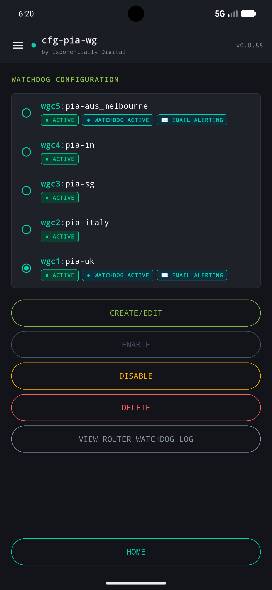
  <br>
  Watchdog configuration
</p><br>

3. Select a slot and use the watchdog actions:
   <br>
   - **CREATE/EDIT:** pick a region and a check interval, defaulting to five minutes, then tap **SAVE & DEPLOY** to deploy router-side watchdog scripts and cron jobs for the selected slot. The region starts as the slot's own, so saving an active watchdog without changing it leaves its tunnel alone. Choosing a region for a slot that already holds a configuration asks before overwriting it. Changing the region rebuilds the tunnel on the new one: it is down while that happens, and devices assigned to it use the default connection until it is up.
<br>
<p align="center">
  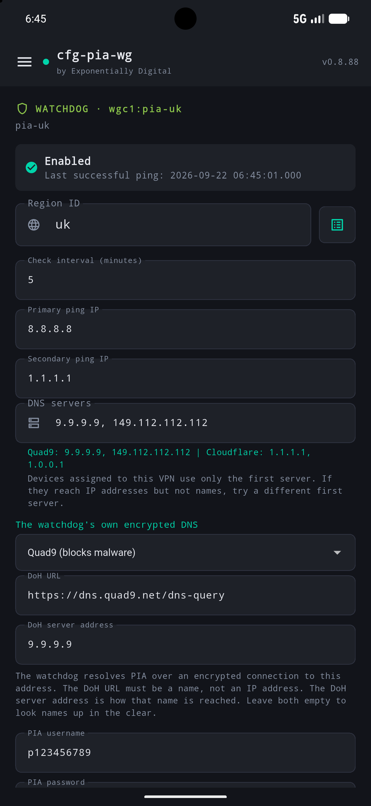
  <br>
  Configuring a watchdog
</p><br>

   - **ENABLE:** restart the watchdog, with all settings retained.
   - **DISABLE:** stop the watchdog running whilst retaining its settings. Disabled watchdogs show a **PAUSED** badge.
   - **DELETE:** remove the watchdog and clear this slot's configuration.
   - **VIEW ROUTER WATCHDOG LOG:** review the router-side watchdog log for this specific slot, including previous logs. **CLEAR** empties this watchdog's log. Logs are rotated at midnight retaining the current and previous logs and do not persist if the router is rebooted or a power loss occurs. That's a conscious design decision to avoid filling your non-volatile router RAM.
  
<p align="center">
  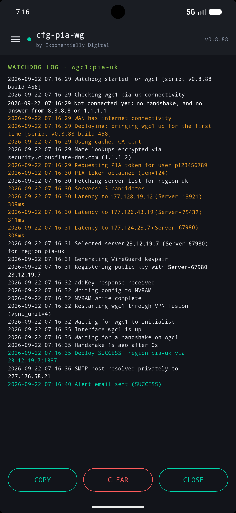
  <br>
  Watchdog log
</p>

#### 5.3.1. Email alerts

<br>
<p align="center">
  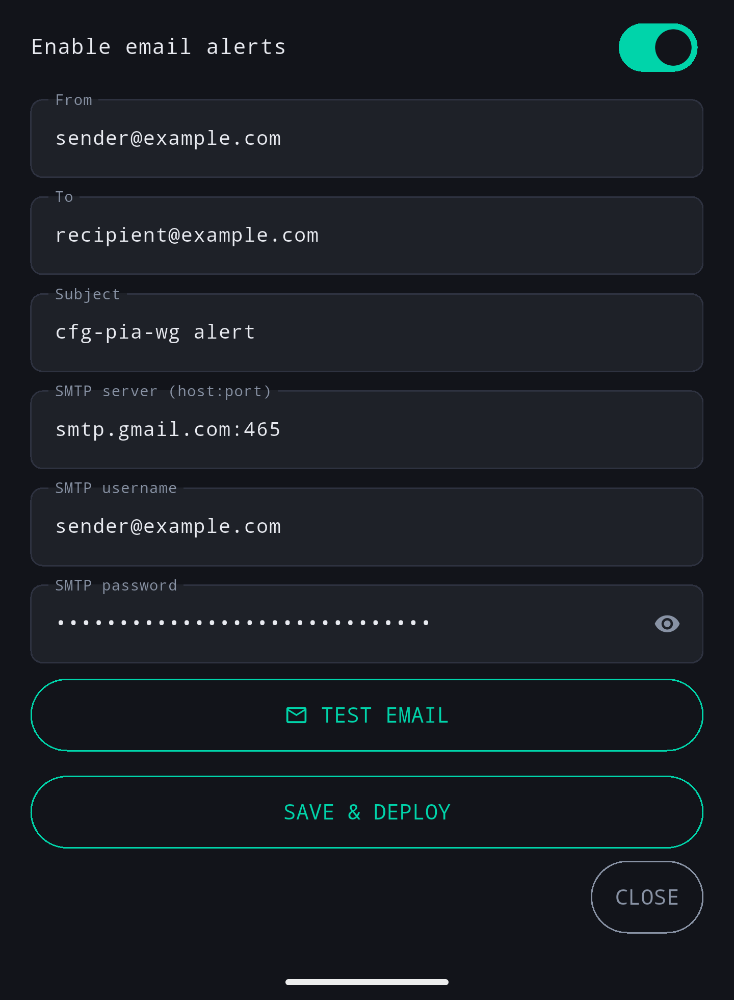
  <br>
  Email alerting
</p><br>

If you elect to `enable email alerts`, the router will send you a plain-text email whenever it rebuilds a tunnel, and if it tries and fails. Alerts come from your own SMTP account, with nothing routed through a third party. When a watchdog is saved, these settings are stored in your router's non-volatile memory and prefilled when creating another watchdog - saves typing! **No** credentials are stored on your phone/tablet, see [ARCHITECTURE.md](https://github.com/ExponentiallyDigital/cfg-pia-wg/blob/main/ARCHITECTURE.md) and [SECURITY.md](https://github.com/ExponentiallyDigital/cfg-pia-wg/blob/main/SECURITY.md) for details.

To set up email alerting, you'll need an **`app password`**, _not_ your "normal" one. Gmail and Outlook thankfully won't accept plain text passwords. How-to links below:

- **Gmail:** <https://myaccount.google.com/apppasswords>
- **Outlook / Microsoft:** <https://account.live.com/proofs/AppPassword>

> [!TIP]
> Having email alerting issues? See [TESTING.md](https://github.com/ExponentiallyDigital/cfg-pia-wg/blob/main/TESTING.md) for a step-by-step walkthrough together with email troubleshooting approaches.

Use the **TEST EMAIL** button, per the screenshot above, before you save the watchdog. This helps ensure that you'll reliably receive alerts. The test email uses the same type of message and sends through the same path as alerts, so a test that arrives is a strong indication that alerts will too. But hey, I'm not a postmaster :-).

Every email has the same sections: what happened, what to do about it (failures only), which router this is, and a running count of how well the watchdog is earning its keep.

**When a tunnel is rebuilt:**

```text
Subject: cfg-pia-wg alert: SUCCESS - wgc1:pia-region_name

Connectivity was lost and the tunnel has been rebuilt.

WHAT HAPPENED
Event: reconfigured successfully on attempt 2
Tunnel was down for: 6m 12s (last seen good 2026-09-05 14:26:41 AEST)
Kill switch: ON - no traffic left the router while it was down
Reconnected to: region_name408 (45.134.140.101:1337), 9 ms
Interval: 5 minutes

ROUTER
Name: my-router.asuscomm.com (192.168.50.1)
Model: <your router model>, firmware <your firmware version>
Time: 2026-09-05 14:32:53 AEST
Uptime: 15:11:29 up 19:21, load average: 2.55, 2.39, 2.36
Watchdog: wgc1:pia-region_name, deployed by cfg-pia-wg <version> build <number>

HISTORY
Since 2026-09-01 this router has recorded 4 successful and 1 failed reconfigurations.

If cfg-pia-wg is useful to you, please consider submitting a review by tapping on the home screen link or via https://play.google.com/store/apps/details?id=com.exponentiallydigital.pia_wireguard_cfga

Thank you,
cfg-pia-wg by Exponentially Digital
```

**When it cannot be rebuilt** two additional sections are populated: what to try, and a tail of the router's watchdog log so you can see the attempt rather than take the summary on trust:

```text
Subject: cfg-pia-wg alert: FAILED - wgc1:pia-region_name

Connectivity was lost and the tunnel could NOT be rebuilt.

WHAT HAPPENED
Event: failed to obtain PIA token (exit 0, HTTP 403, body 34B: {"error":"rate limit exceeded"})
Tunnel has been down for: 41m 09s (last seen good 2026-09-05 13:58:12 AEST)
Kill switch: none on this firmware; while it was down, its devices fell through to the default connection, pia-other_region, so they stayed on a VPN
Attempt: 8 since the last success, retrying per schedule, 5 minutes

WHAT TO DO
1. Check your PIA username and password in the app, under WATCHDOG then CONFIGURE.
2. Open VIEW WATCHDOG LOG in the app for the full history.
3. PIA rate-limits repeated token requests; if the code above is 403, wait 30 minutes before intervening.
4. Review your router log.
5. Is your PIA user account active?

ROUTER
Name: my-router.asuscomm.com (192.168.50.1)
Model: <your router model>, firmware <your firmware version>
Time: 2026-09-05 14:39:02 AEST
Uptime: 15:17:38 up 19:27, load average: 1.02, 1.15, 1.09
Watchdog: wgc1:pia-region_name, deployed by cfg-pia-wg <version> build <number>

HISTORY
Since 2026-09-01 this router has recorded 4 successful and 2 failed reconfigurations.

ROUTER LOG (last 10 lines)
2026-09-05 14:38:41 Checking wgc1 pia-region_name connectivity
2026-09-05 14:38:44 No handshake and both pings failed (9.9.9.9, 1.1.1.1)
2026-09-05 14:38:44 Connectivity lost; reconfiguring (attempt #8)
2026-09-05 14:38:44 WAN has internet connectivity
2026-09-05 14:38:45 Using cached CA cert
2026-09-05 14:38:45 Requesting PIA token for user p123456789
2026-09-05 14:38:46 ERROR: failed to obtain PIA token (exit 0, HTTP 403)
```

How to interpret these emails:

- **Kill switch** answers the question that most often matters when a tunnel drops: did anything leave the router unprotected, in the raw, so to speak? The line reports the state your router was actually in, not a generic warning.
  - On **Merlin**, which has a kill switch: on, or available but not enabled.
  - On **stock**, which has none, it says where the affected devices went instead. If the dropped tunnel was itself the default connection, its devices had no internet and thus no leak. If no devices are assigned to it and it is not the default, it says so, because nothing depended on it. If another WireGuard tunnel is the default and that tunnel is up, they fell through to it and stayed on a VPN. If the default is down too, or is not a WireGuard tunnel the watchdog can check, it says the default was not confirmed up and they may have had no VPN. Only if the default is the plain internet did they certainly travel unprotected.
  - This is why the default connection is worth setting deliberately: on stock it is the difference between a leak and an outage. See [VPN device assignment](#54-vpn-device-assignment).
- **Interval** is read from the router, so it can never claim a schedule that is not actually running.
- **Since `date`** counts every re-configuration this router has made, across all slots, from the day the app first configured itself.
- The router log excerpt includes your **PIA username** (never the password, and never the token). The email travels through your own mail provider, but bear that in mind before forwarding it on.

> [!NOTE]
> **An alert can only be sent if the router can still reach your mail server.** If it cannot because its internet connection is down, or it cannot look up your mail server's name at that moment, then that alert never leaves the router. The attempt is always recorded in the router-side watchdog log, and the next email that does get through says how many were missed.

The first email you receive will be the deployment itself - `Event: watchdog deployed` - sent even though there was nothing to fix. That is deliberate: it confirms the whole alerting path works, at the moment you set it up rather than months later during an outage.

What about rate limiting? No one wants to wake up to an inbox full of alerts! `cfg-pia-wg` employs an intelligent rate limit with an exponential backoff between retries capped at 90 minutes per send interval. WAN down? Email alerts are held over until WAN connectivity is regained, and on resumption you get an alert per interval, again capped. See ARCHITECTURE.md's section on [email alerting](https://github.com/ExponentiallyDigital/cfg-pia-wg/blob/main/ARCHITECTURE.md#email-alerting) and [the backoff process](https://github.com/ExponentiallyDigital/cfg-pia-wg/blob/main/ARCHITECTURE.md#when-the-script-runs-and-when-it-does-nothing) for full details.

### 5.4. VPN device assignment

**Stock firmware only.** Merlin does the same job through VPN Director, which this app does not drive.

Normally every device on your network follows the router's default connection. This capability lets you send particular devices through a particular VPN tunnel and leave everything else alone - a games console straight out to the internet, a laptop through Melbourne, everything else through Perth.

One simple, easy to use interface and your laptop can be globetrotting to anywhere in the world. Practical considerations do apply though as many organisations are actively enforcing geo-blocking via registered IP address blocks. That's never been the purpose of this app. It exists to do one thing extremely well. And that's stopping nominated devices from going out to the Internet in the clear, unprotected and naked, swinging in the breeze so to speak.

DEVICE ASSIGNMENT gives you one list of all your devices and lets you decide which tunnel they should be "pinned" to. It also allows you, as we read earlier (you did read that bit didn't you :)?), to set the default connection simply, quickly, easily and have confidence that devices pinned to that will go where they're intended.

<br>
<p align="center">
  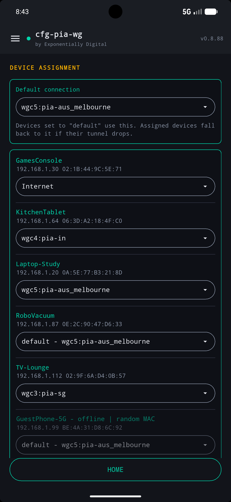
  <br>
  Device assignment
</p><br>

#### 5.4.1. A practical `how to`

1. Tap **DEVICE ASSIGNMENT** on the main menu, or via the hamburger menu.
2. In-session credentials are cached, so if asked, enter your SSH username and password, then tap **CONNECT TO ROUTER**.
3. Every device the router's seen since its birth is listed, plus what network that device is set to use.
4. Tap a device to pick **Internet** or one of your WireGuard slots. Offline devices are listed too, greyed, at the bottom.
5. **APPLY** shows every change as `from -> to` and asks before touching anything. **DISCARD CHANGES** puts them all back. If a tunnel you are moving devices onto is not running, or its server has not answered for a few minutes, APPLY says so before you confirm.

<br>
<p align="center">
  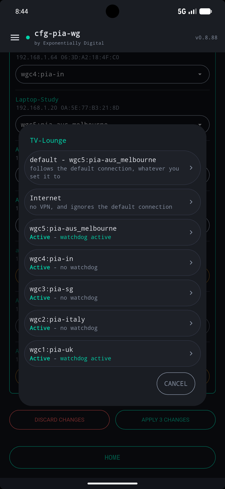
  <br>
  Assigning a device
</p><br>

Assignment is as simple as tapping on a device in the previous menu, then deciding which of the five slots you want that device to use on its globetrotting journey. Select one, then APPLY CHANGES. Easy. What about those "other" two choices? They're special cases as we'll read below.  

- `Internet`, as its name implies is simply that. No tunnel, and as much privacy as your country gives you. Which isn't much sometimes :/.
- What about that `Default - pia-some_region` one that sits at the top of the screen? It handles every device you've *not* assigned to a specific slot.

#### 5.4.2. The `default connection`

<br>
<p align="center">
  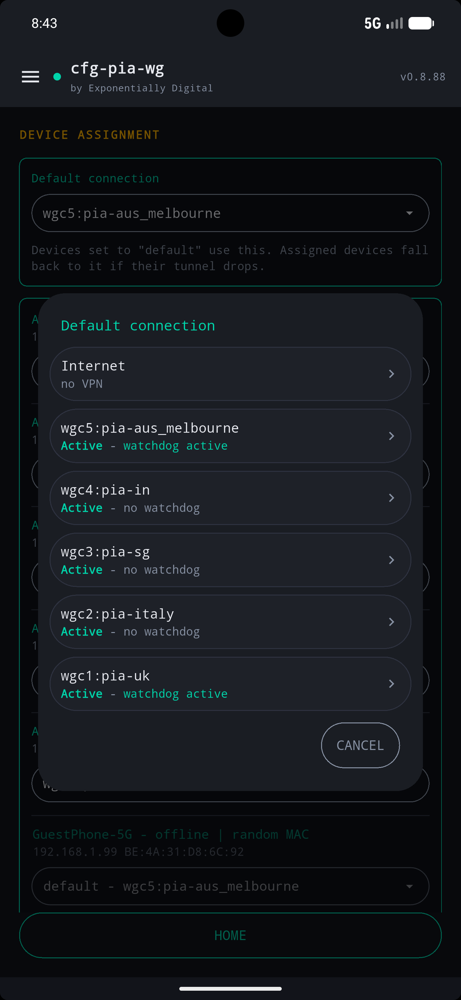
  <br>
  Default connection
</p><br>

Three things you should know about the `default connection`:

> [!IMPORTANT]
> - Changing the default connection restarts **every** tunnel on the router, so anything using a VPN loses its connection for up to a minute. Assigning _individual_ devices causes no tunnel restarts.
> - **Assigning a device is not a kill switch.** If the slot it is pinned to drops, that device does not lose its connection - it falls through to whatever the default connection is. If the default is **Internet**, it carries on unprotected until the tunnel comes back.
> - To get **fail-closed** behaviour instead, point the **default connection** at the same tunnel you assigned the device(s) to. Then a drop means those devices have no internet rather than an unprotected one, and a watchdog on that tunnel is what decides how long that lasts.

And six things that can catch you out:

1. **A device the router has never seen can't be assigned.** Connect it to your network and get it to exchange some traffic through your router, it'll then show up in the device list. There is a time delay, and it depends on things outside our control. But it will show up. Hopefully expeditiously, but sometimes in its own sweet time. Prodding it by talking through your router usually goads it into submission.
2. **Assigning a device pins its address permanently.** And that's the big one. It stops an assignment drifting onto a different device later on. A pinned device stays behind when you unassign - the router never removes it, and neither does this app.
3. **A randomised MAC address breaks assignment silently.** Those devices are tagged in the list with `random MAC`. Many phones randomise their MAC addresses per network by default, and the assignment stops working the next time the address rotates, with nothing to tell you. [5.4.3](#543-phones-and-random-mac-addresses) gives you the settings to change, per phone architecture.
4. **A device assigned to a tunnel that you then turn OFF keeps its assignment**, and falls through to the default connection while that tunnel is down. It reconnects to your chosen tunnel when you power it back on. The main DEVICE ASSIGNMENT screen tells you where that will be. Deleting a slot is different: the app moves its devices to the Internet, tells you which ones it moved, and puts the default connection back to Internet if that tunnel was it.
5. **Guest network devices never appear.** Typically they can't reach your LAN, so putting one on a VPN is a different proposition.
6. **A device assigned to a VPN uses only that VPN's first DNS server.** The router sends every lookup from it to the first DNS server address listed in your slot config and never tries the second. For real. That's by design. If the first stops answering through that tunnel, then devices typically reach IP addresses but not names. You can change the first server with MANAGE, then EDIT.

#### 5.4.3. Phones and random MAC addresses

An assignment is a pin to a MAC address, so a device that changes its MAC quietly stops being the device you assigned. It does not lose its connection: it leaves by the default connection instead, which is possibly something you'd not intended. This is unannounced, and why the main DEVICE ASSIGNMENT screen tags devices like that with `random MAC`.

Many mobile phones do this by default with a per network setting, turning it off for a specific Wi-Fi network is straightforward:

- **iOS 27:** Settings > Wi-Fi > your network (the ⓘ) > Private Wi-Fi Address > off.
- **Android (Pixel):** Settings > Network & internet > Internet > your network (the gear) > Privacy > **Use device MAC**.

Two more ways an Android phone can rotate its address, worth knowing if one keeps coming back:

- Developer options has **Wi-Fi non-persistent MAC randomisation**. With it on, the address changes at a reboot or when the DHCP lease expires, not just when you join a new network.
- An app can ask for a randomised address through the network suggestion API, and an open network with no captive portal gets one, without Developer options even getting into the picture.

Laptops and desktops usually retain one address per adapter. If in doubt, the tag in the device list is your [Rosetta Stone](https://en.wikipedia.org/wiki/Rosetta_Stone).

#### 5.4.4. Where the device list comes from

The list is the router's own view of your network, not a scan this app runs. That has two consequences worth expecting rather than reporting:

- **A device can read as offline while it is sitting there working.** The firmware marks a device online when it sees traffic from it, so a quiet one can lag by minutes. It usually appears shortly after sending/receiving network traffic.
- **A device you no longer own can linger.** The router holds an entry until its DHCP lease expires, and a phone that rotates its address (see [5.4.3](#543-phones-and-random-mac-addresses)) leaves one behind every time it does. A "ghost" with a name you vaguely recognise is usually the same phone under a new random MAC.

### 5.5. ROUTER LOG

Your ASUS router's log, because we all love a great read. Seriously though, I've found my eye balls burning having hunted through the minuscule WebUI log panel. This one's colour coded, just like the APP LOG below. To make it really easy to see the stuff that you need to know about. Watchdog entries in lavender, errors in red, cfg-pia-wg in-app device operations in the app's signature teal. Everything else in fashionable white. Selectable or copy everything that's been pulled down to your phone/tablet over to your device's system clipboard. On scrolling, more of the router log is loaded as far back as it goes. And it does go on, and on, and on.
<br>
<p align="center">
  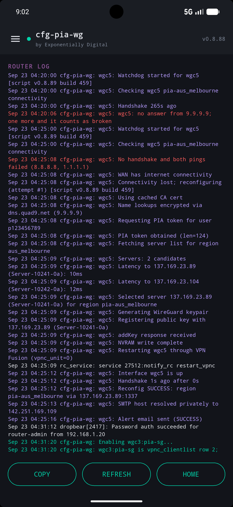
  <br>
  Router log
</p><br>

### 5.6. APP LOG

`cfg-pia-wg` extensively logs everything it does. The author is a big fan of "observability" - being able to see what's been happening. Entries are colour coded to make it easy to see at a glance what's been going on. Within any of the "log" type views (APP / ROUTER/ WATCHDOG) you can select text and copy it to the system clipboard or **COPY** to grab everything, or zap this log with **CLEAR**.
<br>
<p align="center">
  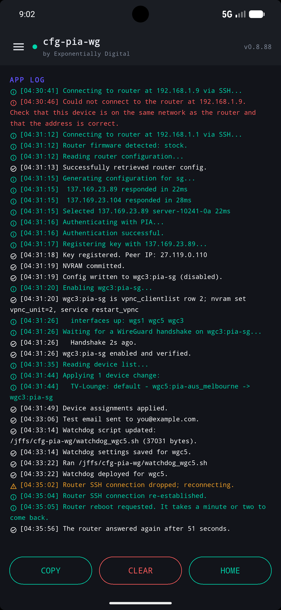
  <br>
  App log
</p><br>

### 5.7. Settings

All those things that you won't need until you do need them, and all in one place.

<p align="center">
  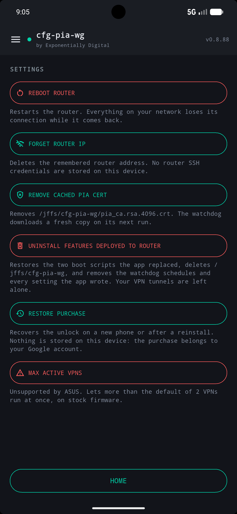
  <br>
  Settings
</p>

  - **REBOOT ROUTER** - surprisingly, this does precisely what it claims. It'll restart your router, after seeking confirmation. With a countdown.
  <p align="center">
  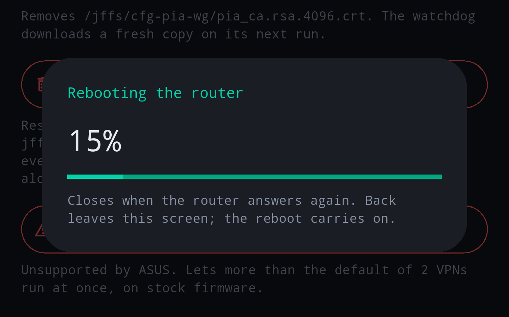
  <br>
  Reboot router
</p><br>

  - **FORGET ROUTER IP** - removes the remembered router address - the _**only**_ data retained on your device. No SSH credentials, no usernames, no PIA password, no tracking, no advertising ID, no ad cache, no in-app user journeys. Zip. Zilch. Nada.
  - **REMOVE CACHED PIA CERT** - deletes the cached PIA certificate from the router; the watchdog fetches a fresh one on its next run. Why? Just in case. The "Irish" approach - to be sure, to be sure. Try doing an Irish accent via a keyboard. Not easy. But why? In case it ever expires/gets updated by PIA, you'll have a way to get a fresh one straight from their official GitHub repo when you run any operation that authenticates with PIA's servers.
  - **UNINSTALL FEATURES DEPLOYED TO ROUTER** - completely removes any watchdogs, their helper apps, and all app configuration deployed to your router; configured WireGuard VPNs are retained. See [What does the app do to my router?](#7-what-does-the-app-do-to-my-router). It asks twice. The "Irish" approach, alive and well. Everything really is removed, nothing's left behind, no stray filaments to clog up your device's storage. That's good software practice, I wish more folks did that.
  - **RESTORE PURCHASE** - resurrects your Google Play Store entitlement for your one-off, lifetime purchase of `pia-cfg-wg`, you did buy a copy didn't you? If nothing matches, based on your device's current Play Store logged in account, you'll be told too.
  - **MAX ACTIVE VPNS** - allows you to run more than two concurrent VPN clients on your router. Absolutely unsupported. You did read the license agreement didn't you? If not that's in the last screen because we all love reading legal documents.

### 5.8. About

All the details of what version you have, the provenance of who built it, and a bunch of stuff that geeks love, me included.
<br>
<p align="center">
  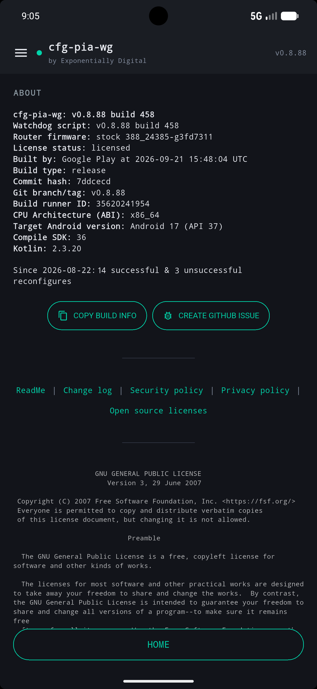
  <br>
  About
</p><br>

- **Router firmware** - whether the router runs stock or Merlin firmware, and its version.
- **License status** - `licensed` when the one-off purchase is entitled per the currently logged in Google account (absolutely not something I have access to, track, or want to know),`unlicenced`, or `homegrown` for a self-build copy (go you, gratz!).
- **"Value"** history - counted across every slot since the first watchdog was deployed to this router.

- **COPY BUILD INFO** - copies the build info block as plain text, for pasting into a bug report or framing.
- **CREATE GITHUB ISSUE** - opens a new issue in the cfg-pia-wg repo via your browser, with pre-filled build and device information.
- **Open source licenses** - the full licence text for every third-party component. Lots of reading material!

<br>
<p align="center">
  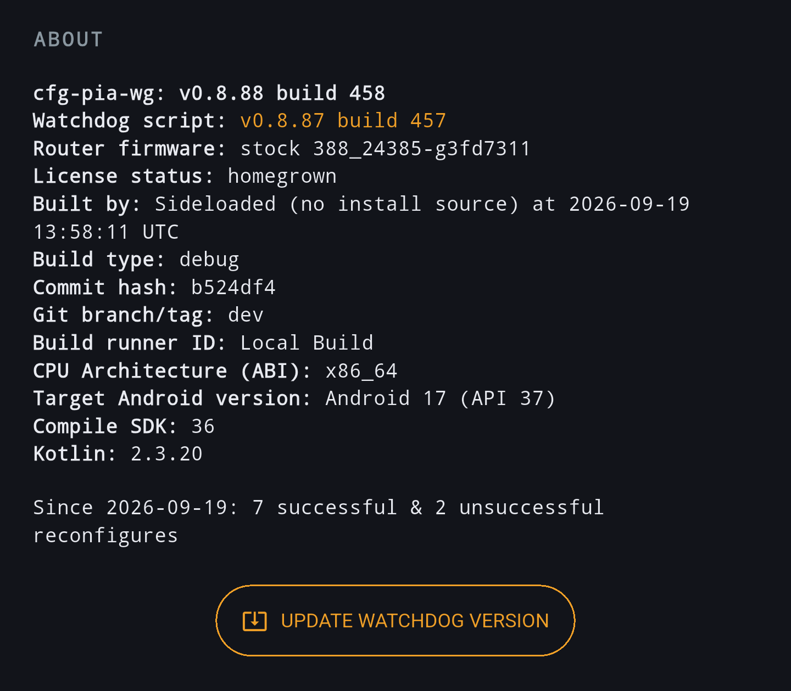
  <br>
  Easily update your deployed watchdog script(s),
</p><br>

- **Update watchdog version** - if your on-router watchdog version is older than the current release, simply upgrade by tapping here. Button only appears if a version mismatch is detected.
<br>
### 5.9. EXIT - Close the app

**EXIT** prompts for confirmation before closing the app, wipes _**all**_ volatile session data, and clears the system clipboard.

### 5.10. Hamburger menu

You can quickly jump between functions via the hamburger menu, always shown in the <span style="color: green; font-weight: bold;">top left corner</span> of each screen:

<p align="center">
  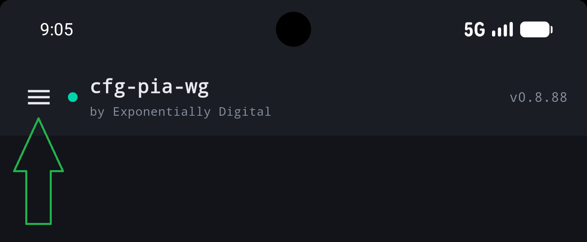
<br>
Hamburger shortcut
</p>
<br>

This is particularly useful for looking through the application's log during operations without losing your place, simply use your device's back button afterwards and you're back to where you came from. Back-to-front?

<p align="center">
  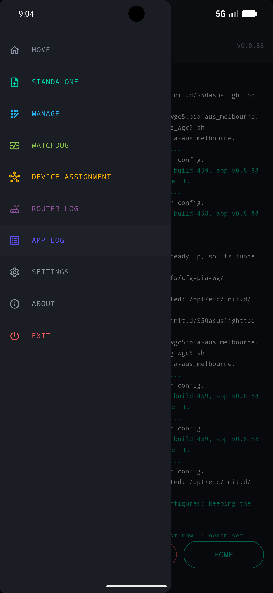
  <br>
  Hamburger Menu
</p>

---

## 6. Notes

- **Pre-shared keys** - PIA WG does not use pre-shared keys. When pushing a config to the router, this field is always set to empty unless a push fails, then its original value is restored.
- **Time-to-live constraints** - PIA WG configs expire without warning per PIA's token handling, requiring you to regenerate a config file periodically (which is why this app exists!).
- **Turn OFF battery optimisation** - for `cfg-pia-wg` otherwise Android may freeze the moment you switch away, and any work it was doing on your router will likely stop mid-action - an SSH session dropped during a watchdog deployment, an alert email abandoned halfway through. Nothing is damaged, but it fails for a reason you cannot see. On most phones: **Settings -> Apps -> cfg-pia-wg -> Battery -> Unrestricted**. Worth doing before you deploy your first watchdog.
- **Extra logins in the router's log are normal** - the router aggressively expires idle SSH sessions - well inside a session spent reading a screen and deciding what to do - so the app reconnects when it finds the connection's expired, and its next action carries on as though nothing happened. What you see afterwards is several `dropbear` logins from your phone for one sitting. That is the app picking the phone back up, not someone else picking the lock.
- **Key safety** - generated configs contain private encryption keys. Treat them like passwords and manage them securely.
- **PIA maintenance** - PIA occasionally take regions offline for maintenance so you might be expecting to have an exit node in say pia-region_one, but online tools may show you as exiting from pia-region_two.
- **Check your VPN is working** - with services like [PIA what is my ip](https://www.privateinternetaccess.com/what-is-my-ip), [ipaddress.my](https://ipaddress.my/?lang=en_US), [2ip.io](https://2ip.io), and [showmyip.com](https://www.showmyip.com). However, these sites may cache your location in the browser and they sometimes return a stale exit region if used multiple times. To be absolutely sure, close your browser rather than just refreshing the page.
- **Watchdog shortcut** - if you deploy a _watchdog_ on an empty slot, that will also create the config for that slot in one step.
- **Change things in one place at a time** - the router's web interface writes the whole VPN list back when you press **Apply all settings**, using the copy it loaded when the page was opened - so a change made in this app can be overwritten by a web page that was open before you made it. If you use both, finish and apply in one before switching to the other, and reload the web page afterwards.
- **Maximum VPN count** - ASUS limits you to two concurrent VPNs on stock firmware, this is enforced by the app. On Merlin, there is no VPN limit.
<br>

> [!NOTE]
> When manually adding a VPN via the router's web GUI, the watchdog function requires the VPN description match the PIA region name exactly eg `aus_melbourne`. If you use the watchdog function and manually set the slot description to something other than "pia-region_name", then the watchdog will fail to identify what region it should use when a reconfigure event occurs.
> 
<br>

> [!WARNING]
> If you sell or give away your router, clear it before it leaves your hands. The watchdog stores your PIA and SMTP passwords in NVRAM in plain text, and a router handed over as-is hands those over with it.
>
> **The way to do that is in the app: SETTINGS -> UNINSTALL FEATURES DEPLOYED TO ROUTER.** It removes every setting the app wrote, the watchdog schedules, the scripts and the whole `/jffs/cfg-pia-wg` folder, and puts back the two boot scripts it replaced. Then delete your VPN slots from the Manage screen, which is what removes the tunnels themselves. If you would rather check by hand, `scripts/showall.sh` prints everything that is stored and `scripts/clearall.sh` removes it; both are in the [GitHub repo](https://github.com/ExponentiallyDigital/cfg-pia-wg).
>
> **A factory reset does clear them.** Measured 2026-09-07 on stock firmware (RT-ABCD): marker values were written to NVRAM and committed, and neither the WebUI factory-default restore nor the WPS-button hard reset left any of them behind - including one shaped like `cfg_pia_wg_password` and one shaped like `wgcN_wd_smtp_pass`. Earlier releases of this page claimed the opposite; that claim was never tested and was wrong. Merlin has not been tested, so if you are on Merlin, use the scripts above rather than relying on the reset.

---

## 7. What does the app do to my router?

A fair question - anything that talks to your router on your behalf deserves scrutiny. Here is the
whole list.

**When you manage a slot**, it writes that slot's WireGuard settings into the router's NVRAM, and
restarts that one tunnel. Nothing else is touched, and nothing happens at all until you press a
button.

**When you deploy a watchdog**, it also writes:

- a small shell script per watched slot, in a folder of its own on the router
- two scheduled entries per slot - the check itself, and a nightly rotate of that slot's log
- the watchdog's settings in NVRAM, **including your PIA and SMTP passwords in plain text**, because the router has to be able to re-authenticate with PIA while you are asleep
- on stock firmware only, the two helper programs from section 4, into the same folder
- enough to make those schedules survive a reboot: on Merlin, two lines in the router's own startup script; on stock, which has no equivalent, the startup area that Download Master provides. **Anything it replaces is kept beside the original and put back on uninstall.**

**What it never does.** No firmware is modified. No packages are installed beyond the two helpers. No ports are opened. None of your traffic is routed anywhere by the app, and none of it goes to us - there is no server on our side to send it to.

**You can take it all off again.** The **SETTINGS** screen has **UNINSTALL FEATURES DEPLOYED TO ROUTER**, that removes the scripts, the schedules, the app's NVRAM settings and the folder, and restores the startup files it replaced. It deliberately leaves your **VPN slots and tunnels alone** - those are yours, and DELETE on the Manage screen is what removes them. Device assignments and the default connection are left in place for the same reason.

**And you can read the script before you trust it** - see [9.1. How to check the watchdog script yourself](#91-how-to-check-the-watchdog-script-yourself).

Full technical detail, including a flow chart of user interactions and diagrams of network calls and traffic flows: [ARCHITECTURE.md](https://github.com/ExponentiallyDigital/cfg-pia-wg/blob/main/ARCHITECTURE.md).

---

## 8. App permissions

In summary, the app requires only the following:

- Have full network access
- View network connections
- Google Play billing service
- Google Play license check

### 8.1. Internet (android.permission.INTERNET)

Required to:

- authenticate with Private Internet Access (PIA)
- retrieve VPN server information
- generate WG configuration profiles
- perform latency and connectivity tests

No user traffic is routed through this application. The app communicates only with PIA provisioning and API endpoints required to generate configuration files.

### 8.2. Network state (android.permission.ACCESS_NETWORK_STATE)

Required to:

- detect whether the device currently has network connectivity
- avoid unnecessary network requests when offline
- provide error handling and process diagnostics

### 8.3. Storage access

The application can export generated WG configuration files to the device.

#### 8.3.1. Write external storage (android.permission.WRITE_EXTERNAL_STORAGE)

- used only on legacy Android versions (Android 9 and earlier)
- allows exported configuration files to be written to the Downloads folder

#### 8.3.2. Read external storage (android.permission.READ_EXTERNAL_STORAGE)

- used only on older Android versions where required by the operating system
- allows the application to verify exported configuration files

### 8.4. Billing (com.android.vending.BILLING)

Required to offer the one-off in-app purchase through Google Play.

- it is a normal permission: nothing is requested at runtime and no dialog appears
- it grants no access to your device, your files or your network
- payment is handled entirely by Google Play. The app never sees a card number, and no payment
  detail reaches this app or its developer
- the app asks Google Play whether this installation holds the purchase, and nothing else

---

## 9. Security

We take credential safety and application hardening seriously. Please see the [SECURITY.md](./SECURITY.md) for details on our secure development practices, data handling lifecycle, and instructions on how to privately report potential vulnerabilities.

### 9.1. How to check the watchdog script yourself

This app asks a lot of you: it writes a script that holds your PIA password and runs as root on your
router, on a schedule, indefinitely. You should not have to take that on trust, and you do not have
to - the script is there to be read.

**Where it is.** `/jffs/cfg-pia-wg/watchdog_wgcN.sh`, one file per watched slot, where `N` is the
slot number. SSH into the router and `cat` it.

**It is plain shell.** Never obfuscated, never minified, never compressed or encoded. What you read
is exactly what runs. It is a few hundred lines of POSIX `sh` with comments left in.

**It matches what is in this repository.** The script is generated from a template you can read in
[`lib/router_watchdog.dart`](lib/router_watchdog.dart). The only differences between that text and
the file on your router are the slot number, the path to `jq`, and which mail command your firmware
uses.

**The boot scripts are checked automatically, and there are two of them.** On stock the app
installs `S50downloadmaster` and `S50asuslighttpd`, and the repo carries an exact copy of each -
[`scripts/S50downloadmaster-TEMPLATE.sh`](scripts/S50downloadmaster-TEMPLATE.sh) and
[`scripts/S50asuslighttpd-TEMPLATE.sh`](scripts/S50asuslighttpd-TEMPLATE.sh). The project has an
automated test suite that has to pass before a release can be built. It refuses to pass if the copy
shipped inside the app differs from the file in the repo by even one character, or if the watchdog
script is built with any placeholder left unfilled. So a release cannot exist in which the
published text and the deployed text disagree - not as a promise, but because the build stops.

**You can always tell our files from yours.** Every file the app writes to your router carries
`auto-generated by cfg-pia-wg` on its second line, and the uninstall refuses to delete a file that
does not have it.

**See everything it has stored.** [`scripts/showall.sh`](scripts/showall.sh) prints every NVRAM value
the app has written, passwords included, so you can check for yourself what is on the router.
[`scripts/clearall.sh`](scripts/clearall.sh) removes them.

---

## 10. Privacy

This application does not collect analytics, advertising identifiers, or personal usage data. Authentication credentials are used only to communicate with Private Internet Access services required to generate configuration files. See [Privacy Policy](https://exponentiallydigital.com/cfg-pia-wg/privacy.html).

---

## 11. Bugs and feature requests

Found a bug or want to request a feature? [Open an issue here](https://github.com/ExponentiallyDigital/cfg-pia-wg/issues).

The quickest route is from inside the app: **About** -> **CREATE GITHUB ISSUE** opens a new issue
with your app version, build number and firmware already filled in. **COPY BUILD INFO** on the same
screen gives you the same block to paste anywhere else.

---

## 12. Donations

Kindly consider a [PayPal](https://www.paypal.com/donate/?hosted_button_id=QJYPGRLG2RPBS) or [Patreon](https://www.patreon.com/cw/ExponentiallyDigital) donation to help support development.

---

## 13. Support

This app is unsupported and may cause objects in mirrors to be closer than they appear. Batteries not included.

---

## 14. Trademark and affiliation notice

The "cfg-pia-wg" name, the app icon, and all associated branding are trademarks of Exponentially Digital. They are reserved in all cases and are not licensed under the GPLv3, which covers the source code only, not the name or the branding.

The GPLv3 licence permits anyone to copy, modify, and redistribute this code, including as a fork or derivative work. That permission does not extend to the trademarks. Any fork, derivative work, or redistribution must:

- Use a different name and app icon, one not confusingly similar to "cfg-pia-wg";
- Remove all Exponentially Digital branding, including from splash screens, store listings, and documentation;
- Not state or imply endorsement by, affiliation with, or sponsorship from Exponentially Digital; and 
- Not use the "cfg-pia-wg" name in its app store listing, package identifier, or repository name in a way that could mislead users into thinking it is the official release.

This is an independent, open-source utility released under the GNU General Public License v3.0. It requires an active Private Internet Access (PIA) account subscription to authenticate with the provisioning endpoints. This application is not affiliated with, endorsed by, sponsored by, or associated with Private Internet Access, WireGuard or ASUS. WireGuard® is a registered trademark of Jason A. Donenfeld. Private Internet Access and PIA are trademarks of their respective owner. ASUS is a trademark of ASUSTek Computer Inc.

---

## 15. License

This program is free software: you can redistribute it and/or modify it under the terms of the GNU General Public License as published by the Free Software Foundation, either version 3 of the License, or (at your option) any later version.

This program is distributed in the hope that it will be useful, but WITHOUT ANY WARRANTY; without even the implied warranty of MERCHANTABILITY or FITNESS FOR A PARTICULAR PURPOSE. See the GNU General Public License for more details.

You should have received a copy of the GNU General Public License along with this program. If not, see <https://www.gnu.org/licenses/>.

Copyright (C) 2026 Andrew Newbury.
