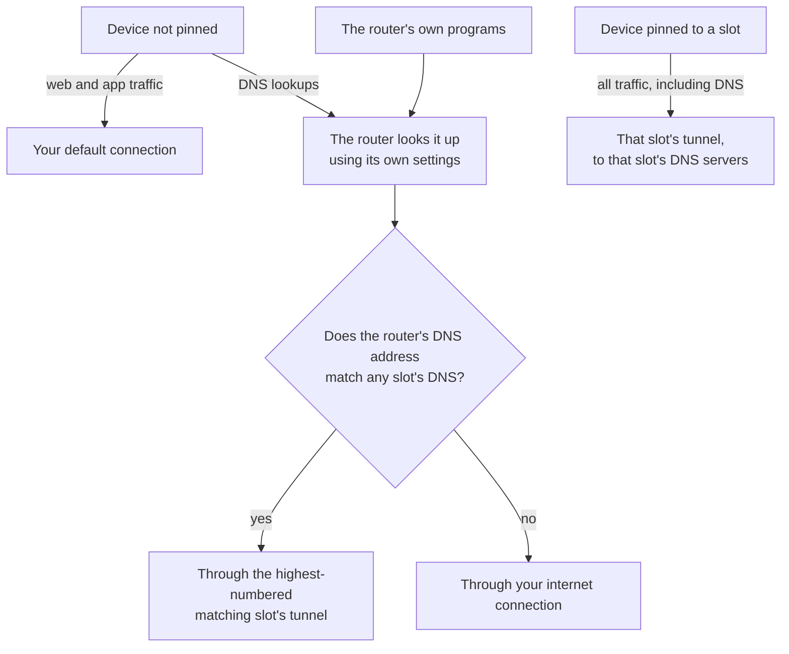
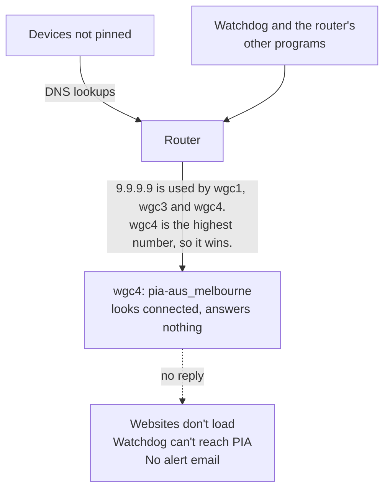
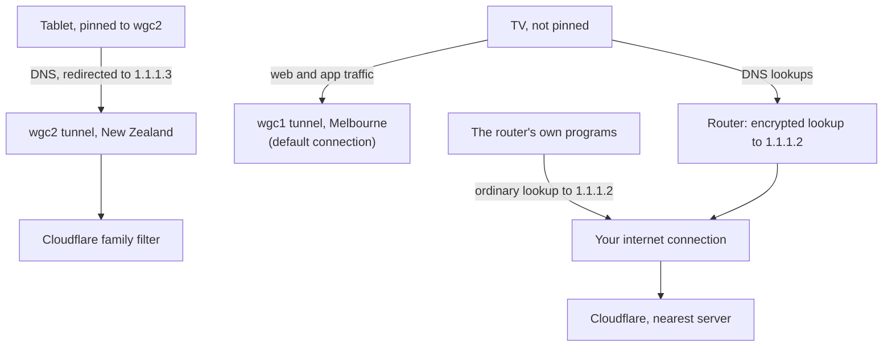
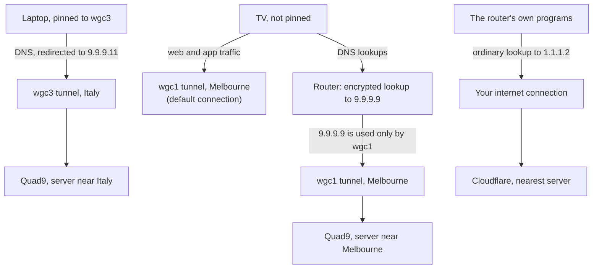
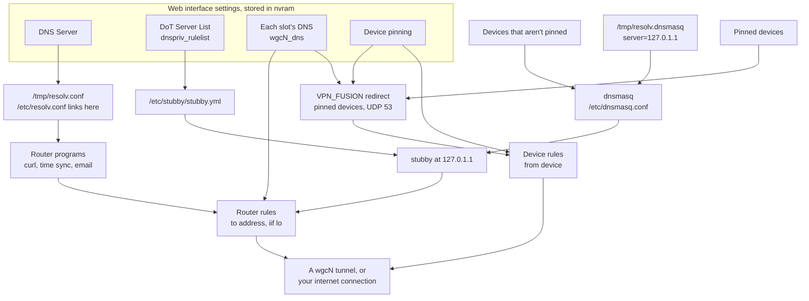

# DNS: where your lookups actually go

This is the long version. [README section 5.2.2](README.md#522-dns-where-your-lookups-go) has the
short one, and links here for the detail.

> [!IMPORTANT]
> **Your default connection decides where a device's traffic goes. It does not decide where that device's DNS goes.**

If you read nothing else in this section, read that. It's easy to think of DNS as just more traffic that follows the same path as everything else. On an ASUS router it usually doesn't, and that one difference explains every surprise below.

Short version:

- **Pin a device to a slot** and its DNS follows that slot.
- **A device that isn't pinned** uses the router's own DNS settings, whatever your default connection is.
- **Keep the router's DNS addresses away from your slots' DNS addresses**, unless you choose to share one on purpose (setup B below). If a slot uses the same address as the router, one broken tunnel can stop every device that isn't pinned from finding websites, and stop the watchdog from fixing it.

This section covers stock ASUS firmware. Asuswrt-Merlin hasn't been tested yet.

### What is DNS?

DNS is the internet's phone book. It turns a name like `example.com` into the address your device actually connects to. The server that answers is called a DNS server, or resolver.

### Why doesn't my DNS follow my default connection?

Because a device that isn't pinned doesn't send its lookups out to the internet. It sends them **to the router**, and the router makes the lookup for it.

Think of an office receptionist. You ask them to look up a number, and they ring the directory on the office line, not on your phone. Your phone plan has no say in which line they use.

The router works the same way. Your device's lookup arrives at the router and stops there. The router then makes a new lookup of its own, and the router's own rules decide which way that goes. Your default connection only applies to traffic that passes **through** the router to somewhere else, so it never sees the lookup.

A device pinned to a slot is different. The router catches its ordinary lookups and sends them to that slot's DNS servers, through that slot's tunnel.



### Who looks things up on the router?

Two groups, and they use different settings.

**Your devices** look up websites, apps, streaming services and everything else you use. Devices that aren't pinned use the router's **DNS-over-TLS (DoT) Server List**. DoT is DNS sent inside an encrypted connection, so your internet provider can't read it.

**The router itself** looks up names for its own work, using the router's **DNS Server** setting. For example:

- setting its clock (time servers);
- checking for firmware updates;
- keeping a DDNS name up to date, and the ASUS app's remote access, if you use them;
- the cfg-pia-wg watchdog reaching PIA to rebuild a tunnel;
- the watchdog sending you an alert email; and
- downloading the helper programs cfg-pia-wg installs.

Is the router's own lookup encrypted? That's up to the program making it, not the router. Most programs on the router, including the watchdog, look names up using ordinary DNS, which isn't encrypted. Everything the watchdog then sends and receives is encrypted (HTTPS). So your internet provider could see that the router looked up a PIA server name, but nothing more.

### How can one tunnel take away DNS for everything?

Each VPN slot can have its own DNS servers. That's how you can send a child's tablet to a family filter while your own devices use something else.

There's a catch. When a slot has DNS servers set, the router also sends **its own** traffic to those addresses through that slot's tunnel. If the router's DNS settings use the same address as a slot, the router's lookups travel down that slot's tunnel. If more than one slot uses that address, the highest-numbered slot carries them.

cfg-pia-wg can't change how the router routes its own traffic, and it never changes your router's DNS settings: they're yours.

Here's an example router with five slots:

| Slot | PIA region | Role | Slot DNS |
| --- | --- | --- | --- |
| `wgc1` | `pia-aus_melbourne` | Default connection, watchdog on | Quad9: `9.9.9.9`, `149.112.112.112` |
| `wgc2` | `pia-nz` | Child's tablet | Cloudflare family: `1.1.1.3` |
| `wgc3` | `pia-italy` | | Quad9: `9.9.9.9`, `149.112.112.112` |
| `wgc4` | `pia-aus_melbourne` | | Quad9: `9.9.9.9`, `149.112.112.112` |
| `wgc5` | `pia-uk` | | Cloudflare: `1.1.1.1`, `1.0.0.1` |

This router's DNS Server and DoT Server List are both set to Quad9, `9.9.9.9` and `149.112.112.112`. Three slots use the same addresses, and `wgc4` is the highest-numbered, so the router's lookups go through `wgc4`.

For example, suppose `wgc4:pia-aus_melbourne` breaks because PIA has rotated that server's key, as it does from time to time. The tunnel still looks connected, but nothing comes back. This is what happens:



- **Devices that aren't pinned can't find any website.**
- **The watchdog can't rebuild a tunnel.** It can't reach `serverlist.piaservers.net` (PIA's server list), `www.privateinternetaccess.com` (your login token) or `raw.githubusercontent.com` (PIA's security certificate).
- **No alert email is sent,** because the watchdog can't find your email server.
- **Pinned devices keep working,** because their DNS goes through their own slot.

The broken slot doesn't need to be your default connection, or have a watchdog, for this to happen. It only needs to use the same DNS address as the router. cfg-pia-wg can't change this router behaviour, but on stock firmware it tells you when a slot's DNS uses the same address as your router's DoT Server List: the note appears under the DNS field as you type it, in CREATE and in EDIT, and names the addresses that overlap.

What if the slot is stopped rather than broken? Then the router drops that slot's rules and moves its lookups to the next-highest slot using the same address, here `wgc3` in Italy. Lookups keep working, but they're answered by a server near Italy. Only a slot that looks connected but answers nothing makes lookups disappear.

### What should I set?

Start with the devices you care most about.

**Pin them.** A pinned device's DNS goes to its slot's DNS servers, through its slot's tunnel. Its lookups leave from the same place as its traffic, and nothing else on the router can move them. cfg-pia-wg makes pinning quick, and you can set your default connection to the internet or to any slot in the same way.

Then set the router. Both settings are under **Advanced Settings > WAN > Internet Connection > WAN DNS Setting**:

- **DNS Server** (click **Assign**). This is for the router's own lookups, including the watchdog's.
- **DNS-over-TLS (DoT) Server List.** This is for every device that isn't pinned. It appears when **DNS Privacy Protocol** is set to **DNS-over-TLS (DoT)**.

For the **DNS Server**, whichever setup you choose below, use addresses that no slot uses, from a service that blocks malware. The router makes few lookups of its own, but if anything on it ever misbehaves, a filtering service is one more thing in its way. Example: Cloudflare's malware filter, `1.1.1.2` and `1.0.0.2`.

For the **DoT Server List**, there are two sensible setups. Both work. Each costs something different, and the choice is yours.

| | Setup A: reliable | Setup B: private |
| --- | --- | --- |
| DoT Server List | Addresses **no slot** uses | The same addresses as **one** slot in your own country, with the watchdog on. No higher-numbered slot may use them. |
| Lookups from devices that aren't pinned | Go straight out over your internet connection, encrypted, to the nearest server | Go through that slot's tunnel, encrypted |
| Who sees your home address | The DNS provider | Nobody: the provider sees PIA's address |
| If one tunnel breaks | Lookups carry on | If that slot looks connected but answers nothing, every device that isn't pinned loses DNS until the slot is rebuilt |
| What cfg-pia-wg says | Nothing: there is nothing to say | A note under the DNS field, naming the shared addresses. It's information, not a warning - you matched them on purpose |

#### Setup A: reliable

| Setting | DNS servers |
| --- | --- |
| Router: DNS Server | `1.1.1.2`, `1.0.0.2` |
| Router: DoT Server List | `1.1.1.2` and `1.0.0.2`, port `853`, TLS hostname `security.cloudflare-dns.com` |
| `wgc1`, `wgc3`, `wgc4` | Quad9: `9.9.9.9`, `149.112.112.112` |
| `wgc2` | Cloudflare family: `1.1.1.3` |
| `wgc5` | Cloudflare: `1.1.1.1`, `1.0.0.1` |



Notice the TV. Its traffic leaves through `wgc1`, but its lookups leave through your internet connection, even though your default connection is a tunnel. They're encrypted, so your internet provider can't read them, but Cloudflare sees your home address.

#### Setup B: private

The DoT Server List uses the same addresses as `wgc1`, and every other slot uses different addresses. Quad9 offers a second set of addresses that does the same job, so the overseas slots and `wgc4` can use those. `wgc4` is in Melbourne too, but it has a higher number than `wgc1`, so it must not use the router's addresses.

| Setting | DNS servers |
| --- | --- |
| Router: DNS Server | `1.1.1.2`, `1.0.0.2` |
| Router: DoT Server List | `9.9.9.9` and `149.112.112.112`, port `853`, TLS hostname `dns.quad9.net` |
| `wgc1` (default connection, watchdog on) | Quad9: `9.9.9.9`, `149.112.112.112` |
| `wgc2` | Cloudflare family: `1.1.1.3` |
| `wgc3`, `wgc4` | Quad9: `9.9.9.11`, `149.112.112.11` |
| `wgc5` | Cloudflare: `1.1.1.1`, `1.0.0.1` |



There's a bonus in using `9.9.9.11` on overseas slots. It passes part of the sender's address on to the website's own DNS servers, and for a device on `wgc3`, the sender is PIA's server in Italy. Websites then send that device to their servers near Italy, not near you. Your home address isn't passed on.

### Using a slot for parental controls

This is a suggested approach, not advice. Your network and your family's setup are yours to decide.

A filtering DNS service on a child's slot only works when the child's device asks the router for DNS in the ordinary way. A device that encrypts its own DNS, or sends it to another server, goes straight past the filter. On the child's device:

- **Android:** set **Settings > Network and internet > Private DNS** to **Off** or **Automatic**. Automatic is fine: the router doesn't offer encrypted DNS, so the device falls back to the ordinary way.
- **iPhone and iPad:** turn off **iCloud Private Relay** (**Settings > [your name] > iCloud > Private Relay**). Remove any DNS profile under **Settings > General > VPN & Device Management**. Under **Settings > Wi-Fi**, tap the (i) next to your network and check that **Configure DNS** is **Automatic**.
- **Browsers:** turn off **Use secure DNS** in Chrome and Edge, and **DNS over HTTPS** in Firefox.
- **Apps:** avoid ad blockers, VPN apps and other apps that set their own DNS.

### For the technically inquisitive

What follows is a representation of what a stock ASUS router can look like. Everything in it was measured on one stock ASUS router in September 2026, not read in documentation - ASUS publish none of it. Other models and firmware versions may differ.

#### The pieces

- **dnsmasq** is the router's local DNS server. Devices send their lookups to it, at the router's LAN address, port 53.
- **stubby** is a small program that turns ordinary lookups into encrypted DoT. It listens on the router at `127.0.1.1`, port 53.
- **dnsmasq hands lookups to stubby.** With DoT on, `/tmp/resolv.dnsmasq` contains a single line, `server=127.0.1.1`, so dnsmasq forwards everything to stubby. Stubby then connects to the DoT Server List on port 853.
- **The router's own programs don't use dnsmasq.** They read `/etc/resolv.conf` and make ordinary lookups, as programs do on any Linux system.

**How the DNS Server setting reaches `/etc/resolv.conf`:** when you click **Apply**, or the internet connection comes up, the firmware rewrites `/tmp/resolv.conf` from the DNS Server setting. `/etc/resolv.conf` is a link to that file. With DoT on, the firmware also adds stubby (`nameserver 127.0.1.1`) as the last entry. The firmware also adds a route for each DNS Server address through your internet connection.

The settings you choose in the web interface are stored in nvram, the router's settings store. The firmware builds the files, rules and redirects from them:



#### The router rules

For each address in a slot's DNS, the firmware adds a routing rule. On the example router above, `ip rule show` includes:

```text
1016: from all to 1.1.1.1 iif lo lookup 5   # wgc5
1017: from all to 1.0.0.1 iif lo lookup 5   # wgc5
1019: from all to 9.9.9.9 iif lo lookup 6   # wgc4 WINS
1020: from all to 149.112.112.112 iif lo lookup 6
                                            # wgc4 WINS
1022: from all to 9.9.9.9 iif lo lookup 7   # wgc3
1023: from all to 149.112.112.112 iif lo lookup 7
                                            # wgc3
1025: from all to 1.1.1.3 iif lo lookup 8   # wgc2
1028: from all to 9.9.9.9 iif lo lookup 9   # wgc1
1029: from all to 149.112.112.112 iif lo lookup 9
                                            # wgc1
```

Reading one rule, `1019: from all to 9.9.9.9 iif lo lookup 6`:

- **`1019`** is the rule's priority. The router checks rules from the lowest number up and uses the first that matches.
- **`from all`** matches any sender.
- **`to 9.9.9.9`** matches traffic going to that address.
- **`iif lo`** means "input interface: loopback". Loopback is the router talking to itself, so this matches only traffic the router creates, from its own programs and from stubby. Traffic from your devices arrives on the LAN interface instead, so these rules never match it.
- **`lookup 6`** means "route this using routing table 6".

Each slot has its own routing table:

| Slot | Table | Rule priorities |
| --- | --- | --- |
| `wgc1` | 9 | 1028, 1029 |
| `wgc2` | 8 | 1025 |
| `wgc3` | 7 | 1022, 1023 |
| `wgc4` | 6 | 1019, 1020 |
| `wgc5` | 5 | 1016, 1017 |

The higher the slot number, the lower the table number and rule priority. So when more than one slot is set to the same DNS address, the highest-numbered slot's rule matches first and carries the router's lookups. Tables 6 to 9 were measured. Table 5 for `wgc5` follows the same pattern but hasn't been confirmed.

#### Why a broken tunnel could blackhole DNS

Each slot's table sends traffic through that slot's `wgcN` interface. WireGuard has no way of knowing whether the other end is still answering, so a broken tunnel's interface stays up. Its rules and routes stay in place, and lookups go in and get nothing back. Ping to an IP address may still work, because the ping doesn't need DNS and may take a different path.

A tunnel that's **stopped** is different. When a slot is stopped, from the web interface, from cfg-pia-wg or by the watchdog during a rebuild, the firmware removes that slot's rules. On the test router, stopping `wgc4` removed rules 1019 and 1020, and the router's lookups to `9.9.9.9` moved to `wgc3`. If no slot uses the address, they use the main routing table and go out through your internet connection.

If the router's DNS Server setting uses the same address as a slot, you'll also see a second route for that address in each slot's table, through your internet connection with `metric 1`. The firmware adds it for the DNS Server setting. While the tunnel is up, the tunnel's route wins.

#### Pinned and not pinned devices

| | Pinned to a slot | Not pinned |
| --- | --- | --- |
| Web and app traffic | Its slot's table, through a rule of its own (`100: from <device> lookup <table>`) | The default connection's rule (`10000: iif br0 lookup <table>`), or the main table if the default is the internet |
| Ordinary DNS to the router (UDP 53) | Redirected by `VPN_FUSION` to its slot's DNS servers, then routed like the rest of its traffic | Answered by dnsmasq, then stubby, then the router rules above |
| DNS over TCP port 53, DoT (853) or DoH (443) | Not redirected: follows its own traffic route | Not redirected: follows the default connection |
| DNS sent straight to another server, such as `8.8.8.8` | Not redirected: follows its own traffic route | Not redirected: follows the default connection |

The redirect only matches UDP port 53 sent to the router's own address. DoH looks like ordinary web traffic, so no router can redirect it by port.

#### Common DNS services

Addresses are as published in September 2026. Check the provider's site before you rely on them.

| Service | Blocks | Ordinary DNS | DoT hostname | DoH URL |
| --- | --- | --- | --- | --- |
| Quad9 | Malware | `9.9.9.9`, `149.112.112.112` | `dns.quad9.net` | `https://dns.quad9.net/dns-query` |
| Quad9, with location hint | Malware | `9.9.9.11`, `149.112.112.11` | `dns11.quad9.net` | `https://dns11.quad9.net/dns-query` |
| Quad9, unfiltered | Nothing | `9.9.9.10`, `149.112.112.10` | `dns10.quad9.net` | `https://dns10.quad9.net/dns-query` |
| Cloudflare | Nothing | `1.1.1.1`, `1.0.0.1` | `one.one.one.one` | `https://cloudflare-dns.com/dns-query` |
| Cloudflare, security | Malware | `1.1.1.2`, `1.0.0.2` | `security.cloudflare-dns.com` | `https://security.cloudflare-dns.com/dns-query` |
| Cloudflare, family | Malware, adult content | `1.1.1.3`, `1.0.0.3` | `family.cloudflare-dns.com` | `https://family.cloudflare-dns.com/dns-query` |
| AdGuard DNS | Ads, trackers | `94.140.14.14`, `94.140.15.15` | `dns.adguard-dns.com` | `https://dns.adguard-dns.com/dns-query` |
| AdGuard DNS, family | Ads, trackers, adult content | `94.140.14.15`, `94.140.15.16` | `family.adguard-dns.com` | `https://family.adguard-dns.com/dns-query` |
| Control D, malware | Malware | `76.76.2.1`, `76.76.10.1` | `p1.freedns.controld.com` | `https://freedns.controld.com/p1` |
| Control D, family | Malware, adult content | `76.76.2.4`, `76.76.10.4` | `family.freedns.controld.com` | `https://freedns.controld.com/family` |
| Mullvad | Nothing | Not offered (see note) | `dns.mullvad.net` | `https://dns.mullvad.net/dns-query` |
| Mullvad, base | Ads, trackers, malware | Not offered (see note) | `base.dns.mullvad.net` | `https://base.dns.mullvad.net/dns-query` |
| Google | Nothing | `8.8.8.8`, `8.8.4.4` | `dns.google` | `https://dns.google/dns-query` |
| PIA | Nothing | `10.0.0.243`, `10.0.0.242` (inside a PIA tunnel only) | Not offered | Not offered |

Notes:

- **Slot DNS must offer ordinary DNS.** The router's redirect sends plain port 53 lookups, so a slot can't use Mullvad, and PIA's addresses only work on a slot whose tunnel is up.
- **Mullvad only answers encrypted lookups.** Use `194.242.2.2` (`dns.mullvad.net`) or `194.242.2.4` (`base.dns.mullvad.net`) in the router's DoT Server List, with the matching hostname.
- **Google** records more about lookups than the privacy-focused services. It's included for comparison.

#### See it on your router

All of these commands only read. They change nothing.

```sh
ls -l /etc/resolv.conf           # a link to /tmp/resolv.conf
cat /etc/resolv.conf             # router programs' DNS servers
cat /tmp/resolv.dnsmasq          # where dnsmasq sends lookups
cat /etc/stubby/stubby.yml       # stubby's DoT servers
nvram get dnspriv_rulelist       # the DoT Server List
nvram show 2>/dev/null | grep -E '^wgc[0-9]_dns'
                                 # each slot's DNS servers
ip rule show                     # all routing rules
ip route get 9.9.9.9             # the route for one address
iptables -t nat -S VPN_FUSION    # pinned devices' redirects
for t in 5 6 7 8 9; do echo "table $t:"; ip route show table $t; done
                                 # each slot's routing table
```

If `ip route get` names a `wgc` interface for an address in your router's DNS Server or DoT Server List, that address is shared with a slot.
